# AgentOS Multi-Agent 编排详细实施方案

## 1. 文档目的

本文给出 AgentOS 从当前状态演进为“可配置 Agent + 可发布编排 + 持久运行 +
实时图监控”平台的推荐实施顺序。它不是界面原型说明，而是后端、数据库、Worker、
事件协议和未来前端共同遵守的实施基线。

本文覆盖以下目标：

1. 用户可以创建自定义 Agent，并配置模型、系统提示词、预算和上下文策略。
2. Agent 可以绑定指定版本的 Tool 与 Skill，历史运行不受后续配置覆盖影响。
3. 用户可以从模板创建编排，也可以在统一图协议上扩展自定义编排。
4. 编排启动后与浏览器连接解耦，页面关闭、刷新或 SSE 断线不会取消或重复运行。
5. 页面可以查看静态执行图、动态任务、节点状态、已走边、重试、制品和成本。
6. 支持参考项目的五种模式，并支持图片中的 Pipeline、Debate、Hierarchical 和真正的
   Peer-to-Peer 等模式。

本文中的迁移编号以 2026-08-05 仓库当前唯一 Alembic Head
`0020_agent_mvp_comments` 为基线。当前已经存在 `tools`、`agents`、`agent_tools`、
`agent_skills`，并且 `skills` 已具备 Workspace 归属，因此本方案采用增量版本化改造，
不再重复创建一套 `agent_definitions`。真正开发时如果主分支已经新增迁移，应从新的 Head 顺延，
禁止改写 `0019_agent_tool_catalog`、`0020_agent_mvp_comments` 等已经进入历史的迁移文件。

## 2. 结论与难度判断

这项功能可以实现，但不是“再加几个 Agent 类和一张流程图”即可完成。真正困难的部分是：

- 配置必须版本化，否则历史 Run 无法重放。
- 浏览器请求与执行生命周期必须解耦，否则断线即取消。
- 节点状态、边流转、事件和 Checkpoint 必须持久化，否则页面只能看到本次内存 Trace。
- 并行、Join、循环、重试和取消必须有严格状态机，否则容易重复执行有副作用的工具。
- 图片中的 Peer-to-Peer 如果要求“无单点故障”，本质是分布式系统能力，不能靠把图画成网状实现。

按复杂度分为三档：

| 档位 | 范围 | 难度判断 |
|---|---|---|
| MVP | Agent 配置、Single、Pipeline、Router、持久 Run、SSE 重放、运行图 | 中高，但边界明确 |
| 完整编排 | Planner、Supervisor、Handoff、Debate、Hierarchical | 高，需要循环、动态任务、子图和预算传播 |
| 高可用 P2P | 消息租约、重复投递、故障转移、quorum、脑裂防护 | 很高，应最后独立建设 |

推荐先完成 MVP 的可靠闭环，再逐步增加动态模式。不要把九种模式分别写成九套运行器；
模式应该只是“将模板参数编译为统一可执行图”的产品入口。

### 2.1 总实施顺序

| 阶段 | 交付结果 | 进入下一阶段的硬门槛 |
|---|---|---|
| 0 | 权限、Skill scope、Team AgentType 和功能开关 | 无跨租户写入口，完整测试基线稳定 |
| 1 | 统一 IR、状态机、条件和 Compiler | 三种 MVP 模板可编译，高级模板有稳定未实现错误 |
| 2 | Skill Revision、Agent Definition/Revision 与绑定 | 精确 Revision 可重复解析 |
| 3 | Workflow Definition/Revision、Node/Edge 与发布 | 无效图不能发布，历史图不可变 |
| 4 | Run/NodeRun/TokenGroup/Token/Event/Artifact/Checkpoint | Fake Pipeline 可持久运行和恢复 |
| 5 | 独立 Worker、AgentExecutor、Lease/Retry/Cancel | 断开 HTTP 后继续，崩溃可接管 |
| 6 | 独立 SSE、历史重放、Graph Snapshot | 刷新/断线后无缺失且不重跑 |
| 7 | Single、Pipeline（顺序/并行/条件/循环）、Router + 三个基础页面切片 | MVP 端到端验收通过 |
| 8 | Planner-Executor 动态任务 DAG | 动态任务并发、Join 和恢复稳定 |
| 9 | Leader-Worker、Handoff | 有界循环、Owner 转移、无进展检测 |
| 10 | Debate | 多方隔离、证据、Judge 和收敛可审计 |
| 11 | Hierarchical | 子 Run、预算/权限传播和取消级联 |
| 12 | Peer-to-Peer | 重复/乱序/故障转移/quorum 测试通过 |
| 13 | 高级模式前端能力最终收口 | 浏览器 E2E 与多视口视觉验收 |
| 14 | 安全、配额、成本、保留和生产灰度 | 生产验收清单全部通过 |

### 2.2 与 Spring AI Alibaba 源码模式的对应关系

源码审计基于 `/Users/xianglei/Desktop/spring-ai-alibaba-main` 当前快照（`pom.xml` 标称
`1.1.2.2`）。官方页面顶层 Multi-Agent 模式表只定义 Tool Calling 和 Handoffs，同一页面后续又展示
Sequential、Parallel、Routing、Supervisor 和 Customized；源码中的 FlowAgent 与构图策略属于实现层，
不能与前两种协作模式视为同一级分类。AgentOS 不照搬 Java 类层级，而是把它们编译成同一套
Node/Edge/Token IR：

| Spring AI Alibaba 源码能力 | 源码真实语义 | AgentOS 实现映射 |
|---|---|---|
| `SequentialAgent` | 线性连边，Agent 通过父图共享状态和 output key 传递数据 | `pipeline` 模板，顺序边 + 显式 reducer/data mapping |
| `ParallelAgent` | fan-out 到多个 Agent，再进入 aggregator；支持 merge strategy 和并发上限 | `fork + agent/tool + join + finalizer`，由 Token 分组和 Run 并发预算保证可靠 Join |
| `LlmRoutingAgent` | Router 返回一个或多个 Agent，当前源码用 `MultiCommand` 支持多目标并行 | `router` 节点输出结构化 `RouteDecision`；单目标直达，多目标 fan-out 后 Join |
| `LoopAgent` | init/dispatch/subAgent 回边，支持 count/array/condition | 显式 `loop` Edge、`execution_no/iteration`、局部 `max_traversals` 和全局预算 |
| `ConditionalGraphBuildingStrategy` | 公共可访问且默认注册的构图策略，但没有具体 `ConditionalAgent` 包装类 | 受控 JSON 谓词的 `conditional` Edge，不新增独立 Agent 类型 |
| `AgentTool` / Tool Calling | 主 ReactAgent 把子 Agent 包装成工具；新建消息、派生 thread 并重置 checkpoint，但仍继承部分父 `RunnableConfig` metadata，只返回最后一条 AssistantMessage | 当前 NodeRun 内的受控子 Agent 调用，记录 ToolCall/SubAgentRun，并显式定义上下文继承白名单；不等同于持久子 Workflow Run |
| Handoffs 示例 | transfer tool 更新 `active_agent`；示例未注册 `ReturnDirectModelHook`，当前 tools-to-model 边也不会保证 `returnDirect` 立即退出 | 持久 Owner 状态 + `handoff` Edge + `hop_count` + 审核节点，不依赖 Spring 示例的即时退出行为 |
| Supervisor 示例 | 当前可运行示例是 `ReactAgent + AgentTool`；`SUPERVISOR` 仅有枚举值，默认注册表未注册对应策略，仓库也没有公开 `SupervisorAgent` | `leader_worker` 模板，Supervisor/Worker/Reviewer 显式有界循环 |
| Customized | 继承 `FlowAgent` 或注册新的 Building Strategy | TemplateCompiler 或 `custom_graph`，运行器仍只解释稳定 IR 原语 |

关键源码入口包括：

- `FlowGraphBuilder.java` 和 `FlowGraphBuildingStrategyRegistry.java`：策略选择与注册。
- `SequentialGraphBuildingStrategy.java`、`ParallelGraphBuildingStrategy.java`、
  `RoutingGraphBuildingStrategy.java`、`LoopGraphBuildingStrategy.java`：四种具体 Flow Agent 的构图。
- `ConditionalGraphBuildingStrategy.java`：默认注册的公共条件构图策略，但没有对应 Agent 包装类。
- `AgentTool.java`：Agent-as-Tool。
- `examples/multiagent-patterns/handoffs-multiagent`：`active_agent + transfer tool + conditional edge`。

当前源码快照的核对锚点（路径相对 Spring AI Alibaba 根目录）：

| 源码锚点 | 当前行附近 | 证明的语义 |
|---|---:|---|
| `.../flow/agent/FlowAgent.java` | 75、93 | FlowAgent 把配置交给 FlowGraphBuilder/Strategy 构图 |
| `.../flow/strategy/FlowGraphBuildingStrategyRegistry.java` | 163-169 | 默认只注册 Sequential、Routing、Parallel、Conditional、Loop |
| `.../flow/strategy/SequentialGraphBuildingStrategy.java` | 44-60 | 子 Agent 线性连边，共享父图状态 |
| `.../flow/strategy/ParallelGraphBuildingStrategy.java` | 81 附近 | 同一入口 fan-out，完成后进入 aggregator |
| `.../flow/node/RoutingNode.java` | 98-126 | 模型可返回多个 Agent，并为每个目标写独立 query/input |
| `.../flow/strategy/LoopGraphBuildingStrategy.java` | 49 附近 | init/dispatch/subAgent 的显式回边 |
| `.../AgentTool.java` | 194-225 | 派生子 thread/config，只取最后 AssistantMessage 返回 |
| `.../ReactAgent.java` | 835-854 | 当前 tools-to-model 边未保证 returnDirect 立即退出 |
| `spring-ai-alibaba-graph-core/.../graph/checkpoint/Checkpoint.java` | 30-48 | Checkpoint 仅含 id/state/node/next-node |

省略号分别表示 `spring-ai-alibaba-agent-framework/src/main/java/com/alibaba/cloud/ai/graph/agent` 或
`spring-ai-alibaba-graph-core/src/main/java/com/alibaba/cloud/ai` 的公共前缀；开始编码前用实际 SHA 清单
重新定位行号，不能把文档行号当稳定 API。

因此不能按在线文档中的 `SupervisorAgent.builder()` 直接移植：本地源码快照没有该类，
`FlowGraphBuildingStrategyRegistry` 也只默认注册 Sequential、Routing、Parallel、Conditional 和
Loop。AgentOS 的 Leader-Worker 必须作为自己的图模板实现，不能依赖一个实际不存在的 Spring
运行时策略。

Spring Graph Core 的 Checkpoint 主要保存 state/node/next-node，没有本方案要求的 Workflow Revision、
Lease、fencing、Run 幂等键和持久事件日志。默认 `ALL_OF` 在聚合完成后才保存父图 Checkpoint；
`ANY_OF` 只采用首个成功结果并尝试取消其余 Future；子图 Saver 只负责子图自身的 checkpoint。
这些机制都不形成父 fan-out 的逐分支完成账本，因此 AgentOS 只复用其“状态增量、图编译与模式策略”
思想，不把 Spring Checkpoint 当作可靠的逐分支恢复或生产调度事实源。

本地源码目录没有 `.git` 元数据，`pom.xml` 版本号不足以唯一标识代码。真正开始移植前必须对审计
涉及的 Java 源文件生成排序后的 SHA-256 清单并随 ADR 保存，后续源码更新时重新审计差异。
仓库根 `LICENSE` 是 Apache License 2.0。AgentOS 优先复用架构思想和协议语义、用 Python 独立实现；
若实际复制或翻译源码片段，必须由项目维护者按 Apache 2.0 保留所需版权与许可证声明。

## 3. 当前能力与缺口

### 3.1 可以直接复用的能力

- 异步 Anthropic 流式 ReAct 循环及 Tool Use。
- `BaseTool`、Pydantic 输入、`ToolContext`、静态 `ToolRegistry` 和工具调用记录。
- 已落地的 `tools` 工具目录，以及 Workspace 级 `agents/agent_tools/agent_skills` 控制面 MVP。
- Skill ZIP bundle、MinIO 资源、`SKILL.md` 注入和脚本执行。
- 一次性 SubAgent、持久 teammate、团队消息及任务依赖。
- 人工交互的持久暂停、恢复、行锁和幂等冲突处理。
- `StreamEvent`、SSE 事件结构和 actor 概念。
- Memory Job 已验证的 PostgreSQL 队列、`FOR UPDATE SKIP LOCKED`、租约、重试和独立 Worker。
- Workspace、成员和 Session 的基本租户边界。

### 3.2 必须新增的能力

- 在现有 `agents` Definition 上增加不可变 Agent Revision、发布指针和存量数据回填。
- Skill Revision，以及 Agent Revision 到 Tool/Skill Revision 的绑定。
- Workflow Definition、不可变 Workflow Revision、Node、Edge 和发布前图校验。
- Workflow Run、Node Run、TokenGroup、执行令牌、Event、Artifact 和 Checkpoint。
- 与 HTTP 请求解耦的编排 Worker，以及 Claim、Lease、Heartbeat、Retry、Cancel 和接管。
- 独立运行订阅 API、`Last-Event-ID` 重放和运行快照。
- fan-out/fan-in、Join、循环、动态任务、子工作流和预算传播。
- 独立前端工程及通用图组件。当前仓库没有前端，不能假定已有 React、Vue 或图形库。

### 3.3 开工前必须处理的现有问题

1. `TeamSpawn` 默认值仍是 `general_purpose`，而 `AgentType` 的合法值是
   `general-purpose`。应把 API Schema 改为枚举并统一存储值。
2. Skill API 和 Agent API 已有 Workspace 边界，但 `permission_rules` 仍只有
   `global/session` 作用域，缺少可信 `workspace_id`；编排前必须完成权限规则租户化。
3. Skill 上传仍会删除同名 Workspace 对象前缀再覆盖，`skill_id` 不能代表不可变内容；必须先引入
   Skill Revision 或冻结对象版本。
4. 现有 `agents` 的 Prompt、模型和 Tool/Skill 绑定可原地修改；Session 只绑定 Agent ID，
   历史 Turn 无法确定当时使用的配置，必须先完成 Revision 回填和运行解析切换。
5. Skill 脚本只运行在宿主子进程，不是真正沙箱。生产环境应默认禁用，直到容器化或
   等价隔离完成。
6. 当前 `StreamBus` 是请求级内存队列，sequence 不能作为断线重放的事实源。
7. 当前主 Agent producer 仍与 SSE 请求生命周期绑定，不能直接作为 Workflow Worker 使用。

子代理权限裁决、`agent_type` 定向 matcher、轮次分档等能力当前已经存在，应补回归测试，
不要重新实现另一套权限系统。

## 4. 总体架构

系统分为控制面、运行面和观测面：

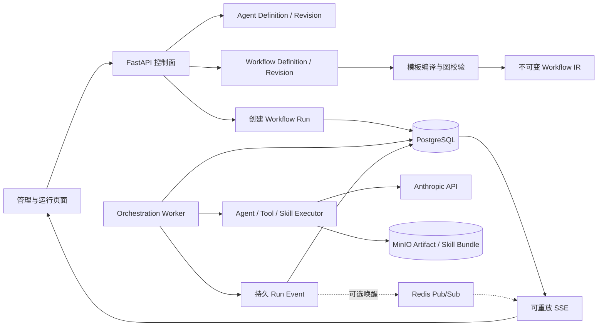

### 4.1 控制面

控制面负责创建、修改、校验和发布 Agent/Workflow。修改配置永远创建新 Revision；
Definition 只保存稳定身份、列表元数据和当前发布指针。

### 4.2 运行面

运行面只接受已经发布且冻结的 Revision。API 仅创建 `workflow_runs` 并返回 `202`；
Worker 在独立进程中领取 Run/Node，LLM 和工具 I/O 不占用长数据库事务。

### 4.3 观测面

运行状态和生命周期事件先进入 PostgreSQL，再通知在线订阅者。Redis 只能用于降低轮询延迟，
不能作为事实源。前端随时可以用 Run 快照和 sequence 续传重建状态。

### 4.4 代码边界

按现有 feature 分域约定改造 `agent` 并新增 `orchestration` 顶层包：

```text
agent/                         # 已存在，在现有 feature 内增量增加 Revision
  models.py
  schemas.py
  repository.py
  service.py
  api.py

orchestration/
  models.py
  schemas.py
  repository.py
  service.py
  api.py
  compiler.py
  state_machine.py
  scheduler.py
  executor.py
  event_service.py
  worker.py
  templates/
```

仍然遵守 `API -> Service -> Repository -> ORM Model`：

- `agent` 域拥有 Agent Definition、Revision 和绑定表。
- `orchestration` 域拥有 Workflow 定义和运行表。
- `skill` 域拥有 Skill 与 Skill Revision；AgentService 只能调用 SkillService，不能直接访问
  SkillRepository。
- `tools` 域继续拥有 Tool Registry 和 ToolCall；编排执行器通过 ToolService 调用。
- `interaction` 域拥有人工交互；编排 Service 通过 InteractionService 创建和恢复请求。
- 所有新 ORM 必须登记到 `database/registry.py`，路由登记到 `api/router.py`。

### 4.5 LangGraph 采用决策（ADR）

LangGraph 是开源项目；截至本方案核对日，其官方仓库根 `LICENSE` 为 MIT License。许可证允许商用、
修改和分发，但分发复制或衍生代码时仍须保留版权与许可证声明。开源并不等于应该把它直接作为
AgentOS 的持久调度内核：当前 AgentOS 的 `pyproject.toml`、`uv.lock` 和业务源码均没有
LangGraph/LangChain 依赖，MVP 不新增该依赖。

架构决策如下：

| 决策项 | 结论 | 原因 |
|---|---|---|
| Workflow Compiler/Scheduler | AgentOS 自研并拥有 | 必须与 Revision、Workspace、Permission、Lease、fencing、TokenGroup 和数据库事务统一 |
| Run/NodeRun/Token/Event/Checkpoint | PostgreSQL 表是唯一事实源 | 避免 AgentOS 与 LangGraph Checkpointer 各自认为自己拥有恢复进度 |
| Single/Pipeline/Router 等模板 | 编译到本方案统一 IR | 模式差异停留在 Compiler，不扩散为多套运行器 |
| LangGraph 的可用位置 | 后续可选的单个 Node 内部执行适配器 | 可以复用第三方预构建 Agent/Graph，但不能接管父 Workflow 的推进和持久状态 |
| Spring AI Alibaba 的可用位置 | 源码设计参考，不作为 Python 运行依赖 | 借鉴构图语义，同时保持 AgentOS 的事务、异步 I/O 和领域边界 |

若后续确有业务需要，引入接口必须是 `NodeExecutionAdapter`，默认实现为
`NativeAgentExecutionAdapter`；可选 `LangGraphNodeExecutionAdapter` 只能在一次 NodeRun 的 lease
边界内运行。它接收冻结的 NodeInput、预算、取消信号和只写 EventSink，返回标准 NodeOutput，
不得直接修改 `workflow_runs`、`workflow_node_runs`、TokenGroup、Token、Checkpoint 或 Event
sequence，也不得生成父图下一跳。子图内部状态需要跨进程保存时，只能作为带命名空间的 Artifact
或适配器私有数据保存，并由 NodeRun attempt/fencing token 约束；父图仍只认标准 NodeOutput 的一次
有效提交。

以下方案明确禁止：

- 同时使用 LangGraph Checkpointer 和 `workflow_checkpoints` 决定父 Workflow 恢复位置。
- 把 LangGraph node/thread ID 暴露为 AgentOS 稳定 API ID，或让前端依赖第三方内部图结构。
- 让适配器绕过 AgentService、ToolService、PermissionService 或 ArtifactService 直接访问跨域表。
- 为了接入第三方图而放松 Workspace 复合外键、幂等键、预算、取消、lease 或 fencing 约束。
- MVP 中引入 LangGraph 后再补可靠性语义；MVP 首先完成原生内核的崩溃恢复闭环。

阶段 1 必须把本节固化为 `docs/adr/0001-orchestration-engine-boundary.md`。只有同时满足以下条件，
才另立 ADR 评审可选适配器：锁定版本和 MIT 许可证/SBOM；验证 Python 3.14 与现有异步栈兼容；
通过超时、取消、进程崩溃、重复执行和旧 lease 迟到提交测试；证明禁用适配器后原生 Workflow
仍可运行；基准数据证明收益足以承担新增依赖和升级成本。未满足时不在 `pyproject.toml` 增加依赖。

## 5. 统一图协议

### 5.1 两层图模型

采用“产品模板 DSL -> 可执行 IR”两层模型：

1. 产品模板层使用 Planner、Supervisor、Judge、Handoff 等业务术语，便于用户配置。
2. 编译后的 IR 只使用少量稳定原语，运行器只解释 IR。

可执行节点原语：

| `node_type` | 用途 |
|---|---|
| `start` | 唯一入口，不执行外部 I/O |
| `end` | 终态汇聚和最终输出校验 |
| `agent` | 执行冻结的 Agent Revision；Planner、Judge 等通过 `semantic_role` 区分 |
| `tool` | 确定性调用一个 Tool，适合 Pipeline |
| `router` | 产生结构化路由决定 |
| `transform` | 按受控映射转换数据，禁止任意 Python |
| `fork` | 根据静态边或动态任务生成多个执行令牌 |
| `join` | 按 all/any/quorum 策略等待令牌 |
| `human_gate` | 创建持久人工交互并释放 Worker 租约 |
| `subworkflow` | 创建子 Run，并等待或异步收集结果 |

`semantic_role` 可取 `planner/validator/supervisor/reviewer/handoff/judge/finalizer/debater`
等值，仅影响模板校验、提示词和展示，不新增独立运行器。

边原语（共 9 种）：

| `edge_type` | 用途 |
|---|---|
| `success` | 节点成功后的普通转移 |
| `conditional` | 受控条件命中后转移 |
| `loop` | 显式有界回边 |
| `fanout` | Fork 产生分支 |
| `join` | 分支进入 Join |
| `handoff` | 所有权转交另一个 Agent |
| `error` | 节点失败后的错误处理 |
| `timeout` | 节点超时后的处理 |
| `cancel` | 预留的取消补偿边；`engine_version=v1` 禁止发布，首版取消只做结构化停止 |

`error/timeout` 是 v1 可执行边：节点重试耗尽后，由失败提交事务按 priority 选择至多一条边并产生
Token。`cancel` 不是普通失败边，当前没有补偿日志、逆拓扑和副作用撤销协议，因此 Compiler 必须
拒绝它；以后实现 Saga/补偿运行时再提升 `engine_version` 开放，不能只画一条边就声称已回滚。

### 5.2 标准节点输入输出

每个节点都接收相同外壳，业务字段位于 `context` 和 `upstream_outputs`：

```json
{
  "run_id": "uuid",
  "node_run_id": "uuid",
  "root_goal": "用户目标",
  "task": "当前节点任务",
  "context": {},
  "upstream_outputs": [],
  "artifact_refs": [],
  "session_ref": {"session_id": 1, "turn_id": "uuid"},
  "budget_remaining": {},
  "attempt_no": 1,
  "execution_no": 1,
  "iteration": 0,
  "token_group_ref": null
}
```

标准输出：

```json
{
  "status": "succeeded",
  "text": "对人可读的摘要",
  "data": {},
  "artifact_refs": [],
  "metrics": {},
  "decision": null,
  "error": null
}
```

Router、Supervisor、Handoff 都必须输出带 discriminator 的结构化决定，不从自然语言中猜下一节点。
不同语义的决定不能强行共用一个只有 `task_override` 的对象：

`RouteDecision` 用于 Router，一次决定可以包含一个或多个目标，每个目标拥有独立任务和上下文补丁，
对应 Spring `RoutingNode` 为每个目标写入独立输入键的语义：

```json
{
  "kind": "route",
  "routes": [
    {
      "next_node_key": "researcher",
      "task": "检索指定仓库中的路由实现",
      "context_patch": {"query": "..."}
    }
  ],
  "reason": "需要代码检索",
  "confidence": 0.92
}
```

`DelegationDecision` 用于 Supervisor/Leader-Worker，字段为
`delegations[{target_node_key, task, wait_for_result, result_key}]`；`HandoffDecision` 用于控制权转移，
字段为 `action=continue|handoff|review|complete|respond_user|block`、`target_node_key`、
`task`、`context_patch`、`artifact_refs` 和 `reason`。`hop_count` 是 Scheduler 在 Handoff 成功提交事务中
原子递增的运行事实，不能由 LLM 提供。Leader-Worker Reviewer 使用
`SupervisorReviewDecision`，Debate Judge 使用 `DebateVerdict`；两者拥有不同 action 枚举，不能复用
一个含糊的 `ReviewDecision`，也不能把 Handoff 动作塞进 Router 结果。Pydantic 以 `kind` 做
discriminated union，编译器按模板限制可用的决定类型和目标集合。

### 5.3 条件和映射

- 条件保存为版本化 JSON 谓词，不允许 `eval()`、Python 源码或 Shell。
- 支持的初始操作符只包含 `eq/ne/gt/gte/lt/lte/in/exists/and/or/not`。
- 数据路径使用受限 JSON Pointer；读不到路径时按校验失败处理，不能隐式返回空字符串。
- Edge 的 `data_mapping` 显式声明源输出到目标输入的映射。
- Workflow 发布前用 JSON Schema 检查上游输出和下游输入是否兼容。

### 5.4 全局预算

每个 Workflow Revision 至少冻结：

- `max_duration_seconds`
- `max_node_runs`
- `max_llm_calls`
- `max_input_tokens`、`max_output_tokens`
- `max_cost_microunits`
- `max_tool_calls`
- `max_loops`、`max_hops`、`max_depth`
- `max_parallel_nodes`

任何循环还必须同时具备局部次数上限、全局预算和无进展检测。预算耗尽必须进入明确终态并写
事件，不能只抛出未归类异常。

## 6. 数据库通用约定

1. UUID 使用 `PGUUID(as_uuid=True)` 和 `uuid4`；高频追加记录使用 `BigInteger` 主键。
2. 状态使用 `String + CheckConstraint`，不使用 PostgreSQL ENUM，便于后续显式迁移。
3. 动态对象使用 `MutableDict.as_mutable(JSONB())` 或 `MutableList.as_mutable(JSONB())`。
4. 金额统一保存为 `BigInteger` 微货币单位，禁止使用浮点数。
5. 所有表继承 `Base` 的 `created_at/updated_at/is_deleted/deleted_at`。
6. Definition 允许软删除；Revision、RunEvent、Artifact 等历史事实默认禁止更新和软删除，
   仅由保留策略批量清理。
7. Run 和历史事实引用已发布 Revision 使用 `RESTRICT`；Revision 自己拥有的 Node、Edge 和绑定
   使用 `CASCADE`；`created_by` 使用 `SET NULL`；Workspace 所属根资源使用 `CASCADE`。
   存量 `agents.created_by_user_id` 当前为非空 `RESTRICT`，为兼容既有删除语义暂不改动；新建的
   Revision/Workflow 版本创建者字段才使用可空 `SET NULL`，待独立用户归档策略完成后再评估统一。
8. 所有租户查询必须同时携带可信的 `workspace_id`，不能只凭客户端传来的 Definition ID。
9. JSONB 只能保存配置、Schema、快照和小载荷；大文本、文件和大工具输出进入 MinIO，表中保存
   object key、hash 和大小。
10. 数据库不保存 API Key、Token 或完整连接串，只保存秘密管理系统中的 credential reference。
11. 状态、计数、空 JSON 和队列时间同时声明 Python `default` 与安全的 `server_default`，避免
    迁移脚本、运维 SQL 或其他写入方产生 NULL；时间使用带时区 `now()`。
12. Schema 层对长度和范围做友好校验，数据库 CHECK/UNIQUE/FK 负责最后防线；两层规则名称和
    合法值必须一致。
13. 服务端生成的幂等键统一使用短类型前缀、协议版本和规范输入 SHA-256，例如
    `tc:v1:{sha256(...)}`；原始维度另列保存，禁止直接拼接多个最长字段后写入定长列。

### 6.1 中文注释强制规范

所有 ORM 表必须在 `__table_args__` 中声明中文 `comment`，所有 `mapped_column()` 必须声明中文
`comment`；对应 Alembic 的 `op.create_table(..., comment="...")` 和 `sa.Column(...,
comment="...")` 必须完全一致。修改存量注释时使用 `op.create_table_comment()` 或
`op.alter_column(..., comment=..., existing_comment=...)`，不能只改 ORM。

下文每个字段表中的“说明”就是必须写入数据库的字段中文注释，不是只给文档阅读的说明。
所有新表继承的公共字段固定如下，因此后续不再逐表重复：

| 公共字段 | SQLAlchemy 类型 | 空/默认 | 数据库中文注释 |
|---|---|---|---|
| `created_at` | `DateTime(timezone=True)` | 非空/`now()` | 创建时间 |
| `updated_at` | `DateTime(timezone=True)` | 非空/`now()` | 更新时间 |
| `is_deleted` | `Boolean` | 非空/`false` | 软删除标记: false 有效 / true 已删除 |
| `deleted_at` | `DateTime(timezone=True)` | 可空 | 软删除时间, 空表示未删除 |

Revision、Event、Artifact 等不可变事实虽然沿用当前 `Base`，业务 Service 不提供普通更新和单行
软删除方法；物理清理只允许通过独立保留任务执行。

## 7. 数据库详细定义

下列表格省略 `Base` 自动提供的四个审计字段。`nullable`、默认值、外键和约束均按目标设计
给出，不表示可以省略在 ORM 和 Alembic 中的显式声明。现有 `agents` 表继续承担稳定 Definition
身份，避免重命名表、修改整数主键和破坏现有 Session/API 外键。

### 7.0 表归属与中文表注释总表

下表是 ORM 与 Alembic 必须使用的精确表级中文注释。标记“改造”的表已经存在，只增加字段、
约束或注释；标记“兼容”的表在切换期保留；其余为新增表。

| 表名 | Owner Domain | 性质 | 数据库中文表注释 |
|---|---|---|---|
| `skills` | `skill` | 改造 | 工作区 Skill 定义表 |
| `skill_revisions` | `skill` | 新增 | Skill 不可变版本表 |
| `agents` | `agent` | 改造 | 工作区 Agent 定义表 |
| `agent_revisions` | `agent` | 新增 | Agent 不可变版本表 |
| `agent_revision_tools` | `agent` | 新增 | Agent 版本工具绑定表 |
| `agent_revision_skills` | `agent` | 新增 | Agent 版本 Skill 绑定表 |
| `agent_tools` | `agent` | 兼容 | Agent 当前工具绑定兼容表 |
| `agent_skills` | `agent` | 兼容 | Agent 当前 Skill 绑定兼容表 |
| `workflow_definitions` | `orchestration` | 新增 | 工作流定义表 |
| `workflow_revisions` | `orchestration` | 新增 | 工作流不可变版本表 |
| `workflow_revision_nodes` | `orchestration` | 新增 | 工作流版本节点表 |
| `workflow_revision_edges` | `orchestration` | 新增 | 工作流版本连边表 |
| `workflow_runs` | `orchestration` | 新增 | 工作流运行实例表 |
| `workflow_node_runs` | `orchestration` | 新增 | 工作流节点执行尝试表 |
| `workflow_run_tokens` | `orchestration` | 新增 | 工作流可靠调度令牌表 |
| `workflow_run_token_groups` | `orchestration` | 新增 | 工作流运行令牌组表 |
| `workflow_run_events` | `orchestration` | 新增 | 工作流运行事件表 |
| `workflow_artifacts` | `orchestration` | 新增 | 工作流运行制品表 |
| `workflow_checkpoints` | `orchestration` | 新增 | 工作流运行检查点表 |
| `tools` | `tools` | 复用 | 内置工具目录 |
| `tool_calls` | `tools` | 改造 | 工具调用记录表 |
| `session_turns` | `session` | 改造 | Agent交互轮次记录 |
| `runtime_suspensions` | `interaction` | 改造 | Agent运行暂停点 |
| `interaction_requests` | `interaction` | 改造 | 人工交互请求 |
| `subagent_runs` | `team` | 改造 | 子代理运行记录 |
| `permission_rules` | `permission` | 改造 | 工作区工具权限规则表 |
| `workflow_dynamic_tasks` | `orchestration` | 后期新增 | 工作流动态任务表 |
| `workflow_dynamic_task_dependencies` | `orchestration` | 后期新增 | 工作流动态任务依赖表 |
| `workflow_peer_members` | `orchestration` | 后期新增 | 工作流对等成员实例表 |
| `workflow_peer_messages` | `orchestration` | 后期新增 | 工作流对等消息表 |
| `workflow_peer_task_leases` | `orchestration` | 后期新增 | 工作流对等任务租约表 |

跨域规则保持 `Service -> Service`：例如 Agent 发布时由 `AgentService` 调用 `SkillService` 和
`ToolCatalogService`；编排域不能直接实例化其他域的 Repository。

### 7.1 Skill 版本化改造

当前 `skills` 同名覆盖会同时覆盖 MinIO 的 `{name}/` 前缀。为了让 Agent Revision 可复现，
先把 `skills` 收敛为 Definition，再新增不可变 `skill_revisions`。

#### 7.1.1 修改 `skills`

表注释：`工作区 Skill 定义表`。

| 字段 | SQLAlchemy 类型 | 空/默认 | 外键 | 说明 |
|---|---|---|---|---|
| `id` | `Integer` PK | 非空 | - | 保留现有 Skill ID |
| `workspace_id` | `Integer` | 非空 | `workspaces.id ON DELETE CASCADE` | 所属工作区 ID |
| `name` | `String(64)` | 非空 | - | Workspace 内稳定名称 |
| `description` | `Text` | 非空 | - | 当前发布版本摘要的列表缓存 |
| `scope` | `String(16)` | `workspace` | - | Skill 作用域，首版固定为 workspace |
| `published_revision_id` | `UUID` | 可空 | 见下方复合外键 | 当前发布版本指针 |
| `created_by_user_id` | `Integer` | 可空 | `users.id ON DELETE SET NULL` | 创建者 |
| `frontmatter` | `MutableDict(JSONB)` | 兼容期保留 | - | 当前发布版本 frontmatter 兼容缓存 |
| `version` | `String(32)` | 兼容期可空 | - | 当前发布版本声明版本兼容缓存 |
| `skill_hash` | `String(64)` | 兼容期可空 | - | 当前发布 ZIP 哈希兼容缓存 |

约束与索引：

```sql
CHECK (scope = 'workspace');
ALTER TABLE skills DROP CONSTRAINT uq_skills_workspace_name;
CREATE UNIQUE INDEX uq_skills_active_workspace_name
ON skills(workspace_id, name)
WHERE is_deleted = false;
CREATE INDEX ix_skills_workspace_updated
ON skills(workspace_id, updated_at DESC);
```

发布指针必须使用复合外键
`(skills.id, published_revision_id) -> (skill_revisions.skill_id, skill_revisions.id)`，
`skill_revisions` 同时增加 `UNIQUE(skill_id, id)`。只做 `published_revision_id -> id` 的单列外键
无法阻止 Skill A 指向 Skill B 的 Revision。三个 Definition 的发布指针复合 FK 均使用
`DEFERRABLE INITIALLY DEFERRED` 和 `NO ACTION`，这样物理删除整个 Definition 聚合时可在事务结束
统一校验，同时单独删除仍被发布指针引用的 Revision 会失败。

`0019_agent_tool_catalog` 已经把历史 Skill 复制到具体 Workspace，当前不存在可无损恢复的全局
Skill 所有权，因此本项目首版不再引入 `system` Skill。现有 `frontmatter/version/skill_hash` 在
兼容期保留，只用于旧 API 和当前发布版本投影。完成 Revision 回填和运行时切换后，再用单独迁移
删除，不能在同一次迁移中边改语义边删回滚依据。

#### 7.1.2 新增 `skill_revisions`

表注释：`Skill 不可变版本表`。

| 字段 | SQLAlchemy 类型 | 空/默认 | 外键 | 说明 |
|---|---|---|---|---|
| `id` | `UUID` PK | `uuid4` | - | 不可变版本 ID |
| `skill_id` | `Integer` | 非空 | `skills.id ON DELETE CASCADE` | 所属 Definition |
| `revision_number` | `Integer` | 非空 | - | 从 1 开始递增 |
| `declared_version` | `String(32)` | 可空 | - | frontmatter 声明版本 |
| `description` | `Text` | 非空 | - | 该版本描述快照 |
| `frontmatter` | `MutableDict(JSONB)` | `dict` | - | 完整 frontmatter 快照 |
| `allowed_tool_names` | `MutableList(JSONB)` | `list` | - | 解析并校验后的 `allowed-tools` |
| `bundle_hash` | `String(64)` | 可空 | - | 新上传原始 ZIP 的 SHA-256；迁移版本为空 |
| `legacy_bundle_hash` | `String(64)` | 可空 | - | 从旧 `skills.skill_hash` 保留的审计值 |
| `manifest_hash` | `String(64)` | 非空 | - | 规范化文件路径、大小和内容 hash 的集合 hash |
| `object_prefix` | `String(512)` | 非空 | - | Skill 不可变对象前缀：`skills/{skill_id}/{revision_id}/` |
| `content_size_bytes` | `BigInteger` | 非空 | - | 所有解压内容字节数总和 |
| `bundle_size_bytes` | `BigInteger` | 可空 | - | 新上传原始 ZIP 大小；迁移版本为空 |
| `created_by_user_id` | `Integer` | 可空 | `users.id ON DELETE SET NULL` | 上传者 |
| `change_note` | `String(500)` | 可空 | - | 版本说明 |

约束与索引：

```sql
CHECK (revision_number >= 1);
CHECK (content_size_bytes >= 0);
CHECK (bundle_size_bytes IS NULL OR bundle_size_bytes >= 0);
UNIQUE (skill_id, revision_number);
UNIQUE (skill_id, id);
UNIQUE (skill_id, manifest_hash);
UNIQUE (object_prefix);
CREATE INDEX ix_skill_revisions_skill_created
ON skill_revisions(skill_id, created_at DESC);
```

上传顺序必须是：解析和校验 ZIP -> 写新的不可变对象前缀 -> 开启数据库事务 -> 插入 Revision
-> 可选更新发布指针。数据库失败时对象成为可清理的 orphan，不能反过来先覆盖旧对象。
旧系统只保存了解压对象，无法恢复曾经被覆盖的历史版本，也无法重建原始 ZIP 大小。迁移只能把
当前对象集合生成为 Revision 1，并重新计算 `manifest_hash/content_size_bytes`；旧
`skill_hash` 只能放入 `legacy_bundle_hash`，不能冒充迁移后内容的校验值。

这里的“迁移”分为两步：`0022` 只做数据库 expand schema；MinIO 的列举、读取、逐文件 hash、对象
复制和 Revision 1 插入由可重入的应用回填命令完成。Alembic upgrade/downgrade 事务中禁止访问
MinIO，否则一次网络抖动会让 DDL 事务长期持锁且无法可靠续跑。

### 7.2 Agent 控制面

#### 7.2.1 修改 `agents`

表注释：`工作区 Agent 定义表`。该表就是稳定 Definition；保留现有整数主键和 API ID，
不新增语义重复的 `agent_definitions`。

| 字段 | SQLAlchemy 类型 | 空/默认 | 外键 | 说明 |
|---|---|---|---|---|
| `id` | `Integer` PK | 非空 | - | Agent 稳定 ID |
| `workspace_id` | `Integer` | 非空 | `workspaces.id ON DELETE CASCADE` | 所属 Workspace |
| `name` | `String(128)` | 非空 | - | Workspace 内唯一显示名称 |
| `description` | `Text` | 可空 | - | 能力说明和选择依据 |
| `lifecycle_status` | `String(16)` | `draft` | - | 生命周期状态：`draft/published/archived` |
| `published_revision_id` | `UUID` | 可空 | 见下方复合外键 | 当前发布版本 |
| `tags` | `MutableList(JSONB)` | `list` | - | 搜索标签，不参与执行 |
| `created_by_user_id` | `Integer` | 非空 | `users.id ON DELETE RESTRICT` | 创建者用户 ID |
| `is_enabled` | `Boolean` | `true` | - | 是否允许创建新的运行 |
| `system_prompt` | `Text` | 兼容期非空 | - | 当前发布版本系统提示词兼容缓存 |
| `model_name` | `String(128)` | 兼容期可空 | - | 当前发布版本模型名称兼容缓存 |

约束与索引：

```sql
CHECK (lifecycle_status IN ('draft', 'published', 'archived'));
CHECK (lifecycle_status <> 'published' OR published_revision_id IS NOT NULL);
CHECK (lifecycle_status <> 'archived' OR is_enabled = false);
CREATE UNIQUE INDEX uq_agents_active_workspace_name
ON agents(workspace_id, name)
WHERE is_deleted = false;
CREATE INDEX ix_agents_workspace_status_updated
ON agents(workspace_id, lifecycle_status, updated_at DESC);
```

发布指针使用复合外键
`(agents.id, published_revision_id) -> (agent_revisions.agent_id, agent_revisions.id)`，Revision 增加
`UNIQUE(agent_id, id)`。迁移顺序是：给 `agents` 加可空字段 -> 创建 Revision 和绑定表 -> 回填每个
存量 Agent 的 Revision 1 -> 设置发布指针和状态 -> 最后 `ALTER TABLE` 添加复合发布指针。
存量 Agent 全部回填为 `published`；保留原 `is_enabled`，创建新 Run 时同时要求
`lifecycle_status='published' AND is_enabled=true`。
兼容期内旧写 API 每次修改都创建新 Revision，并同步 `system_prompt/model_name/agent_tools/agent_skills`
投影；新运行只解析 `published_revision_id`。完成至少一个版本的双读观察后才能删除兼容列和旧绑定表。

#### 7.2.2 `agent_revisions`

表注释：`Agent 不可变版本表`。

| 字段 | SQLAlchemy 类型 | 空/默认 | 外键 | 说明 |
|---|---|---|---|---|
| `id` | `UUID` PK | `uuid4` | - | 不可变 Agent 版本 ID |
| `agent_id` | `Integer` | 非空 | `agents.id ON DELETE CASCADE` | 所属 Agent Definition |
| `revision_number` | `Integer` | 非空 | - | Definition 内递增版本号 |
| `schema_version` | `Integer` | `1` | - | Revision 载荷协议版本 |
| `system_prompt` | `Text` | 非空 | - | 完整系统提示词 |
| `model_provider` | `String(32)` | `anthropic` | - | 模型供应商 |
| `model_name` | `String(128)` | 非空 | - | 精确模型名称；与现有 `agents.model_name` 长度一致，避免回填截断 |
| `model_parameters` | `MutableDict(JSONB)` | `dict` | - | temperature、thinking 等白名单参数 |
| `context_policy` | `MutableDict(JSONB)` | `dict` | - | Session、Memory、历史窗口策略 |
| `delegation_policy` | `MutableDict(JSONB)` | `dict` | - | 是否可派生子 Agent、深度和并发 |
| `permission_policy` | `MutableDict(JSONB)` | `dict` | - | 默认审批和工具边界 |
| `max_iterations` | `Integer` | `20` | - | 本次节点内 ReAct 上限 |
| `timeout_seconds` | `Integer` | `300` | - | 单节点总超时 |
| `max_input_tokens` | `BigInteger` | 可空 | - | 输入 Token 硬上限 |
| `max_output_tokens` | `BigInteger` | 可空 | - | 输出 Token 硬上限 |
| `max_cost_microunits` | `BigInteger` | 可空 | - | 单节点成本上限 |
| `content_hash` | `String(64)` | 非空 | - | 规范化配置 SHA-256 |
| `created_by_user_id` | `Integer` | 可空 | `users.id ON DELETE SET NULL` | 版本创建者 |
| `change_note` | `String(500)` | 可空 | - | 变更说明 |

约束与索引：

```sql
CHECK (revision_number >= 1);
CHECK (schema_version >= 1);
CHECK (max_iterations BETWEEN 1 AND 1000);
CHECK (timeout_seconds BETWEEN 1 AND 86400);
CHECK (max_input_tokens IS NULL OR max_input_tokens > 0);
CHECK (max_output_tokens IS NULL OR max_output_tokens > 0);
CHECK (max_cost_microunits IS NULL OR max_cost_microunits >= 0);
UNIQUE (agent_id, revision_number);
UNIQUE (agent_id, id);
UNIQUE (agent_id, content_hash);
CREATE INDEX ix_agent_revisions_definition_created
ON agent_revisions(agent_id, created_at DESC);
```

Revision 插入后 Service 禁止更新或软删除。所谓“编辑草稿”也是基于上一版本创建新 Revision；
发布只是在锁住 Definition 后原子切换 `published_revision_id`。

#### 7.2.3 `agent_revision_tools`

表注释：`Agent 版本工具绑定表`。

| 字段 | SQLAlchemy 类型 | 空/默认 | 外键 | 说明 |
|---|---|---|---|---|
| `id` | `BigInteger` PK | 自动生成 | - | 绑定 ID |
| `agent_revision_id` | `UUID` | 非空 | `agent_revisions.id ON DELETE CASCADE` | Agent 版本 |
| `tool_id` | `Integer` | 非空 | `tools.id ON DELETE RESTRICT` | 工具目录 ID |
| `tool_key_snapshot` | `String(120)` | 非空 | - | 发布时工具稳定标识快照 |
| `runtime_name_snapshot` | `String(120)` | 非空 | - | 发布时代码注册表名称快照 |
| `permission_behavior` | `String(16)` | `ask` | - | 权限行为：`allow/ask/deny` |
| `tool_implementation_version` | `String(64)` | 非空 | - | 显式工具版本或应用构建版本 |
| `tool_schema_hash` | `String(64)` | 非空 | - | 发布时 Tool Schema 哈希 |
| `tool_schema_snapshot` | `MutableDict(JSONB)` | `dict` | - | UI、审计和兼容检查快照 |
| `execution_config` | `MutableDict(JSONB)` | `dict` | - | 超时、输出上限等非秘密配置 |
| `sort_order` | `Integer` | `0` | - | Prompt 中稳定排序 |

约束：

```sql
CHECK (permission_behavior IN ('allow', 'ask', 'deny'));
CHECK (sort_order >= 0);
UNIQUE (agent_revision_id, tool_id);
UNIQUE (agent_revision_id, tool_key_snapshot);
CREATE INDEX ix_agent_revision_tools_revision_order
ON agent_revision_tools(agent_revision_id, sort_order, id);
```

v1 直接引用已经落地的 `tools` 目录，同时冻结 `tool_key/runtime_name/schema/hash/build version`。
运行时先按 `tool_id` 验证目录身份，再按快照名称解析代码注册表；缺失或 Schema 不兼容时 fail
closed。真正重放仍需要兼容 Worker 镜像。未来接入 MCP 或自定义连接器时再引入 Tool Revision，
不要现在虚构一个尚无运行实现的动态 Tool 系统。

#### 7.2.4 `agent_revision_skills`

表注释：`Agent 版本 Skill 绑定表`。

| 字段 | SQLAlchemy 类型 | 空/默认 | 外键 | 说明 |
|---|---|---|---|---|
| `id` | `BigInteger` PK | 自动生成 | - | 绑定 ID |
| `agent_revision_id` | `UUID` | 非空 | `agent_revisions.id ON DELETE CASCADE` | Agent 版本 |
| `skill_revision_id` | `UUID` | 非空 | `skill_revisions.id ON DELETE RESTRICT` | 精确 Skill 版本 |
| `injection_mode` | `String(16)` | `on_demand` | - | Skill 注入模式：`catalog/on_demand/always` |
| `priority` | `Integer` | `0` | - | 注入排序和冲突裁决 |
| `config` | `MutableDict(JSONB)` | `dict` | - | 资源白名单、脚本开关等 |

约束：

```sql
CHECK (injection_mode IN ('catalog', 'on_demand', 'always'));
CHECK (priority >= 0);
UNIQUE (agent_revision_id, skill_revision_id);
CREATE INDEX ix_agent_revision_skills_revision_priority
ON agent_revision_skills(agent_revision_id, priority, id);
```

发布时由 AgentService 调 SkillService 校验：Skill 与 Agent 属于同一 Workspace；Skill 所需 Tool
必须是 Agent 已绑定 Tool 的子集。

#### 7.2.5 现有 `agent_tools` / `agent_skills` 兼容投影

两张存量表的表级注释分别固定为 `Agent 当前工具绑定兼容表` 和 `Agent 当前 Skill 绑定兼容表`；
两表继续包含第 6.1 节四个公共字段。为保证 `0029` downgrade 可精确重建，业务字段冻结如下。

`agent_tools`：

| 字段 | SQLAlchemy 类型 | 空/默认 | 外键 | 数据库中文注释 |
|---|---|---|---|---|
| `id` | `Integer` PK | 非空/自增 | - | 绑定 ID |
| `agent_id` | `Integer` | 非空 | `agents.id ON DELETE CASCADE` | 所属 Agent ID |
| `tool_id` | `Integer` | 非空 | `tools.id ON DELETE RESTRICT` | 工具定义 ID |

约束与索引：`uq_agent_tools_agent_tool(agent_id, tool_id)`；外键名固定为
`fk_agent_tools_agent_id_agents`、`fk_agent_tools_tool_id_tools`；索引固定为
`ix_agent_tools_agent_id`、`ix_agent_tools_tool_id`、`ix_agent_tools_is_deleted`。

`agent_skills`：

| 字段 | SQLAlchemy 类型 | 空/默认 | 外键 | 数据库中文注释 |
|---|---|---|---|---|
| `id` | `Integer` PK | 非空/自增 | - | 绑定 ID |
| `agent_id` | `Integer` | 非空 | `agents.id ON DELETE CASCADE` | 所属 Agent ID |
| `skill_id` | `Integer` | 非空 | `skills.id ON DELETE RESTRICT` | 关联 Skill ID |

约束与索引：`uq_agent_skills_agent_skill(agent_id, skill_id)`；外键名固定为
`fk_agent_skills_agent_id_agents`、`fk_agent_skills_skill_id_skills`；索引固定为
`ix_agent_skills_agent_id`、`ix_agent_skills_skill_id`、`ix_agent_skills_is_deleted`。

现有 ORM/数据库中的纯英文列注释不满足第 6.1 节规则；`0023` 必须用 `alter_column` 同步改为上表
目标注释，并同步 ORM。回填时把每个当前绑定复制到最新 Agent Revision，并记录 Tool/Skill Schema
或 manifest 快照。
双写期间只能由 AgentService 在同一事务更新投影和 Revision；禁止调用方直接更新绑定表。Revision
读取稳定后，`0029_remove_legacy_projections` 才删除这两张表、`agents.system_prompt/model_name` 以及
`skills.frontmatter/version/skill_hash`；`agents.is_enabled` 继续作为新运行的运维开关保留。

### 7.3 Workflow 控制面

#### 7.3.1 `workflow_definitions`

表注释：`工作流定义表`。

| 字段 | SQLAlchemy 类型 | 空/默认 | 外键 | 说明 |
|---|---|---|---|---|
| `id` | `UUID` PK | `uuid4` | - | Workflow 稳定 ID |
| `workspace_id` | `Integer` | 非空 | `workspaces.id ON DELETE CASCADE` | 所属 Workspace |
| `slug` | `String(64)` | 非空 | - | Workspace 内稳定标识 |
| `name` | `String(120)` | 非空 | - | 显示名称 |
| `description` | `Text` | 可空 | - | 业务用途 |
| `template_type` | `String(32)` | 非空 | - | 九种模板或 `custom_graph` |
| `lifecycle_status` | `String(16)` | `draft` | - | 生命周期状态：`draft/published/archived` |
| `published_revision_id` | `UUID` | 可空 | 见下方复合外键 | 当前发布版本 |
| `tags` | `MutableList(JSONB)` | `list` | - | 列表筛选标签 |
| `created_by_user_id` | `Integer` | 可空 | `users.id ON DELETE SET NULL` | 创建者 |

`template_type` 合法值：

```text
single_agent_chat, router_specialists, planner_executor,
leader_worker, pipeline, handoff, peer_to_peer,
debate, hierarchical, custom_graph
```

`supervisor_dynamic` 和 `peer_handoff` 只作为导入 Multi-Agent-Playground 时的 API alias，保存前
分别规范化为 `leader_worker` 和 `handoff`，数据库不保存两套同义值。

约束与索引精确定义为：

```sql
CHECK (template_type IN (
  'single_agent_chat', 'router_specialists', 'planner_executor',
  'leader_worker', 'pipeline', 'handoff', 'peer_to_peer',
  'debate', 'hierarchical', 'custom_graph'
));
CHECK (lifecycle_status IN ('draft', 'published', 'archived'));
CHECK (lifecycle_status <> 'published' OR published_revision_id IS NOT NULL);
CREATE UNIQUE INDEX uq_workflow_definitions_active_workspace_slug
ON workflow_definitions(workspace_id, slug)
WHERE is_deleted = false;
CREATE INDEX ix_workflow_definitions_workspace_status_updated
ON workflow_definitions(workspace_id, lifecycle_status, updated_at DESC);
```

发布指针同样使用复合外键
`(workflow_definitions.id, published_revision_id) ->
(workflow_revisions.workflow_definition_id, workflow_revisions.id)`，防止跨 Definition 指错版本。

#### 7.3.2 `workflow_revisions`

表注释：`工作流不可变版本表`。

| 字段 | SQLAlchemy 类型 | 空/默认 | 外键 | 说明 |
|---|---|---|---|---|
| `id` | `UUID` PK | `uuid4` | - | 不可变图版本 ID |
| `workflow_definition_id` | `UUID` | 非空 | `workflow_definitions.id ON DELETE CASCADE` | 所属 Definition |
| `revision_number` | `Integer` | 非空 | - | Definition 内递增版本 |
| `schema_version` | `Integer` | `1` | - | IR 协议版本 |
| `engine_version` | `String(32)` | `v1` | - | Worker Handler 兼容版本 |
| `entry_node_key` | `String(64)` | 非空 | - | 编译后入口节点 key |
| `input_schema` | `MutableDict(JSONB)` | `dict` | - | Run 输入 JSON Schema |
| `output_schema` | `MutableDict(JSONB)` | `dict` | - | Run 输出 JSON Schema |
| `default_run_config` | `MutableDict(JSONB)` | `dict` | - | 可覆盖但必须冻结的默认参数 |
| `failure_policy` | `String(16)` | `fail_fast` | - | 失败处理策略：`fail_fast/continue/error_route` |
| `checkpoint_policy` | `MutableDict(JSONB)` | `dict` | - | Checkpoint 时机和保留策略 |
| `max_duration_seconds` | `Integer` | `3600` | - | Run 墙钟上限 |
| `max_node_runs` | `Integer` | `100` | - | 节点尝试总上限 |
| `max_parallel_nodes` | `Integer` | `4` | - | 并行节点上限 |
| `max_llm_calls` | `Integer` | `100` | - | LLM 调用上限 |
| `max_tool_calls` | `Integer` | `200` | - | Tool 调用上限 |
| `max_input_tokens` | `BigInteger` | 可空 | - | Run 输入 Token 上限 |
| `max_output_tokens` | `BigInteger` | 可空 | - | Run 输出 Token 上限 |
| `max_cost_microunits` | `BigInteger` | 可空 | - | Run 成本上限 |
| `max_loops` | `Integer` | `10` | - | 全局回边上限 |
| `max_hops` | `Integer` | `20` | - | Handoff 上限 |
| `max_depth` | `Integer` | `3` | - | 子工作流最大深度 |
| `compiled_graph_hash` | `String(64)` | 非空 | - | 规范化 IR SHA-256 |
| `created_by_user_id` | `Integer` | 可空 | `users.id ON DELETE SET NULL` | 创建者 |
| `change_note` | `String(500)` | 可空 | - | 版本说明 |

约束精确定义为：

```sql
CHECK (schema_version >= 1 AND length(engine_version) >= 1);
CHECK (failure_policy IN ('fail_fast', 'continue', 'error_route'));
CHECK (max_duration_seconds > 0 AND max_node_runs > 0 AND max_parallel_nodes > 0);
CHECK (max_llm_calls > 0 AND max_tool_calls > 0);
CHECK (max_loops > 0 AND max_hops > 0 AND max_depth > 0);
CHECK (max_input_tokens IS NULL OR max_input_tokens > 0);
CHECK (max_output_tokens IS NULL OR max_output_tokens > 0);
CHECK (max_cost_microunits IS NULL OR max_cost_microunits >= 0);
CHECK (compiled_graph_hash ~ '^[0-9a-f]{64}$');
UNIQUE (workflow_definition_id, revision_number);
UNIQUE (workflow_definition_id, id);
UNIQUE (workflow_definition_id, compiled_graph_hash);
```

#### 7.3.3 `workflow_revision_nodes`

表注释：`工作流版本节点表`。

| 字段 | SQLAlchemy 类型 | 空/默认 | 外键 | 说明 |
|---|---|---|---|---|
| `id` | `UUID` PK | `uuid4` | - | 编译后节点 ID，事件和 UI 共用 |
| `workflow_revision_id` | `UUID` | 非空 | `workflow_revisions.id ON DELETE CASCADE` | 所属图版本 |
| `node_key` | `String(64)` | 非空 | - | 版本内稳定 key |
| `node_type` | `String(24)` | 非空 | - | 十种可执行原语之一 |
| `semantic_role` | `String(32)` | 可空 | - | planner、judge 等展示/契约角色 |
| `label` | `String(120)` | 非空 | - | 图上显示名称 |
| `agent_revision_id` | `UUID` | 可空 | `agent_revisions.id ON DELETE RESTRICT` | Agent 类节点的执行配置 |
| `tool_id` | `Integer` | 可空 | `tools.id ON DELETE RESTRICT` | Tool 类节点的工具目录 ID |
| `tool_runtime_name_snapshot` | `String(120)` | 可空 | - | Tool 类节点的运行时名称快照 |
| `tool_schema_hash` | `String(64)` | 可空 | - | Tool 类节点的输入 Schema 哈希 |
| `subworkflow_revision_id` | `UUID` | 可空 | `workflow_revisions.id ON DELETE RESTRICT` | 子图节点配置 |
| `input_schema` | `MutableDict(JSONB)` | `dict` | - | 节点输入 Schema |
| `output_schema` | `MutableDict(JSONB)` | `dict` | - | 节点输出 Schema |
| `config` | `MutableDict(JSONB)` | `dict` | - | 原语专属配置 |
| `retry_policy` | `MutableDict(JSONB)` | `dict` | - | 次数、退避、可重试错误码 |
| `timeout_seconds` | `Integer` | 可空 | - | 节点覆盖超时 |
| `max_visits` | `Integer` | `1` | - | 循环中最多激活次数 |
| `ui_metadata` | `MutableDict(JSONB)` | `dict` | - | 位置、分组、折叠，仅供展示 |
| `sort_order` | `Integer` | `0` | - | 稳定序列化顺序 |

约束与索引：

```sql
CHECK (node_type IN (
  'start', 'end', 'agent', 'tool', 'router',
  'transform', 'fork', 'join', 'human_gate', 'subworkflow'
));
CHECK (timeout_seconds IS NULL OR timeout_seconds > 0);
CHECK (max_visits >= 1);
CHECK (sort_order >= 0);
CHECK ((node_type IN ('agent', 'router')) = (agent_revision_id IS NOT NULL));
CHECK ((node_type = 'subworkflow') = (subworkflow_revision_id IS NOT NULL));
CHECK (
  (node_type = 'tool') =
  (tool_id IS NOT NULL AND tool_runtime_name_snapshot IS NOT NULL AND tool_schema_hash IS NOT NULL)
);
CHECK (node_type IN ('agent', 'router') OR agent_revision_id IS NULL);
CHECK (node_type = 'subworkflow' OR subworkflow_revision_id IS NULL);
CHECK (node_type = 'tool' OR (
  tool_id IS NULL AND tool_runtime_name_snapshot IS NULL AND tool_schema_hash IS NULL
));
UNIQUE (workflow_revision_id, node_key);
UNIQUE (workflow_revision_id, id);
CREATE INDEX ix_workflow_revision_nodes_revision_order
ON workflow_revision_nodes(workflow_revision_id, sort_order, id);
```

数据库只能检查局部字段。`agent` 和 `router` 节点必须具有且只能具有 `agent_revision_id`，`tool`
节点必须具有 `tool_id/tool_runtime_name_snapshot/tool_schema_hash`，`subworkflow` 节点必须只有
`subworkflow_revision_id`；跨 Workspace 禁止引用等规则由 Compiler 在发布前验证。

#### 7.3.4 `workflow_revision_edges`

表注释：`工作流版本连边表`。

| 字段 | SQLAlchemy 类型 | 空/默认 | 外键 | 说明 |
|---|---|---|---|---|
| `id` | `UUID` PK | `uuid4` | - | 边 ID，事件和 UI 共用 |
| `workflow_revision_id` | `UUID` | 非空 | `workflow_revisions.id ON DELETE CASCADE` | 所属图版本 |
| `edge_key` | `String(64)` | 非空 | - | 版本内稳定 key |
| `source_node_id` | `UUID` | 非空 | 见下方复合外键 | 起点 |
| `target_node_id` | `UUID` | 非空 | 见下方复合外键 | 终点 |
| `edge_type` | `String(16)` | `success` | - | 九种边原语之一 |
| `label` | `String(120)` | 可空 | - | 图上说明 |
| `condition` | `MutableDict(JSONB)` | 可空 | - | 受控 JSON 谓词 |
| `data_mapping` | `MutableDict(JSONB)` | `dict` | - | 输入输出映射 |
| `priority` | `Integer` | `0` | - | 多条边的判定顺序 |
| `is_default` | `Boolean` | `false` | - | Router 无条件回退边 |
| `max_traversals` | `Integer` | 可空 | - | loop 边局部次数上限 |

约束与索引：

```sql
CHECK (edge_type IN (
  'success', 'conditional', 'loop', 'fanout',
  'join', 'handoff', 'error', 'timeout', 'cancel'
));
CHECK (priority >= 0);
CHECK (max_traversals IS NULL OR max_traversals >= 1);
UNIQUE (workflow_revision_id, edge_key);
UNIQUE (workflow_revision_id, id);
CREATE UNIQUE INDEX uq_workflow_edges_default_source
ON workflow_revision_edges(workflow_revision_id, source_node_id)
WHERE is_deleted = false AND is_default = true;
CREATE INDEX ix_workflow_edges_source_priority
ON workflow_revision_edges(workflow_revision_id, source_node_id, priority, id);
CREATE INDEX ix_workflow_edges_target
ON workflow_revision_edges(workflow_revision_id, target_node_id);
```

Edge 使用两个复合外键：

```text
(workflow_revision_id, source_node_id)
  -> workflow_revision_nodes(workflow_revision_id, id)
(workflow_revision_id, target_node_id)
  -> workflow_revision_nodes(workflow_revision_id, id)
```

数据库据此直接阻止跨 Revision 连边。Compiler 仍负责检查：`conditional` 有 condition；默认边
没有 condition；`loop` 必须设置 `max_traversals`；一个 Router 最多一条默认边；
`engine_version=v1` 出现 `cancel` 边时拒绝发布。

### 7.4 Workflow 运行面

#### 7.4.1 `workflow_runs`

表注释：`工作流运行实例表`。

| 字段 | SQLAlchemy 类型 | 空/默认 | 外键 | 说明 |
|---|---|---|---|---|
| `id` | `UUID` PK | `uuid4` | - | 工作流运行 ID |
| `workspace_id` | `Integer` | 非空 | `workspaces.id ON DELETE CASCADE` | 冗余可信租户边界 |
| `workflow_revision_id` | `UUID` | 非空 | `workflow_revisions.id ON DELETE RESTRICT` | 冻结执行图 |
| `root_run_id` | `UUID` | 可空 | 见下方复合外键 | 根 Run；顶层为空 |
| `parent_run_id` | `UUID` | 可空 | 见下方复合外键 | 直接父 Run |
| `invoking_node_run_id` | `UUID` | 可空 | 见下方复合外键 | 创建子 Run 的节点尝试 |
| `session_id` | `Integer` | MVP 非空 | `sessions.id ON DELETE RESTRICT` | 当前 ToolContext 的执行归属 |
| `turn_id` | `UUID` | 可空 | `session_turns.id ON DELETE SET NULL` | 可选关联 Turn |
| `requested_by_user_id` | `Integer` | 可空 | `users.id ON DELETE SET NULL` | 发起用户 |
| `idempotency_key` | `String(160)` | 非空 | - | 客户端重试去重键 |
| `request_hash` | `String(64)` | 非空 | - | 规范化创建请求 SHA-256，用于检测幂等键误复用 |
| `retry_of_run_id` | `UUID` | 可空 | 见下方复合外键 | 重新运行所来源的 Run |
| `status` | `String(24)` | `queued` | - | Run 状态 |
| `wait_reason` | `String(32)` | 可空 | - | human/child/retry/external 等等待原因 |
| `priority` | `Integer` | `0` | - | 认领优先级 |
| `available_at` | `DateTime(timezone=True)` | `now()` | - | 下次允许领取时间 |
| `input_payload` | `MutableDict(JSONB)` | `dict` | - | 经 Schema 校验的输入 |
| `output_payload` | `MutableDict(JSONB)` | 可空 | - | 成功时最终输出 |
| `run_config` | `MutableDict(JSONB)` | `dict` | - | 本 Run 冻结后的安全覆盖项 |
| `budget_usage` | `MutableDict(JSONB)` | `dict` | - | 只读展示快照，不作为并发计数真源 |
| `node_run_count` | `Integer` | `0` | - | 已创建节点尝试数 |
| `llm_call_count` | `Integer` | `0` | - | 已原子预留的 LLM 调用名额数，包含失败调用 |
| `tool_call_count` | `Integer` | `0` | - | 已发起 Tool 调用数 |
| `input_tokens` | `BigInteger` | `0` | - | 累计输入 Token |
| `output_tokens` | `BigInteger` | `0` | - | 累计输出 Token |
| `cost_microunits` | `BigInteger` | `0` | - | 累计成本 |
| `reserved_input_tokens` | `BigInteger` | `0` | - | 在途 LLM 调用预留的输入 Token |
| `reserved_output_tokens` | `BigInteger` | `0` | - | 在途 LLM 调用预留的最大输出 Token |
| `reserved_cost_microunits` | `BigInteger` | `0` | - | 在途 LLM 调用预留的最大成本 |
| `loop_count` | `Integer` | `0` | - | 已走 loop 边次数 |
| `hop_count` | `Integer` | `0` | - | 已发生 Handoff 次数 |
| `current_owner_node_id` | `UUID` | 可空 | 见下方复合外键 | Handoff 当前拥有控制权的静态节点 ID |
| `last_event_sequence` | `BigInteger` | `0` | - | Run 内最后已分配事件序号 |
| `step_count` | `Integer` | `0` | - | 已落地状态转移数 |
| `version` | `Integer` | `1` | - | 乐观并发控制版本 |
| `worker_id` | `String(128)` | 可空 | - | 当前协调 Worker |
| `lease_until` | `DateTime(timezone=True)` | 可空 | - | 协调租约到期时间 |
| `lease_token` | `UUID` | 可空 | - | 每次 Claim 生成的 fencing token |
| `lease_version` | `BigInteger` | `0` | - | 每次接管原子递增 |
| `heartbeat_at` | `DateTime(timezone=True)` | 可空 | - | 最近心跳 |
| `cancel_requested_at` | `DateTime(timezone=True)` | 可空 | - | 用户请求取消时间 |
| `started_at` | `DateTime(timezone=True)` | 可空 | - | 首次开始时间 |
| `finished_at` | `DateTime(timezone=True)` | 可空 | - | 终态时间 |
| `error_code` | `String(64)` | 可空 | - | 对外稳定错误码 |
| `error_message` | `Text` | 可空 | - | 已脱敏错误摘要 |

Run 状态：

```text
queued -> running -> waiting -> queued
queued/running/waiting -> cancelling -> cancelled
queued/running/waiting -> succeeded | failed | timed_out
```

`succeeded/failed/cancelled/timed_out` 是终态，不允许回退。重跑必须创建新 Run，并通过
`retry_of_run_id` 记录来源，不能复活终态行。

约束与索引：

```sql
CHECK (status IN (
  'queued', 'running', 'waiting', 'cancelling',
  'succeeded', 'failed', 'cancelled', 'timed_out'
));
CHECK (wait_reason IS NULL OR wait_reason IN (
  'human_interaction', 'child_run', 'retry_backoff', 'external_event'
));
CHECK ((status = 'waiting') = (wait_reason IS NOT NULL));
CHECK (priority BETWEEN -1000 AND 1000);
CHECK (last_event_sequence >= 0);
CHECK (step_count >= 0);
CHECK (version >= 1);
CHECK (node_run_count >= 0 AND llm_call_count >= 0 AND tool_call_count >= 0);
CHECK (input_tokens >= 0 AND output_tokens >= 0 AND cost_microunits >= 0);
CHECK (reserved_input_tokens >= 0 AND reserved_output_tokens >= 0);
CHECK (reserved_cost_microunits >= 0);
CHECK (loop_count >= 0 AND hop_count >= 0);
CHECK (lease_version >= 0);
CHECK (length(idempotency_key) BETWEEN 1 AND 160);
CHECK (request_hash ~ '^[0-9a-f]{64}$');
CHECK (
  status NOT IN ('succeeded', 'failed', 'cancelled', 'timed_out')
  OR finished_at IS NOT NULL
);
CHECK (
  status NOT IN ('succeeded', 'failed', 'cancelled', 'timed_out')
  OR (reserved_input_tokens = 0 AND reserved_output_tokens = 0
      AND reserved_cost_microunits = 0)
);
CHECK (status <> 'succeeded' OR output_payload IS NOT NULL);
CHECK (status <> 'failed' OR error_code IS NOT NULL);
CHECK ((parent_run_id IS NULL) = (root_run_id IS NULL));
CHECK ((parent_run_id IS NULL) = (invoking_node_run_id IS NULL));
CHECK (parent_run_id IS NULL OR parent_run_id <> id);
CHECK (root_run_id IS NULL OR root_run_id <> id);
CHECK (retry_of_run_id IS NULL OR retry_of_run_id <> id);
UNIQUE (workspace_id, idempotency_key);
UNIQUE (id, workflow_revision_id);
UNIQUE (id, workspace_id);
UNIQUE (id, workflow_revision_id, workspace_id);
CREATE INDEX ix_workflow_runs_workspace_created
ON workflow_runs(workspace_id, created_at DESC, id);
CREATE INDEX ix_workflow_runs_revision_created
ON workflow_runs(workflow_revision_id, created_at DESC);
CREATE INDEX ix_workflow_runs_parent
ON workflow_runs(parent_run_id, created_at, id);
CREATE INDEX ix_workflow_runs_retry_source
ON workflow_runs(retry_of_run_id, created_at, id);
CREATE INDEX ix_workflow_runs_current_owner
ON workflow_runs(current_owner_node_id, status, updated_at DESC)
WHERE is_deleted = false AND current_owner_node_id IS NOT NULL;
CREATE INDEX ix_workflow_runs_claim
ON workflow_runs(status, available_at, lease_until, priority DESC, created_at, id)
WHERE is_deleted = false AND status IN ('queued', 'running', 'cancelling');
```

`root_run_id/parent_run_id` 分别和 `workspace_id` 组成复合外键，引用
`workflow_runs(id, workspace_id)` 并使用 `ON DELETE CASCADE`。重跑来源使用
`(retry_of_run_id, workflow_revision_id, workspace_id) ->
workflow_runs(id, workflow_revision_id, workspace_id) ON DELETE NO ACTION DEFERRABLE INITIALLY
DEFERRED`，因此重跑不能跨 Workspace，也不能静默改用另一 Workflow Revision。若用户选择新版图，
应创建普通新 Run，不填写 `retry_of_run_id`。`invoking_node_run_id`
构成运行表间循环外键，应在 `workflow_node_runs` 创建后增加
`(parent_run_id, invoking_node_run_id) -> workflow_node_runs(workflow_run_id, id)`，使用
`NO ACTION DEFERRABLE INITIALLY DEFERRED`。存在子 Run 时禁止单独删除调用 NodeRun；保留任务按整棵
Run 树在一个事务内清理，避免丢失历史调用链。

`(workflow_revision_id, current_owner_node_id) ->
workflow_revision_nodes(workflow_revision_id, id) ON DELETE RESTRICT` 防止 Handoff Owner 指向另一张图。
Compiler 还必须保证 Owner 是该 Handoff 模板允许的 `agent` 节点；非 Handoff 模板该字段固定为空。
Handoff 初始化时写入口 Owner，转交时在同一锁事务更新 Owner、
`hop_count`、下一跳 Token、Checkpoint 和 `handoff.transferred` Event。Event 只负责审计，不能反推
当前调度 Owner。

应用层必须在同一锁事务中验证：`turn_id` 属于 `session_id`；`root_run_id` 确实是顶层 Run，且等于
父 Run 的 `COALESCE(root_run_id, id)`；调用节点属于直接父 Run；重跑来源与新 Run 同为顶层，或具有
相同父 Run 和根 Run；子 Run 的 `workflow_revision_id` 等于调用静态节点冻结的
`subworkflow_revision_id`；深度不超过上限。父子 Run 通常执行不同 Workflow Revision，禁止加入
“父子 Revision 必须相同”的错误约束。

`request_hash` 固定为小写十六进制 SHA-256，覆盖 Workflow Revision、规范化 input、冻结后的
run_config、Session/Turn 归属、父调用关系和 `retry_of_run_id`。同一 Workspace 重复提交同一个
`idempotency_key` 时，hash 相同则返回原 Run，hash 不同则返回稳定的幂等冲突错误。

MVP 创建 Run 时必须绑定一个真实 Session；调用方未提供时，由 SessionService 按正常权限和审计
规则创建，不能伪造裸 ID。只有把 `ToolContext`、ToolCall、SubAgent 和 Interaction 全部改为类型化
执行归属后，才能把 `session_id` 放宽为可空并开放真正 headless Run。

并行预算更新必须使用上述原子数值列，例如 `SET tool_call_count = tool_call_count + 1`，并在同一
SQL 的 WHERE 中检查上限。LLM 调用前先消费不可退还的 `llm_call_count` 名额，并把本次最大用量
加入三个 `reserved_*` 字段；结算时原子减预留、加实际用量。`budget_usage` 只用于返回预聚合展示，
不能 read-modify-write 后当锁。

#### 7.4.2 `workflow_node_runs`

一行代表一次节点尝试，而不是静态节点。循环、动态分支和重试可能让同一个
`workflow_node_id` 产生多行。

表注释：`工作流节点执行尝试表`。

| 字段 | SQLAlchemy 类型 | 空/默认 | 外键 | 说明 |
|---|---|---|---|---|
| `id` | `UUID` PK | `uuid4` | - | 节点尝试 ID |
| `workflow_run_id` | `UUID` | 非空 | 见下方复合外键 | 所属 Run |
| `workflow_revision_id` | `UUID` | 非空 | 参与两个复合外键 | 冗余冻结图版本 |
| `workflow_node_id` | `UUID` | 非空 | 见下方复合外键 | 静态节点 |
| `logical_instance_id` | `UUID` | 非空 | - | 多次重试共享的逻辑实例 ID |
| `activation_key` | `String(200)` | 非空 | - | 由节点、分支、循环生成的确定性键 |
| `node_key` | `String(64)` | 非空 | - | 冗余显示快照 |
| `parent_node_run_id` | `UUID` | 可空 | 见下方复合外键 | 触发本实例的直接节点 |
| `token_group_id` | `UUID` | 可空 | 见 7.4.4 的复合外键 | 所属 Fork/Join 令牌组 ID |
| `token_group_version` | `BigInteger` | 可空 | - | 激活时捕获的令牌组 fencing 版本 |
| `branch_key` | `String(120)` | 可空 | - | fan-out 分支标识 |
| `iteration` | `Integer` | `0` | - | 循环轮次，从 0 开始 |
| `execution_no` | `Integer` | `1` | - | 同一静态节点第几次被重新激活 |
| `attempt_no` | `Integer` | `1` | - | 当前逻辑实例第几次失败重试 |
| `status` | `String(24)` | `pending` | - | 节点状态 |
| `available_at` | `DateTime(timezone=True)` | `now()` | - | 重试退避后的可执行时间 |
| `input_payload` | `MutableDict(JSONB)` | `dict` | - | 冻结输入，小数据 |
| `output_payload` | `MutableDict(JSONB)` | 可空 | - | 结构化输出，小数据 |
| `error_code` | `String(64)` | 可空 | - | 稳定错误码 |
| `error_message` | `Text` | 可空 | - | 已脱敏错误摘要 |
| `retry_reason` | `String(120)` | 可空 | - | 创建本次尝试的原因 |
| `worker_id` | `String(128)` | 可空 | - | 当前执行 Worker |
| `lease_until` | `DateTime(timezone=True)` | 可空 | - | 节点租约到期时间 |
| `lease_token` | `UUID` | 可空 | - | 本次 Claim 的 fencing token |
| `lease_version` | `BigInteger` | `0` | - | 每次接管递增 |
| `heartbeat_at` | `DateTime(timezone=True)` | 可空 | - | 最近心跳 |
| `llm_call_count` | `Integer` | `0` | - | 本节点已发起的 LLM 调用次数，包含失败调用 |
| `tool_call_count` | `Integer` | `0` | - | 本节点已发起的工具调用次数，包含失败调用 |
| `input_tokens` | `BigInteger` | `0` | - | 输入 Token |
| `output_tokens` | `BigInteger` | `0` | - | 输出 Token |
| `cost_microunits` | `BigInteger` | `0` | - | 节点成本 |
| `reserved_input_tokens` | `BigInteger` | `0` | - | 当前在途 LLM 调用预留的输入 Token |
| `reserved_output_tokens` | `BigInteger` | `0` | - | 当前在途 LLM 调用预留的最大输出 Token |
| `reserved_cost_microunits` | `BigInteger` | `0` | - | 当前在途 LLM 调用预留的最大成本 |
| `started_at` | `DateTime(timezone=True)` | 可空 | - | 开始执行时间 |
| `finished_at` | `DateTime(timezone=True)` | 可空 | - | 终态时间 |

节点状态：

```text
pending -> ready -> running -> waiting -> ready
running -> succeeded | failed | timed_out
pending/ready/running/waiting -> skipped | cancelled
failed/timed_out 不原地恢复；Scheduler 创建 attempt_no + 1 的新行。
```

约束与索引：

```sql
CHECK (status IN (
  'pending', 'ready', 'running', 'waiting',
  'succeeded', 'failed', 'skipped', 'cancelled', 'timed_out'
));
CHECK (iteration >= 0);
CHECK (execution_no >= 1 AND attempt_no >= 1);
CHECK (lease_version >= 0);
CHECK ((token_group_id IS NULL) = (token_group_version IS NULL));
CHECK (token_group_version IS NULL OR token_group_version >= 0);
CHECK (llm_call_count >= 0 AND tool_call_count >= 0);
CHECK (input_tokens >= 0 AND output_tokens >= 0 AND cost_microunits >= 0);
CHECK (reserved_input_tokens >= 0 AND reserved_output_tokens >= 0);
CHECK (reserved_cost_microunits >= 0);
CHECK (
  status NOT IN ('succeeded', 'failed', 'skipped', 'cancelled', 'timed_out')
  OR finished_at IS NOT NULL
);
CHECK (
  status NOT IN ('succeeded', 'failed', 'skipped', 'cancelled', 'timed_out')
  OR (reserved_input_tokens = 0 AND reserved_output_tokens = 0
      AND reserved_cost_microunits = 0)
);
UNIQUE (logical_instance_id, attempt_no);
UNIQUE (workflow_run_id, activation_key, attempt_no);
UNIQUE (workflow_run_id, id);
CREATE INDEX ix_workflow_node_runs_run_status
ON workflow_node_runs(workflow_run_id, status, created_at, id);
CREATE INDEX ix_workflow_node_runs_node
ON workflow_node_runs(workflow_node_id, created_at DESC);
CREATE INDEX ix_workflow_node_runs_claim
ON workflow_node_runs(status, available_at, lease_until, created_at, id)
WHERE is_deleted = false AND status IN ('ready', 'running');
```

NodeRun 使用两个复合外键：

```text
(workflow_run_id, workflow_revision_id)
  -> workflow_runs(id, workflow_revision_id)
(workflow_revision_id, workflow_node_id)
  -> workflow_revision_nodes(workflow_revision_id, id)
(workflow_run_id, parent_node_run_id)
  -> workflow_node_runs(workflow_run_id, id) ON DELETE NO ACTION DEFERRABLE INITIALLY DEFERRED
```

数据库据此阻止某个 Run 执行另一 Revision 的节点。`execution_no` 表示循环或 Handoff 后再次访问
静态节点，`attempt_no` 只表示同一逻辑执行失败后的重试，二者不能混用。`activation_key` 由
Scheduler 规范为 `ak:v1:{sha256(node_key|parent_activation|branch|iteration|execution_no)}`；用于展示的
node/branch/iteration 已有独立列，不把多个最长字段拼进 key。相同激活的相同 attempt 由唯一约束去重。
不能使用 `(workflow_run_id, workflow_node_id, execution_no, attempt_no)` 做唯一约束，因为同一个
Worker 静态节点可能被多个动态任务或 fan-out 分支在同一轮合法并发激活。

#### 7.4.3 `workflow_run_tokens`

表注释：`工作流可靠调度令牌表`。

该表是可靠 fan-out/fan-in 的关键。Token 表示“某条边为某个目标节点交付了一份输入”；
如果只从 Event 猜测待执行节点，Worker 崩溃后 Join 很容易少算或重复执行。

| 字段 | SQLAlchemy 类型 | 空/默认 | 外键 | 说明 |
|---|---|---|---|---|
| `id` | `UUID` PK | `uuid4` | - | 调度令牌 ID |
| `workflow_run_id` | `UUID` | 非空 | 见下方复合外键 | 所属 Run |
| `workflow_revision_id` | `UUID` | 非空 | 参与目标节点复合外键 | 冻结图版本 |
| `edge_id` | `UUID` | 可空 | 见下方复合外键 | 初始 Token 可为空 |
| `source_node_run_id` | `UUID` | 可空 | 见下方复合外键 | 产生者 |
| `target_node_id` | `UUID` | 非空 | 见下方复合外键 | 目标静态节点 |
| `token_key` | `String(220)` | 非空 | - | 幂等键 |
| `token_group_id` | `UUID` | 可空 | 见 7.4.4 的复合外键 | Fork/Join 令牌组 ID，普通顺序边为空 |
| `token_group_key` | `String(220)` | 非空 | - | 一次 Fork/Join 激活波次的分组键，防止不同循环轮次混 Join |
| `branch_key` | `String(120)` | 可空 | - | 分支身份 |
| `status` | `String(16)` | `pending` | - | 令牌状态：`pending/consumed/discarded` |
| `payload` | `MutableDict(JSONB)` | `dict` | - | 映射后的轻量输入 |
| `consumed_by_node_run_id` | `UUID` | 可空 | 见下方复合外键 | 消费者 |
| `consumed_at` | `DateTime(timezone=True)` | 可空 | - | 消费时间 |

约束与索引：

```sql
CHECK (status IN ('pending', 'consumed', 'discarded'));
CHECK (length(token_key) BETWEEN 1 AND 220);
CHECK (length(token_group_key) BETWEEN 1 AND 220);
CHECK (
  (status = 'consumed' AND consumed_by_node_run_id IS NOT NULL AND consumed_at IS NOT NULL)
  OR (status <> 'consumed' AND consumed_by_node_run_id IS NULL AND consumed_at IS NULL)
);
UNIQUE (workflow_run_id, token_key);
CREATE INDEX ix_workflow_run_tokens_pending_target
ON workflow_run_tokens(workflow_run_id, target_node_id, token_group_key, branch_key, created_at, id)
WHERE is_deleted = false AND status = 'pending';
CREATE INDEX ix_workflow_run_tokens_source
ON workflow_run_tokens(source_node_run_id, id);
```

`token_key` 统一为 `tk:v1:{sha256(run|source|edge|target|activation|branch)}`；Join 到达 Token 使用第
7.4.4 节的 `jt:v1` 前缀。`token_group_key` 使用同一 fan-out 波次的 `tg:v1` hash；普通顺序边也写
确定性波次 key，但 `token_group_id` 为空。

Token 使用以下复合外键，数据库同时约束 Run、Node 和可选 Edge 的 Revision：

```text
(workflow_run_id, workflow_revision_id)
  -> workflow_runs(id, workflow_revision_id)
(workflow_revision_id, target_node_id)
  -> workflow_revision_nodes(workflow_revision_id, id)
(workflow_revision_id, edge_id)
  -> workflow_revision_edges(workflow_revision_id, id)
(workflow_run_id, source_node_run_id)
  -> workflow_node_runs(workflow_run_id, id) ON DELETE NO ACTION DEFERRABLE INITIALLY DEFERRED
(workflow_run_id, consumed_by_node_run_id)
  -> workflow_node_runs(workflow_run_id, id) ON DELETE NO ACTION DEFERRABLE INITIALLY DEFERRED
```

Scheduler 激活节点时，消费输入 Token、创建 NodeRun、更新 Run 计数和写 `node.ready` 必须在同一
短事务完成；节点执行完成时，写 Node 终态、产生下一批 Token、更新预算、写 Event 和 Checkpoint
在另一笔短事务完成。LLM、Tool、对象存储等外部 I/O 均不能持有这两笔事务。

#### 7.4.4 `workflow_run_token_groups`

表注释：`工作流运行令牌组表`。

`token_group_key` 只能隔离不同 fan-out 波次，不能原子决定 ANY/QUORUM 的唯一赢家。本表保存预期
分支清单、Join 策略和关闭状态，是并行 Join 的调度事实源。

| 字段 | SQLAlchemy 类型 | 空/默认 | 外键 | 说明 |
|---|---|---|---|---|
| `id` | `UUID` PK | `uuid4` | - | 令牌组 ID |
| `workflow_run_id` | `UUID` | 非空 | 参与复合外键 | 所属 Run |
| `workflow_revision_id` | `UUID` | 非空 | 参与复合外键 | Run 冻结的工作流版本 ID |
| `group_key` | `String(220)` | 非空 | - | 一次 fan-out 激活的确定性幂等键 |
| `fork_node_run_id` | `UUID` | 非空 | 见下方复合外键 | 创建该组的 Fork/Router 节点尝试 |
| `join_node_id` | `UUID` | 非空 | 见下方复合外键 | 目标 Join 静态节点 |
| `join_policy` | `String(16)` | 非空 | - | 汇聚策略：`all/any/quorum` |
| `branch_manifest` | `MutableList(JSONB)` | `list` | - | 冻结的 branch_key、required 和顺序清单 |
| `expected_branch_count` | `Integer` | 非空 | - | 预期分支总数 |
| `quorum_count` | `Integer` | 可空 | - | quorum 所需成功数，其他策略为空 |
| `succeeded_branch_count` | `Integer` | `0` | - | 已确认成功的不同分支数 |
| `failed_branch_count` | `Integer` | `0` | - | 已确认失败的不同分支数 |
| `status` | `String(16)` | `open` | - | 令牌组状态：`open/closed/failed/cancelled` |
| `winner_branch_key` | `String(120)` | 可空 | - | ANY 首个有效赢家，其他策略可为空 |
| `join_node_run_id` | `UUID` | 可空 | 见下方复合外键 | 成功关闭或失败关闭时创建的 Join 节点尝试 ID |
| `closure_version` | `BigInteger` | `0` | - | 每次关闭或接管递增的 fencing 版本 |
| `closed_at` | `DateTime(timezone=True)` | 可空 | - | 进入关闭状态的时间 |

约束：策略和状态合法；预期分支数大于 0；成功/失败计数非负且总和不超过预期数；只有 quorum 策略
允许 `quorum_count`，且范围为 `1..expected_branch_count`；`open` 时 `closed_at` 为空，其他状态非空；
`closed/failed` 必须有 `join_node_run_id`，`open/cancelled` 必须为空；
`UNIQUE(workflow_run_id, group_key)`、`UNIQUE(workflow_run_id, id)`。`branch_manifest` 由 Pydantic 校验
branch key 唯一且条目数等于 `expected_branch_count`；非空 `join_node_run_id` 全局唯一。开放组索引为
`(workflow_run_id, status, join_node_id, created_at, id) WHERE status='open'`。
`group_key` 规范为 `tg:v1:{sha256(run_id|fork_activation_key|join_node_id|iteration)}`，不能直接拼接
最长 activation/branch 字段。

强制复合外键：

```text
(workflow_run_id, workflow_revision_id)
  -> workflow_runs(id, workflow_revision_id) ON DELETE CASCADE
(workflow_run_id, fork_node_run_id)
  -> workflow_node_runs(workflow_run_id, id) ON DELETE NO ACTION DEFERRABLE INITIALLY DEFERRED
(workflow_revision_id, join_node_id)
  -> workflow_revision_nodes(workflow_revision_id, id) ON DELETE RESTRICT
(workflow_run_id, join_node_run_id)
  -> workflow_node_runs(workflow_run_id, id) ON DELETE NO ACTION DEFERRABLE INITIALLY DEFERRED
```

`workflow_node_runs.token_group_id` 和 `workflow_run_tokens.token_group_id` 分别使用
`(workflow_run_id, token_group_id) -> workflow_run_token_groups(workflow_run_id, id)` 延迟 `NO ACTION`
复合外键。迁移先建三张表，再显式补循环外键。

分支完成事务必须锁定 TokenGroup，以
`jt:v1:{sha256(group_key|join_node_id|branch_key)}` 作为到达 Token 的规范 `token_key`，原始 branch
信息保留在独立列；只有 Token 首次插入成功才递增分支计数。满足策略时只有一个事务能把
`status=open` CAS 为 `closed`、递增
`closure_version`、设置 `closed_at=now()`、创建 Join NodeRun、废弃未消费 Token 并写 Event。迟到分支仍可保存
NodeRun/Artifact，但捕获的 `token_group_version` 已过期，不得产生下游 Token；改写为
`node.late_result_discarded` 审计事件。含不可撤销副作用 Tool 的分支默认只允许 `all`；除非 Tool
明确支持幂等取消或业务接受迟到副作用，否则禁止 `any/quorum`。

`all` 在任一 required 分支失败且无可用 error route 时失败；`any` 在首个成功时关闭、全部失败时
失败；`quorum` 达标时关闭，`成功数 + 剩余数 < quorum_count` 时提前失败。这些判断均使用锁内计数，
不能在 Worker 内存中先算再写。策略已不可满足时也必须在同一锁事务以
`status=open + closure_version` CAS 为 `failed`，递增 `closure_version`、设置 `closed_at`、创建唯一的
failed Join NodeRun，并在该行写 `status=failed`、`finished_at=now()`、
`error_code=JOIN_POLICY_UNSATISFIABLE`；同时废弃未消费 Token，写
`node.failed + token_group.failed` Event；随后按 Join 的
`error` 边创建至多一枚确定性 Token，没有错误边则以 `JOIN_POLICY_UNSATISFIABLE` 结束 Run。版本递增
同时 fence 仍在运行的分支，迟到结果只能落 NodeRun/Artifact 和审计 Event，不能再产生下游 Token。

#### 7.4.5 `workflow_run_events`

表注释：`工作流运行事件表`。

| 字段 | SQLAlchemy 类型 | 空/默认 | 外键 | 说明 |
|---|---|---|---|---|
| `id` | `BigInteger` PK | 自动生成 | - | 全局事件 ID |
| `workflow_run_id` | `UUID` | 非空 | 参与复合外键，Run 删除时整体 `CASCADE` | 所属 Run |
| `workflow_revision_id` | `UUID` | 非空 | 参与复合外键 | 事件所属的冻结工作流版本 ID |
| `sequence` | `BigInteger` | 非空 | - | Run 内从 1 严格递增 |
| `node_run_id` | `UUID` | 可空 | 见下方复合外键 | 关联节点尝试 |
| `workflow_node_id` | `UUID` | 可空 | 见下方复合外键 | 关联静态节点 |
| `event_type` | `String(64)` | 非空 | - | 如 `node.started` |
| `event_version` | `Integer` | `1` | - | payload 协议版本 |
| `event_key` | `String(220)` | 可空 | - | 状态事件的确定性幂等键，流式增量可为空 |
| `visibility` | `String(16)` | `user` | - | 事件可见性：`user/internal/restricted` |
| `actor_type` | `String(24)` | 非空 | - | 事件参与者类型：system/agent/tool/user/worker |
| `actor_ref` | `String(160)` | 可空 | - | Agent版本、工具、用户或 Worker 的稳定引用 |
| `actor_name` | `String(120)` | 可空 | - | 展示名快照 |
| `causation_event_id` | `BigInteger` | 可空 | 见下方复合外键 | 触发当前事件的事件 |
| `command_id` | `UUID` | 可空 | - | 触发状态变化的外部命令 ID |
| `correlation_id` | `UUID` | 可空 | - | 跨子图/消息关联 ID |
| `payload` | `MutableDict(JSONB)` | `dict` | - | 小型、已脱敏的版本化载荷 |
| `request_id` | `String(120)` | 可空 | - | HTTP 请求链路标识 |
| `occurred_at` | `DateTime(timezone=True)` | `now()` | - | 业务发生时间 |

约束与索引：

```sql
CHECK (sequence >= 1);
CHECK (event_version >= 1);
CHECK (visibility IN ('user', 'internal', 'restricted'));
CHECK (actor_type IN ('system', 'agent', 'tool', 'user', 'worker'));
CHECK (event_key IS NULL OR length(event_key) BETWEEN 1 AND 220);
CHECK (actor_ref IS NULL OR length(actor_ref) BETWEEN 1 AND 160);
CHECK (actor_type IN ('system', 'worker') OR actor_ref IS NOT NULL);
CHECK (causation_event_id IS NULL OR causation_event_id <> id);
UNIQUE (workflow_run_id, sequence);
UNIQUE (workflow_run_id, id);
CREATE UNIQUE INDEX uq_workflow_run_events_event_key
ON workflow_run_events(workflow_run_id, event_key)
WHERE event_key IS NOT NULL;
CREATE UNIQUE INDEX uq_workflow_run_events_command_type
ON workflow_run_events(workflow_run_id, command_id, event_type)
WHERE command_id IS NOT NULL;
CREATE INDEX ix_workflow_run_events_type
ON workflow_run_events(workflow_run_id, event_type, sequence);
```

事件必须使用以下复合外键，不能只依赖全局 ID：

```text
(workflow_run_id, workflow_revision_id)
  -> workflow_runs(id, workflow_revision_id) ON DELETE CASCADE
(workflow_run_id, node_run_id)
  -> workflow_node_runs(workflow_run_id, id) ON DELETE NO ACTION DEFERRABLE INITIALLY DEFERRED
(workflow_revision_id, workflow_node_id)
  -> workflow_revision_nodes(workflow_revision_id, id) ON DELETE RESTRICT
(workflow_run_id, causation_event_id)
  -> workflow_run_events(workflow_run_id, id) ON DELETE NO ACTION DEFERRABLE INITIALLY DEFERRED
```

跨事实引用统一使用延迟 `NO ACTION`：单独删除被引用的 NodeRun/Event 会失败，保留任务只有在同一
事务删除完整 Run 聚合后才能通过约束校验。这样不依赖 PostgreSQL 15 的列清单 `SET NULL` 语法，
也不会为了清空一个可空引用而误清空非空的 `workflow_run_id`。

`UNIQUE(workflow_run_id, sequence)` 已经提供回放所需 B-tree，不再创建完全相同的 replay 索引。
Event 首期仍继承项目 `Base`，因此会额外带一个低选择性的 `is_deleted` 索引；达到高事件量后再
独立评估 append-only 基类或分区表，不夹在首批迁移中顺手重构 Base。

分配 sequence 时锁定 `workflow_runs` 行，将 `last_event_sequence + 1` 与 Event 插入放在同一
事务。生命周期状态变化与对应 Event 同事务；LLM 文本 delta 可按 50 毫秒或 1 KiB 合并后用
独立短事务写入，避免每个 Token 一行导致数据库膨胀。

Scheduler、Worker 和恢复逻辑写状态事件时必须提供 `event_key`，规范为
`ev:v1:{sha256(producer|aggregate|transition|version)}`；事务重试命中相同 key 时返回已有事件。
取消、审批、恢复等外部命令必须复用原 `command_id`，同一命令的同类直接事件只能出现一次。
`command_id` 只写外部命令的直接受理/聚合事件，例如 `run.cancel_requested` 或
`interaction.resolved`；由一次取消派生的多个 `node.cancelled`、`token_group.cancelled` 等事件使用
各自 `event_key`，`command_id` 留空，并以 `causation_event_id` 指向直接事件，避免
`UNIQUE(workflow_run_id, command_id, event_type)` 让第二个节点事件冲突。Service 还要校验 causation 事件
sequence 小于当前 sequence；该跨行顺序规则不交给简单 CHECK 猜测。

首期事件类型至少包括：

```text
run.created, run.started, run.waiting, run.cancel_requested,
run.succeeded, run.failed, run.cancelled, run.timed_out,
node.ready, node.started, node.progress, node.waiting,
node.succeeded, node.failed, node.retry_scheduled,
node.skipped, node.cancelled,
node.late_result_discarded, edge.traversed,
token.created, token_group.closed, token_group.failed, token_group.cancelled,
handoff.transferred, artifact.created,
interaction.requested, interaction.resolved, usage.updated
```

#### 7.4.6 `workflow_artifacts`

表注释：`工作流运行制品表`。

| 字段 | SQLAlchemy 类型 | 空/默认 | 外键 | 说明 |
|---|---|---|---|---|
| `id` | `UUID` PK | `uuid4` | - | 工作流制品 ID |
| `workspace_id` | `Integer` | 非空 | `workspaces.id ON DELETE CASCADE` | 租户边界 |
| `workflow_run_id` | `UUID` | 非空 | 见下方复合外键 | 所属 Run |
| `node_run_id` | `UUID` | 可空 | 见下方复合外键 | 产出节点 |
| `parent_artifact_id` | `UUID` | 可空 | 见下方复合外键 | 派生来源 |
| `artifact_key` | `String(160)` | 非空 | - | Run 内业务键 |
| `artifact_type` | `String(32)` | 非空 | - | text/json/file/plan/report/argument 等 |
| `name` | `String(255)` | 非空 | - | 展示名称 |
| `media_type` | `String(120)` | 非空 | - | MIME 类型 |
| `storage_kind` | `String(16)` | 非空 | - | 制品存储方式：`inline/object` |
| `inline_payload` | `JSONB` | 可空 | - | 小型 JSON 或文本外壳 |
| `object_key` | `String(512)` | 可空 | - | MinIO 对象键 |
| `sha256` | `String(64)` | 非空 | - | 内容哈希 |
| `size_bytes` | `BigInteger` | 非空 | - | 内容大小 |
| `artifact_metadata`（数据库列名 `metadata`） | `MutableDict(JSONB)` | `dict` | - | 来源、Schema、预览信息；ORM 属性不能直接命名为 `metadata` |
| `contains_sensitive_data` | `Boolean` | `false` | - | 下载与展示权限标记 |
| `retention_until` | `DateTime(timezone=True)` | 可空 | - | 最早清理时间 |

约束：`storage_kind` 合法；`size_bytes >= 0`；inline 时仅 `inline_payload` 有值，object 时仅
`object_key` 有值；`UNIQUE(workflow_run_id, artifact_key)`；为复合父引用增加
`UNIQUE(workflow_run_id, id)`。索引使用
`(workflow_run_id, node_run_id, created_at, id)` 和 `(workspace_id, created_at DESC)`。

ORM 必须像现有 `SessionRecord.extra` 一样显式映射保留列名，例如
`artifact_metadata = mapped_column("metadata", MutableDict.as_mutable(json_type()), ...)`；禁止声明
`metadata = mapped_column(...)`，因为 `metadata` 是 SQLAlchemy Declarative 的保留属性。

`(workflow_run_id, workspace_id)` 使用复合外键指向 `workflow_runs(id, workspace_id)`，数据库
直接阻止把 Workspace A 的 Artifact 元数据挂到 Workspace B 的 Run。
同时增加 `(workflow_run_id, node_run_id) -> workflow_node_runs(workflow_run_id, id)` 和
`(workflow_run_id, parent_artifact_id) -> workflow_artifacts(workflow_run_id, id)`，两个约束均使用
`ON DELETE NO ACTION DEFERRABLE INITIALLY DEFERRED`。单独删除来源事实会失败；完整 Run 聚合的保留
清理在同一事务完成，不使用 PostgreSQL 15 专属的列清单 `SET NULL`。

Artifact 必须先写不可变对象，再插入数据库元数据。Run/Node 输出只保存 Artifact ID，不把
大内容复制进 JSONB 或 Event。

#### 7.4.7 `workflow_checkpoints`

表注释：`工作流运行检查点表`。

| 字段 | SQLAlchemy 类型 | 空/默认 | 外键 | 说明 |
|---|---|---|---|---|
| `id` | `UUID` PK | `uuid4` | - | 工作流检查点 ID |
| `workflow_run_id` | `UUID` | 非空 | `workflow_runs.id ON DELETE CASCADE` | 所属 Run |
| `checkpoint_sequence` | `Integer` | 非空 | - | Run 内递增序号 |
| `after_node_run_id` | `UUID` | 可空 | 见下方复合外键 | 最近完成节点 |
| `run_step_count` | `Integer` | 非空/`0` | - | 生成快照时 Run 已提交的状态转移数 |
| `last_event_sequence` | `BigInteger` | 非空/`0` | - | 生成快照时 Run 的最后事件序号 |
| `reason` | `String(24)` | 非空 | - | 检查点原因：node/waiting/lease_release/manual |
| `state_schema_version` | `Integer` | `1` | - | 状态协议版本 |
| `state_payload` | `MutableDict(JSONB)` | `dict` | - | 小型执行状态和 Artifact 引用 |
| `object_key` | `String(512)` | 可空 | - | 大型 Agent continuation 的对象键 |
| `checksum` | `String(64)` | 非空 | - | 规范化状态 SHA-256 |

约束：`checkpoint_sequence` 和版本大于等于 1；`run_step_count` 和 `last_event_sequence` 非负；
reason 在合法集合内；
`UNIQUE(workflow_run_id, checkpoint_sequence)`；索引
`(workflow_run_id, checkpoint_sequence DESC)`。

`(workflow_run_id, after_node_run_id)` 复合外键引用
`workflow_node_runs(workflow_run_id, id)`，使用 `ON DELETE NO ACTION DEFERRABLE INITIALLY DEFERRED`；
Checkpoint 和来源 NodeRun 必须按完整 Run 聚合一起清理。

Checkpoint 不是 Event 的替代品：关系表保存可调度事实，Checkpoint 保存恢复 Agent 内部 ReAct
上下文所需的快照。至少在节点成功、进入人工等待、释放租约前写入。

#### 7.4.8 运行事实的跨 Run/Revision 约束

仅写单列 UUID 外键仍可能把 Run A 的节点、Token 或 Artifact 接到 Run B。建表时必须先增加以下
复合唯一键，再用复合外键；如果某个存量表暂时无法增加复合 FK，必须在对应 Service 的锁事务中
执行同等校验，并把缺口写入测试。

| 事实关系 | 需要的复合键/校验 | 目的 |
|---|---|---|
| Run 身份维度 | `workflow_runs` 增加 `UNIQUE(id, workflow_revision_id)`、`UNIQUE(id, workspace_id)`、`UNIQUE(id, workflow_revision_id, workspace_id)` | 为图版本、重跑和租户复合外键提供候选键 |
| `workflow_node_runs` -> Run/静态 Node | FK `(workflow_run_id, workflow_revision_id)`、`(workflow_revision_id, workflow_node_id)`；NodeRun 增加 `UNIQUE(workflow_run_id, id)` | 节点不能跨 Run 或 Revision |
| `workflow_run_tokens.source/consumer` -> NodeRun | FK `(workflow_run_id, node_run_id)` | Token 生产者/消费者必须同 Run |
| `workflow_run_tokens.edge/target` -> Edge/Node | FK `(workflow_revision_id, edge_id/target_node_id)` | Token 不能引用另一张图 |
| Token/NodeRun -> `workflow_run_token_groups` | FK `(workflow_run_id, token_group_id)`；TokenGroup 增加 `UNIQUE(workflow_run_id, id)` | 分支事实必须属于同 Run 的持久 Join 组 |
| TokenGroup -> Run/Fork/Join | FK 到同 Run、同 Revision 的 Run、NodeRun 和静态 Join Node | ANY/QUORUM 关闭和迟到结果 fencing 可恢复 |
| `workflow_run_events.node/causation` -> NodeRun/Event | Event 增加 `UNIQUE(workflow_run_id, id)`；FK `(workflow_run_id, node_run_id)`、`(workflow_run_id, causation_event_id)` | 事件链不能串 Run |
| `workflow_run_events` -> Run/静态 Node | FK `(workflow_run_id, workflow_revision_id)`、`(workflow_revision_id, workflow_node_id)` | Event 的静态节点必须属于 Run 冻结图 |
| `workflow_artifacts.node/parent` -> NodeRun/Artifact | Artifact 增加 `UNIQUE(workflow_run_id, id)`；FK `(workflow_run_id, node_run_id/parent_artifact_id)` | 制品血缘不能跨 Run |
| `workflow_checkpoints.after_node_run_id` -> NodeRun | FK `(workflow_run_id, after_node_run_id)` | 检查点只能指向本 Run 节点 |
| `workflow_runs.parent/root/retry` -> Run | parent/root 使用 `(id, workspace_id)`；retry 使用 `(id, workflow_revision_id, workspace_id)` | 父、根不能跨 Workspace，重跑还必须冻结同一 Revision |
| `workflow_runs.invoking` -> NodeRun | FK `(parent_run_id, invoking_node_run_id) -> (workflow_run_id, id)` | 调用节点必须属于直接父 Run |
| `workflow_runs.current_owner` -> 静态 Node | FK `(workflow_revision_id, current_owner_node_id)` | Handoff Owner 必须属于 Run 冻结图 |

对子 Run 还必须做一次无法用简单 FK 表达的发布/创建校验：读取调用 NodeRun 对应的静态
`subworkflow` 节点，确认子 Run Revision 等于该节点冻结的 `subworkflow_revision_id`。这个规则与
“父子 Run Revision 相同”相反；Hierarchical 模式本来就会让父子执行不同图版本。

`workflow_runs.session_id` 与现有 `sessions.workspace_id` 当前均存在历史可空行，不能直接增加
复合 FK；`0021` 先统计并阻止新建无 Workspace Session，`0025` 的 Run 创建 Service 必须在同一
事务锁定 Session 并验证 `session.workspace_id == run.workspace_id`。待历史数据清理后再单独迁移为
复合 FK，不把猜测租户的回填写进编排迁移。

### 7.5 与现有表的关联改造

#### 7.5.1 `tool_calls`

表注释：`工具调用记录表`。保留现有非空 `session_id` 和整数主键，新增字段全部可空，以兼容普通
会话调用。

新增以下可空字段以兼容普通会话调用：

| 字段 | 类型 | 空/默认 | 外键 | 数据库中文注释 |
|---|---|---|---|---|
| `workflow_run_id` | `UUID` | 可空 | `workflow_runs.id ON DELETE SET NULL` | 关联的工作流运行 ID |
| `workflow_node_run_id` | `UUID` | 可空 | 见下方复合外键 | 关联的工作流节点执行尝试 ID |
| `agent_revision_id` | `UUID` | 可空 | `agent_revisions.id ON DELETE RESTRICT` | 发起调用的 Agent 版本 ID |
| `turn_id` | `UUID` | 可空 | `session_turns.id ON DELETE SET NULL` | 所属交互轮次 ID |
| `tool_use_id` | `String(255)` | 可空 | - | 模型返回的 Tool Use ID |
| `actor_type` | `String(24)` | 可空 | - | 调用者类型：orchestrator/subagent/workflow_node |
| `actor_ref` | `String(160)` | 可空 | - | 调用者稳定引用 |
| `call_index` | `Integer` | 可空 | - | 节点逻辑实例内稳定调用序号 |
| `idempotency_key` | `String(220)` | 可空 | - | 有副作用工具调用的幂等键 |

新增约束和部分唯一索引：

```sql
CHECK (actor_type IS NULL OR actor_type IN (
  'orchestrator', 'subagent', 'workflow_node'
));
CHECK (call_index IS NULL OR call_index >= 0);
CHECK (workflow_node_run_id IS NULL OR workflow_run_id IS NOT NULL);
CREATE UNIQUE INDEX uq_tool_calls_workflow_idempotency
ON tool_calls(workflow_run_id, idempotency_key)
WHERE workflow_run_id IS NOT NULL AND idempotency_key IS NOT NULL;
```

存在 `workflow_node_run_id` 时，再用
`(workflow_run_id, workflow_node_run_id) -> workflow_node_runs(workflow_run_id, id) ON DELETE SET NULL`
复合外键阻止串 Run；删除 NodeRun 时两个可空关联列一起清空，不使用列清单语法。单列 Run FK 仍
负责 node 为空但 run 非空的普通关联。`agent_revision_id` 虽然为兼容历史数据而允许为空，但一旦
写入就是执行事实，外键删除策略
必须是 `RESTRICT`，不能因为删除 Revision 而静默清空审计证据。

工具执行幂等键固定为
`tc:v1:{sha256(run_id|logical_instance_id|call_index|tool_key|canonical_input_hash)}`，避免原字段拼接
超过 `String(220)`；hash 原文的结构化字段仍保存在 ToolCall 其他列中用于审计。key 不能包含
`attempt_no`，否则节点重试必然产生新键，失去副作用去重意义。外部工具如果支持幂等键，必须
继续透传；如果不支持，重试策略默认要求人工确认，不能假装 exactly-once。现有非空
`session_id` 和整数主键在 MVP 中保持不变，避免扩大首批迁移范围。幂等索引故意不带
`is_deleted=false`：软删除审计行也不能释放副作用幂等键，否则相同 Run 的重试会再次执行工具。

#### 7.5.2 `session_turns`

表注释：现有 `Agent交互轮次记录`（保持原注释）。新增字段：

| 字段 | SQLAlchemy 类型 | 空/默认 | 外键 | 数据库中文注释 |
|---|---|---|---|---|
| `agent_revision_id` | `UUID` | 可空 | `agent_revisions.id ON DELETE RESTRICT` | 普通单 Agent Turn 实际解析的 Agent 版本 ID |

普通 Session Agent 在开始 Turn 时锁定并写入该字段。一个 Workflow Turn 可能执行多个 Agent
Revision，不能在同一个 `session_turns.agent_revision_id` 上反复覆盖；Workflow 的精确版本从
`workflow_revision_nodes.agent_revision_id` 经 NodeRun 解析。字段可空仅用于历史 Turn 和 Workflow
聚合 Turn，不能把历史 `agent_id` 猜成某个未来 Revision。非空值属于历史事实，删除策略使用
`RESTRICT`。

#### 7.5.3 `runtime_suspensions` 与 `interaction_requests`

`runtime_suspensions` 表注释保持 `Agent运行暂停点`；`interaction_requests` 表注释保持
`人工交互请求`。新增字段如下：

| 表 | 字段 | SQLAlchemy 类型 | 空/默认 | 外键 | 数据库中文注释 |
|---|---|---|---|---|---|
| `runtime_suspensions` | `workflow_run_id` | `UUID` | 可空 | `workflow_runs.id ON DELETE SET NULL` | 关联的工作流运行 ID |
| `runtime_suspensions` | `workflow_node_run_id` | `UUID` | 可空 | 见下方复合外键 | 触发暂停的节点执行尝试 ID |
| `interaction_requests` | `workflow_run_id` | `UUID` | 可空 | `workflow_runs.id ON DELETE SET NULL` | 关联的工作流运行 ID |
| `interaction_requests` | `workflow_node_run_id` | `UUID` | 可空 | 见下方复合外键 | 等待人工输入的节点执行尝试 ID |
| `interaction_requests` | `kind` | `String(32)` | 兼容扩展 | - | 增加 `workflow_approval` 工作流审批类型 |

首版必须把 `RuntimeSuspensionRecord` 与一个 Session/Turn 关联，Workflow 字段仅作查询和恢复
维度；OrchestrationService 通过 InteractionService 创建请求，不直接写 interaction 表。
两张表都增加 `workflow_node_run_id IS NULL OR workflow_run_id IS NOT NULL`，并用
`(workflow_run_id, workflow_node_run_id) -> workflow_node_runs(workflow_run_id, id) ON DELETE SET NULL`
复合外键阻止跨 Run 关联；两个本地列都可空，因此删除整个 Run/NodeRun 时由标准复合 SET NULL 一起
清空，保留 Session 侧审批审计，不依赖 PostgreSQL 15 的“只清部分列”语法。
当前 `uq_runtime_suspensions_active_session` 只允许一个 Session 同时有一个活动暂停点，不能直接
覆盖为“按节点唯一”。迁移时将其改为部分索引：

```sql
DROP INDEX uq_runtime_suspensions_active_session;
CREATE UNIQUE INDEX uq_runtime_suspensions_active_session_legacy
ON runtime_suspensions(session_id)
WHERE is_deleted = false
  AND status IN ('pending', 'resuming')
  AND workflow_node_run_id IS NULL;
CREATE UNIQUE INDEX uq_runtime_suspensions_active_workflow_node
ON runtime_suspensions(workflow_node_run_id)
WHERE is_deleted = false
  AND status IN ('pending', 'resuming')
  AND workflow_node_run_id IS NOT NULL;
ALTER TABLE interaction_requests
DROP CONSTRAINT ck_interaction_requests_kind;
ALTER TABLE interaction_requests
ADD CONSTRAINT ck_interaction_requests_kind
CHECK (kind IN (
  'tool_approval', 'user_question', 'enter_plan_mode',
  'exit_plan_mode', 'workflow_approval'
));
```

后续真正支持 headless Run 时，再把执行归属抽为类型化 owner，并将 Session/Workflow 两组字段
改成二选一。不要在 MVP 中同时重写 ToolContext、ToolCall、SubAgent 和 Interaction 四条链路。

#### 7.5.4 `subagent_runs` 和事件 actor

表注释：保持 `子代理运行记录`。

Agent-as-Tool 的现有 `SubAgentRunner` 调用路径继续复用 `subagent_runs`，并完整新增以下字段：

| 字段 | SQLAlchemy 类型 | 空/默认 | 外键 | 数据库中文注释 |
|---|---|---|---|---|
| `turn_id` | `UUID` | 可空 | `session_turns.id ON DELETE SET NULL` | 所属交互轮次 ID，历史记录可为空 |
| `workflow_run_id` | `UUID` | 可空 | `workflow_runs.id ON DELETE SET NULL` | 关联的工作流运行 ID |
| `workflow_node_run_id` | `UUID` | 可空 | 见下方复合外键 | 关联的工作流节点执行尝试 ID |
| `agent_revision_id` | `UUID` | 可空 | `agent_revisions.id ON DELETE RESTRICT` | 本次实际执行的 Agent 版本 ID |

约束为 `workflow_node_run_id IS NULL OR workflow_run_id IS NOT NULL`，并增加复合外键
`(workflow_run_id, workflow_node_run_id) -> workflow_node_runs(workflow_run_id, id) ON DELETE SET NULL`，
删除 NodeRun 时两个可空关联列一起清空。索引至少包括
`(workflow_run_id, created_at, id)`、`(workflow_node_run_id, created_at, id)` 和
`(turn_id, created_at, id)`。`agent_revision_id` 可空只为兼容存量行，非空后禁止 `SET NULL`。

长期应抽出请求无关的
`AgentExecutor`，让 Session 主 Agent、SubAgent 和 Workflow Agent 共用执行核，但保留各自 Service
和持久记录，不要直接把 Session Runtime 塞进 Worker。

#### 7.5.5 `permission_rules`

表注释：迁移为 `工作区工具权限规则表`。

当前所谓 `global` 是全系统共享，不能用于多 Workspace 的自定义 Agent。`0021` 必须同步修改 ORM、
Alembic 约束和以下存量列的数据库中文注释；不能只加新字段后保留旧的 global/session 文案：

| 存量字段 | 类型 | 空/默认 | 外键 | 迁移后的数据库中文注释 |
|---|---|---|---|---|
| `scope` | `String(16)` | 非空 | - | 规则作用域：system 系统级 / workspace 工作区级 / session 会话级 |
| `session_id` | `Integer` | 可空 | `sessions.id ON DELETE CASCADE` | 所属会话 ID，仅 scope=session 时非空 |
| `matcher` | `JSONB` | 可空 | - | 细化匹配条件，首版仅支持 agent_type |
| `source` | `String(16)` | 非空/`user` | - | 规则来源：user 用户配置 / always_allow 审批时始终允许 / system 系统内置 |

`tool_name` 和 `behavior` 语义不变，保留现有中文注释。新增字段为：

| 字段 | 类型 | 空/默认 | 外键/说明 | 数据库中文注释 |
|---|---|---|---|---|
| `workspace_id` | `Integer` | 可空 | `workspaces.id ON DELETE CASCADE`；system 规则为空 | 规则所属工作区 ID，系统规则为空 |
| `agent_revision_id` | `UUID` | 可空 | `agent_revisions.id ON DELETE RESTRICT`；自定义 Agent 定向规则 | 定向生效的 Agent 版本 ID，空表示不限版本 |
| `matcher_key` | `String(160)` | 非空/生成列 | 由 `matcher.agent_type` 计算的 STORED generated column | 匹配条件规范键，用于数据库并发去重 |

这些字段分两步迁移：`0021` 先增加 `workspace_id`、`matcher_key` 并修改 scope；
`agent_revision_id` 等 `agent_revisions` 创建后在 `0023` 增加，避免迁移引用尚不存在的表。

`scope` 收敛为 `system/workspace/session`：

- `system`：Workspace 和 Session 都为空，只能来自代码或受控运维，普通 API 不可创建。
- `workspace`：`workspace_id` 非空、`session_id` 为空。
- `session`：`workspace_id` 和 `session_id` 都非空，且 Session 必须属于该 Workspace。

`matcher.agent_type` 继续兼容内置 SubAgent；自定义 Agent 使用强类型
`agent_revision_id`，不把 UUID 隐藏在 JSONB 中。查询索引改为
`(workspace_id, scope, session_id, agent_revision_id, tool_name, matcher_key)`。
PermissionService 创建定向规则时必须经 AgentService 校验 Revision 所属 Agent 的 Workspace 与规则
一致；当前 Revision 表未冗余 Workspace，不能靠单列 UUID 外键完成这项租户校验。

当前 Permission Service 的等价键只读取 `matcher.agent_type`，因此 `matcher_key` 使用 PostgreSQL
生成列，表达式为
`COALESCE('agent_type:' || NULLIF(matcher ->> 'agent_type', ''), '*')`。无 `agent_type` 时为 `*`，
有值时为 `agent_type:{已经校验的规范枚举值}`；生成表达式本身不负责枚举规范化，调用方也不能直接
写该列。`0021` 在增加生成列和查重前，必须把历史 `general_purpose` 改为 `general-purpose`，并只
接受大小写敏感的 `general-purpose/Explore/Plan/verification`；非字符串、空值以外的未知值先导出，
再把整条规则规范化为删除墓碑，不能删除 matcher 后把定向规则意外扩大为通用规则。API 首版拒绝
`matcher` 中其他未实现键，避免数据库按整段 JSONB 区分、Service 却把它们当同一规则。未来扩展
matcher 语义时必须先升级生成表达式/规范键版本，再迁移存量数据。

`0021` 变更约束前必须先导出每条历史规则的原始值和 hash。有效 `session` 规则通过
`sessions.workspace_id` 回填 `permission_rules.workspace_id`；Session 没有可信 Workspace、外键数据
异常或 scope 非法的规则，与所有旧 `global` 规则一起规范化为不可命中的删除墓碑：
`scope=system`、`source=system`、`workspace_id=NULL`、`session_id=NULL`、
`is_deleted=true`、`deleted_at=now()`。这里的 `system` 只用于让已停用历史行通过新 CHECK，部分唯一
索引会排除它们，不能恢复成有效系统规则。内置危险工具策略继续由代码提供；管理员核对导出清单后
再显式创建 Workspace 规则。

以下是 `0023` 完成后的最终数据库约束，必须落库，不能只靠 Service：

```sql
CHECK (scope IN ('system', 'workspace', 'session'));
CHECK (
  (scope = 'system' AND workspace_id IS NULL AND session_id IS NULL AND agent_revision_id IS NULL)
  OR (scope = 'workspace' AND workspace_id IS NOT NULL AND session_id IS NULL)
  OR (scope = 'session' AND workspace_id IS NOT NULL AND session_id IS NOT NULL)
);
CHECK (behavior IN ('allow', 'ask', 'deny'));
CHECK (source IN ('user', 'always_allow', 'system'));
CHECK (scope <> 'system' OR source = 'system');
CHECK (length(matcher_key) BETWEEN 1 AND 160);
CREATE UNIQUE INDEX uq_permission_rules_system
ON permission_rules(tool_name, matcher_key)
WHERE is_deleted = false AND scope = 'system';
CREATE UNIQUE INDEX uq_permission_rules_workspace_default
ON permission_rules(workspace_id, tool_name, matcher_key)
WHERE is_deleted = false AND scope = 'workspace' AND agent_revision_id IS NULL;
CREATE UNIQUE INDEX uq_permission_rules_workspace_agent
ON permission_rules(workspace_id, agent_revision_id, tool_name, matcher_key)
WHERE is_deleted = false AND scope = 'workspace' AND agent_revision_id IS NOT NULL;
CREATE UNIQUE INDEX uq_permission_rules_session_default
ON permission_rules(workspace_id, session_id, tool_name, matcher_key)
WHERE is_deleted = false AND scope = 'session' AND agent_revision_id IS NULL;
CREATE UNIQUE INDEX uq_permission_rules_session_agent
ON permission_rules(workspace_id, session_id, agent_revision_id, tool_name, matcher_key)
WHERE is_deleted = false AND scope = 'session' AND agent_revision_id IS NOT NULL;
```

五个最终部分唯一索引显式覆盖 scope 和“是否定向 Agent”两个维度，不依赖 PostgreSQL 15 的
`NULLS NOT DISTINCT`，也不会让普通 UNIQUE 对 NULL 放行重复规则。迁移必须分阶段：

1. `0021` 先增加 `workspace_id`，执行 scope、Workspace 和 matcher 枚举的历史回填；确认未知 matcher
   已停用后再增加 STORED `matcher_key`，最后建立不引用尚不存在的 `agent_revision_id` 的
   scope/source/shape CHECK。
2. `0021` 分别按 system、workspace、session 三组谓词检测有效行重复并输出冲突报告；裁决后建立
   `uq_permission_rules_system`，以及临时
   `uq_permission_rules_workspace_v1(workspace_id, tool_name, matcher_key)`、
   `uq_permission_rules_session_v1(workspace_id, session_id, tool_name, matcher_key)` 三个部分唯一索引。
3. `0023` 增加 `agent_revision_id` 和外键后，把 shape CHECK 替换为上方最终版本；先按最终五组谓词
   检测冲突，再在同一迁移事务保留 system 索引、删除两张 `v1` 临时索引并创建四张
   workspace/session 的 default/agent 最终索引。
4. 两次迁移的 preflight 都必须先报告再变更；存在未裁决冲突、无 Workspace 的有效 session 规则或
   非删除的旧 global 值时直接失败，不能靠索引创建异常充当迁移报告。

### 7.6 动态 Planner 扩展表

只有 Planner-Executor 进入开发时才增加这两张表。静态 Pipeline 不需要它们。

#### 7.6.1 `workflow_dynamic_tasks`

表注释：`工作流动态任务表`。

| 字段 | SQLAlchemy 类型 | 空/默认 | 外键 | 说明 |
|---|---|---|---|---|
| `id` | `UUID` PK | `uuid4` | - | 动态任务 ID |
| `workflow_run_id` | `UUID` | 非空 | 参与复合外键 | 所属 Run |
| `workflow_revision_id` | `UUID` | 非空 | 参与复合外键 | Run 冻结的工作流版本 ID |
| `planner_node_run_id` | `UUID` | 非空 | 见下方复合外键 | 生成该计划的 Planner 尝试 |
| `task_key` | `String(120)` | 非空 | - | 计划内稳定键 |
| `title` | `String(255)` | 非空 | - | 图上标题 |
| `goal` | `Text` | 非空 | - | 明确任务目标 |
| `status` | `String(16)` | `pending` | - | 动态任务状态：pending/ready/running/succeeded/failed/skipped/cancelled |
| `assigned_node_id` | `UUID` | 可空 | 见下方复合外键 | 选择的 Worker 静态节点 |
| `input_payload` | `MutableDict(JSONB)` | `dict` | - | 类型化任务输入 |
| `success_criteria` | `MutableDict(JSONB)` | `dict` | - | 验收标准 |
| `result_artifact_id` | `UUID` | 可空 | 见下方复合外键 | 结果 Artifact |
| `priority` | `Integer` | `0` | - | 调度优先级 |
| `max_attempts` | `Integer` | `1` | - | 任务总尝试次数 |
| `started_at` | `DateTime(timezone=True)` | 可空 | - | 开始时间 |
| `finished_at` | `DateTime(timezone=True)` | 可空 | - | 终态时间 |

约束：状态合法、`max_attempts >= 1`、`UNIQUE(planner_node_run_id, task_key)`、
`UNIQUE(workflow_run_id, id)`；索引为
`(workflow_run_id, status, priority DESC, created_at, id)`。以下复合外键是 `0027` 的强制项：

```text
(workflow_run_id, workflow_revision_id)
  -> workflow_runs(id, workflow_revision_id) ON DELETE CASCADE
(workflow_run_id, planner_node_run_id)
  -> workflow_node_runs(workflow_run_id, id) ON DELETE NO ACTION DEFERRABLE INITIALLY DEFERRED
(workflow_revision_id, assigned_node_id)
  -> workflow_revision_nodes(workflow_revision_id, id) ON DELETE RESTRICT
(workflow_run_id, result_artifact_id)
  -> workflow_artifacts(workflow_run_id, id) ON DELETE NO ACTION DEFERRABLE INITIALLY DEFERRED
```

#### 7.6.2 `workflow_dynamic_task_dependencies`

表注释：`工作流动态任务依赖表`。

| 字段 | 类型 | 空/默认 | 外键 | 数据库中文注释 |
|---|---|---|---|---|
| `id` | `BigInteger` PK | 自动生成 | - | 依赖记录 ID |
| `workflow_run_id` | `UUID` | 非空 | 参与两个复合外键 | 所属工作流运行 ID |
| `task_id` | `UUID` | 非空 | 见下方复合外键 | 当前（下游）动态任务 ID |
| `depends_on_task_id` | `UUID` | 非空 | 见下方复合外键 | 当前任务依赖的前置任务 ID |
| `dependency_type` | `String(16)` | `required` | - | 依赖类型：required 必须成功 / optional 可选 |

约束：`task_id <> depends_on_task_id`；
`UNIQUE(workflow_run_id, task_id, depends_on_task_id)`。两个任务分别使用
`(workflow_run_id, task_id/depends_on_task_id) -> workflow_dynamic_tasks(workflow_run_id, id)
ON DELETE CASCADE`，由数据库保证同 Run。Service 在一个事务中插入完整计划后执行拓扑排序，发现环
则整个 Planner 输出失败，不能部分落库；复合外键不能替代环检测。

动态任务通过 `activation_key = ak:v1:{sha256(workflow_run_id|task_id)}` 关联生成的 NodeRun，原始
`task_id` 仍保存在动态任务表并由 API 显式返回，不能把原始 UUID 直接拼进定长幂等键。相同任务的
重试复用 activation key、通过 `attempt_no` 区分。图接口把它们作为运行时节点返回，不修改不可变
`workflow_revision_nodes`。

### 7.7 真正 Peer-to-Peer 的后期扩展表

如果产品中的 Peer-to-Peer 只是“Agent 之间多次 Handoff”，使用通用图即可，不需要本节表。
只有要求 Agent 实例故障转移、重复消息去重和 quorum 时才实施本节。
本地 Spring AI Alibaba 源码没有 Swarm、Peer 消息协议或任务租约实现，本节是 AgentOS 自研能力，
不是对 Spring 类的 Python 翻译。

#### 7.7.1 `workflow_peer_members`

表注释：`工作流对等成员实例表`。

| 字段 | 类型 | 空/默认 | 外键 | 数据库中文注释 |
|---|---|---|---|---|
| `id` | `UUID` PK | `uuid4` | - | Peer 实例 ID |
| `workflow_run_id` | `UUID` | 非空 | `workflow_runs.id ON DELETE CASCADE` | 所属工作流运行 ID |
| `member_key` | `String(120)` | 非空 | - | Run 内稳定成员名称 |
| `agent_revision_id` | `UUID` | 非空 | `agent_revisions.id ON DELETE RESTRICT` | 成员使用的 Agent 版本 ID |
| `status` | `String(16)` | `joining` | - | 成员状态：joining/active/suspected/failed/left |
| `epoch` | `BigInteger` | `1` | - | 成员世代，防旧实例复活写入 |
| `capabilities` | `MutableList(JSONB)` | `list` | - | 可认领任务的能力标签 |
| `worker_id` | `String(128)` | 可空 | - | 承载该成员的 Worker ID |
| `lease_until` | `DateTime(timezone=True)` | 可空 | - | 成员活性租约到期时间 |
| `last_heartbeat_at` | `DateTime(timezone=True)` | 可空 | - | 最近心跳时间 |

约束：状态合法、`epoch >= 1`、`UNIQUE(workflow_run_id, id)`、
`UNIQUE(workflow_run_id, member_key, epoch)`；同一 Run 同一 `member_key` 在
`joining/active/suspected` 状态最多有一个当前世代，使用部分唯一索引
`(workflow_run_id, member_key) WHERE status IN ('joining', 'active', 'suspected')`；活动成员查询索引
为 `(workflow_run_id, status, lease_until)`。成员历史行不能被单独删除，引用它的消息和租约使用
延迟 `NO ACTION`。

#### 7.7.2 `workflow_peer_messages`

表注释：`工作流对等消息表`。

| 字段 | 类型 | 空/默认 | 外键 | 数据库中文注释 |
|---|---|---|---|---|
| `id` | `UUID` PK | `uuid4` | - | 消息 ID |
| `workflow_run_id` | `UUID` | 非空 | `workflow_runs.id ON DELETE CASCADE` | 所属工作流运行 ID |
| `message_key` | `String(220)` | 非空 | - | 发送方生成的消息幂等键 |
| `causation_id` | `UUID` | 可空 | 见下方复合外键 | 触发当前消息的父消息 ID |
| `correlation_id` | `UUID` | 非空 | - | 同一任务或会话链路 ID |
| `sender_member_id` | `UUID` | 可空 | 见下方复合外键 | 发送方成员 ID |
| `recipient_member_id` | `UUID` | 可空 | 见下方复合外键 | 接收方成员 ID，空表示受控广播 |
| `message_type` | `String(24)` | 非空 | - | 消息类型：offer/claim/handoff/result/vote/heartbeat |
| `payload` | `MutableDict(JSONB)` | `dict` | - | 已校验的消息载荷 |
| `status` | `String(16)` | `pending` | - | 消息状态：pending/processing/acknowledged/dead |
| `attempts` | `Integer` | `0` | - | 投递尝试次数 |
| `available_at` | `DateTime(timezone=True)` | `now()` | - | 下次允许投递时间 |
| `worker_id` | `String(128)` | 可空 | - | 当前消费者 Worker ID |
| `lease_until` | `DateTime(timezone=True)` | 可空 | - | 消息消费租约到期时间 |
| `acknowledged_at` | `DateTime(timezone=True)` | 可空 | - | 消息确认时间 |

约束：状态和消息类型合法、attempts 非负、`UNIQUE(workflow_run_id, id)`、
`UNIQUE(workflow_run_id, message_key)`。以下复合外键是 `0028` 的强制项，均使用延迟 `NO ACTION`，
消息和成员只能在完整 Run 聚合清理时一起删除：

```text
(workflow_run_id, causation_id)
  -> workflow_peer_messages(workflow_run_id, id)
(workflow_run_id, sender_member_id)
  -> workflow_peer_members(workflow_run_id, id)
(workflow_run_id, recipient_member_id)
  -> workflow_peer_members(workflow_run_id, id)
```

Claim 索引覆盖 `pending/processing`，查询条件另外判断 `lease_until IS NULL OR lease_until < now()`；
不能把 `now()` 写进 PostgreSQL 部分索引谓词，因为它不是 immutable。

#### 7.7.3 `workflow_peer_task_leases`

表注释：`工作流对等任务租约表`。

| 字段 | 类型 | 空/默认 | 外键 | 数据库中文注释 |
|---|---|---|---|---|
| `id` | `UUID` PK | `uuid4` | - | 任务所有权 ID |
| `workflow_run_id` | `UUID` | 非空 | `workflow_runs.id ON DELETE CASCADE` | 所属工作流运行 ID |
| `task_key` | `String(160)` | 非空 | - | 根任务内稳定键 |
| `owner_member_id` | `UUID` | 可空 | 见下方复合外键 | 当前所有者成员 ID |
| `status` | `String(16)` | `offered` | - | 租约状态：offered/leased/completed/released/expired |
| `lease_token` | `UUID` | 可空 | - | 每次认领生成的 fencing token |
| `lease_until` | `DateTime(timezone=True)` | 可空 | - | 所有权租约到期时间 |
| `version` | `BigInteger` | `1` | - | CAS/fencing 版本 |
| `task_payload` | `MutableDict(JSONB)` | `dict` | - | 任务内容 |
| `result_artifact_id` | `UUID` | 可空 | 见下方复合外键 | 结果制品 ID |

约束：状态合法、version 大于等于 1、`UNIQUE(workflow_run_id, task_key)`；`leased/completed` 必须
同时有 owner、lease token，`completed` 必须有 result Artifact。以下复合外键均使用延迟 `NO ACTION`：

```text
(workflow_run_id, owner_member_id)
  -> workflow_peer_members(workflow_run_id, id)
(workflow_run_id, result_artifact_id)
  -> workflow_artifacts(workflow_run_id, id)
```

完成结果更新必须同时匹配 `owner_member_id + lease_token + version`，过期持有者即使恢复也不能覆盖
新 Owner 的结果。

quorum 的票可以先作为 `artifact_type=vote` 的不可变 Artifact 保存；出现高频投票或复杂审计后
再增加专门 Vote 表，不应提前制造空抽象。

### 7.8 关系总览

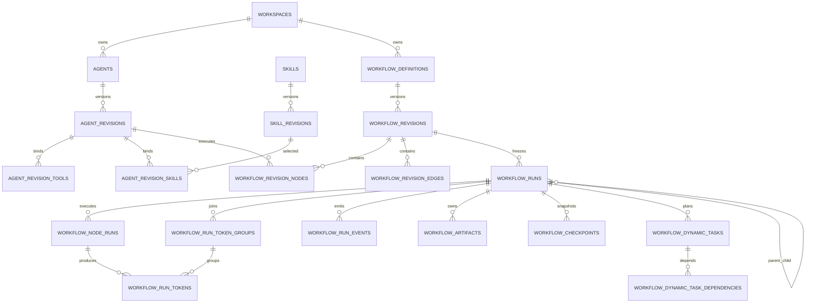

## 8. Alembic 迁移顺序

必须按下列小迁移顺序实施，保证每一步都能独立验证和降级：

| 暂定 Revision | 内容 | 为什么必须在这里 |
|---|---|---|
| `0021_orchestration_prerequisites` | Permission 增加 Workspace/scope、历史 matcher 规范化、Team AgentType 修复 | 当前 Head 后第一笔迁移，先封住租户和枚举问题 |
| `0022_skill_revisions` | 只扩展 `skill_revisions`、发布指针和兼容索引，不访问 MinIO、不回填内容 | 为可恢复的应用回填命令准备 Schema |
| `0023_agent_revisions` | 只扩展 `agents` 发布字段、Agent Revision/绑定和 Permission Agent FK，不解析 ToolRegistry | 为 Agent 应用回填和 Workflow 引用准备 Schema |
| `0024_workflow_definitions` | Workflow Definition/Revision/Node/Edge | 先完成控制面，尚不开放运行 |
| `0025_workflow_runtime` | Run/NodeRun/TokenGroup/Token/Event/Artifact/Checkpoint | 建立持久运行事实源 |
| `0026_workflow_links` | ToolCall、SessionTurn、SubAgentRun、Interaction 关联 | 依赖 `0025` 的运行表 |
| `0027_dynamic_tasks` | Planner 动态任务和依赖 | 仅在 Planner 阶段上线 |
| `0028_peer_runtime` | Peer Member/Message/Task Lease | 仅在真正 P2P 阶段上线 |
| `0029_remove_legacy_projections` | 删除 `agent_tools/agent_skills`、`skills.frontmatter/version/skill_hash`、`agents.system_prompt/model_name`；保留 `agents.is_enabled` | 所有读写切换并观察一个版本周期后最后清理 |

### 8.1 每个迁移的实施规则

1. ORM 和迁移必须同时写中文 table/column comment，且与第 7.0 节目录逐项比对。
   对已存在表（`skills`、`agents`、`tools`、`agent_tools`、`agent_skills`、`tool_calls`、`session_turns`、
   `runtime_suspensions`、`interaction_requests`、`subagent_runs`、`permission_rules`）由对应迁移显式
   执行 `create_table_comment`，使数据库实际注释与目录一致；不能只修改 Python 类上的
   `__table_args__`。
2. 新 ORM 同步登记 `database/registry.py` 后，运行 Alembic metadata 差异检查，确认没有把其他
   feature 表误判为删除。
3. 循环外键采用“先建表、后 `op.create_foreign_key`”的显式顺序。
4. 所有部分索引在真实 PostgreSQL 集成测试中验证，不能用 SQLite 替代。
5. Alembic 迁移中禁止调用 MinIO、LLM、ToolRegistry 或运行时配置。Skill/Agent 回填由第 8.2 节
   的可重入应用命令完成；`0019` 已完成旧 global Skill 的 Workspace 归属迁移，本阶段不再重复
   复制或猜测归属。
6. 大表加列优先 nullable -> 分批回填 -> 加约束，避免长时间锁表。
7. downgrade 按反向依赖顺序删除外键、索引和表；迁移文件必须提供显式 downgrade。
   Permission 的五个部分唯一索引和 generated column 若通过 `op.execute()` 创建，downgrade 必须
   按精确名称显式删除，不能依赖 autogenerate 猜测表达式索引或生成列。
8. `0029` 是数据破坏性迁移，只有完成备份、对象完整性扫描和至少一个版本的兼容观察期后执行。
9. 每个迁移的真实 PostgreSQL 测试读取 `pg_catalog` 的 `obj_description/col_description`，按第 7.0
   节和字段表逐项断言表、业务字段及 Base 公共字段注释非空、含中文且与规范文本完全一致；ORM 有
   comment 但数据库 `pg_description` 为空时，迁移不得验收。

### 8.2 Skill 与 Agent 的可恢复应用回填

这两个回填是 `0022 -> 0023 -> 0024` 之间的发布门槛，不是 Alembic `upgrade()` 的一部分。首次
发布不能直接 `upgrade head` 越过门槛，应按目标 Revision 执行：

1. 升级到 `0022_skill_revisions`，部署同时理解旧列和 Revision 的代码，编排功能开关保持关闭。
2. 先运行计划新增的 `uv run python -m skill.backfill_revisions --dry-run`，输出对象缺失、重名、
   非法路径和预计复制字节数；确认后分批正式运行。
3. Skill 命令按 `skills.id` 游标扫描。对每行读取真实前缀 `{workspace_id}/{name}/`，仅为兼容
   旧数据时回退 `{name}/`；规范化路径后读取对象、计算逐文件 SHA-256、manifest hash 和总大小，
   再复制到不可变 `skills/{skill_id}/{revision_id}/` 前缀。
4. 对象写完后开启短数据库事务并锁 Skill；若发布指针已经指向相同 manifest 则幂等跳过，否则
   插入 Revision 1 并设置发布指针。DB 失败留下的对象是可识别 orphan，由安全窗口后的清理器处理。
5. 命令必须支持 `--batch-size`、`--resume-after-id`、结构化失败报告和重复运行；进度以已经提交的
   Revision/发布指针为事实，不依赖进程内游标。完整性检查重新读取目标对象并核对数量、大小和 hash。
6. Skill 全量校验通过后升级到 `0023_agent_revisions`。先运行计划新增的
   `uv run python -m agent.backfill_revisions --dry-run`，再执行正式回填。
7. Agent 命令为每个存量 Agent 解析非空的精确模型名：原列为空时冻结当前部署的默认模型；从
   `tools + ToolRegistry` 冻结 tool key、runtime name、Schema/hash 和构建版本；从 Skill 发布指针
   冻结精确 Skill Revision。任一依赖缺失则该 Agent 失败并阻断后续门槛。
8. Agent Revision、Tool/Skill 绑定和 `published_revision_id/lifecycle_status` 在同一短事务插入；
   `content_hash` 覆盖主表和有序绑定。重复运行命中相同 hash 时只校验并返回，不重复创建版本。
9. 只有“所有有效 Skill 有可读取发布 Revision、所有有效 Agent 有可解析发布 Revision、源/目标
   数量和 hash 报表一致”后，才允许升级 `0024_workflow_definitions` 并开放控制面。

回填命令只在短时间内持有单个 Definition 行锁，MinIO 列举/复制和 ToolRegistry 解析都在锁外完成；
落库前再次检查源指纹，发现并发修改就放弃本批并重算，不能拿过期快照发布。

### 8.3 发布期间的双读双写

- Skill Revision 上线后，上传 API 同时维护旧字段和新 Revision，读取优先 Revision、缺失时回退旧列。
- Agent Revision 上线后，旧增改 API 改为“创建 Revision + 发布”，并在同一事务同步旧配置列和
  `agent_tools/agent_skills` 投影；运行解析优先精确 Revision。
- 完成全量回填和指标观察后去掉回退，再由 `0029` 单独删除旧列和旧绑定表。
- Workflow 新表没有旧数据来源，不需要双写；功能开关关闭时只允许管理和校验，不允许创建 Run。
- 任何迁移失败都不得回退到覆盖式 MinIO 写入路径。

### 8.4 `0029_remove_legacy_projections` 精确清理与降级

`0029` 的 upgrade 只删除以下兼容投影，不能使用模糊的“等可变列”：

- 删除 `agent_tools`、`agent_skills` 两张旧绑定表及其索引/约束。
- 删除 `skills.frontmatter`、`skills.version`、`skills.skill_hash`；先删除旧
  `skill_hash` 索引。`skills.description/scope/published_revision_id` 保留。
- 删除 `agents.system_prompt`、`agents.model_name`。`agents.is_enabled` 保留，它仍是阻止新运行的
  运维开关；`description/lifecycle_status/published_revision_id` 也保留。
- 不删除旧 MinIO 前缀。对象保留策略在数据库切换稳定后单独执行，不能与 DDL 清理绑定。

执行前必须满足：所有生产读写已经只使用 Revision；双写差异指标连续一个版本周期为零；所有活动
Definition 都通过发布指针完整性扫描；已完成包含旧列和两张旧表的可恢复逻辑备份并实际演练恢复。

downgrade 先按第 7 节的精确中文注释、类型、索引和约束重建旧列/表，再从备份恢复原投影。没有备份
时只能从当前发布 Revision 做有损重建：Skill 使用 `frontmatter/declared_version` 和
`COALESCE(bundle_hash, legacy_bundle_hash)`；Agent 使用发布 Revision 的 Prompt/模型；绑定使用发布
Revision 的 Tool 和 Skill Definition。该路径无法恢复清理前的软删除状态、更新时间和未发布投影，
且遇到无发布指针的 Definition 必须终止，不能填空 Prompt 或猜版本。因此生产 downgrade 的前置
条件是备份可用，而不是依赖有损重建兜底。

## 9. 核心运行算法与事务边界

### 9.1 发布 Agent Revision

1. API 完成认证、Schema 转换，调用 AgentService。
2. AgentService 校验当前用户对 Workspace 的管理权限。
3. 锁定 `agents` 行，分配下一个 `revision_number`。
4. 调 ToolService 查询 Tool Schema；调用 SkillService 解析精确 Skill Revision 和作用域。
5. 规范化 Prompt、解析后的精确模型名、模型参数、Tool/Skill 绑定快照、权限和预算，计算
   `content_hash`；不能只计算 `agent_revisions` 主表字段。
6. 重复 hash 直接返回已有 Revision；否则插入 Revision 和绑定行。
7. 如果请求同时发布，更新 Definition 的指针和生命周期状态。
8. 由普通 `get_db` 请求事务统一提交；Service/Repository 不自行 commit。

发布后任何字段都不能更新。归档 Definition 不影响已有 Run，也不清空发布指针；只阻止新 Run
或新 Workflow Revision 继续引用。

`tools` 当前没有实现版本字段。回填 Revision 1 时，`tool_implementation_version` 使用部署构建号；
无法取得历史构建号时显式保存 `legacy-unknown`，不能伪造可重放版本。今后每次发布都从 Worker
构建元数据注入真实版本。

存量 Agent 的 Revision 1 同样不能由 Alembic 凭数据库列直接生成：`agents.model_name` 为空时要
解析部署时的真实默认模型，Tool 绑定要同时读取 `tools` 目录和 `ToolRegistry` 的运行时 Schema，
实现版本来自构建元数据，Skill 绑定还要解析已经完成回填的发布 Revision。`0023` 只扩表，应用
回填命令完成冻结和发布指针切换；任何 Tool 未注册、Skill 未发布或默认模型无法解析都必须记录
失败并阻止进入 `0024`，不能生成看似成功但不可执行的 Revision。

### 9.2 发布 Workflow Revision

Compiler 在任何数据库写入前先构建内存候选图，随后执行：

1. Schema 版本、节点 key、边 key 和引用格式校验。
2. 恰好一个 Start，至少一个 End；`entry_node_key` 指向 Start。
3. 从 Start 可达所有有效节点；除显式错误终点外，所有节点都能到达 End。
4. 非 loop 边构成的子图必须无环；每条 loop 边有局部上限。
5. Router 有默认路由或显式无匹配错误策略。
6. Fork/Join 配对，Join 的 `all/any/quorum` 参数可满足。
7. 上游 output schema 与边映射、下游 input schema 兼容。
8. Agent/Skill/Subworkflow Revision 存在、未软删、在同一 Workspace 且允许被引用。
9. 子工作流引用图无递归环，静态深度不超过 `max_depth`。
10. 模式专属约束通过，例如 Debate 至少两个 Debater、Router 至少两个候选专家。
11. 所有预算为正且局部预算不超过全局预算。
12. 规范化节点、边和配置并计算 `compiled_graph_hash`。

校验通过后锁 Definition，插入 Revision/Node/Edge，按需切换发布指针。数据库写入在一个请求事务
中完成，不能发布半张图。

### 9.3 创建 Run

1. API 读取 `Idempotency-Key`，没有时生成并返回；客户端重试必须复用。
2. OrchestrationService 按 `workspace_id + workflow_definition_id` 查询并校验权限。
3. 解析当前发布 Revision；调用方也可显式指定有权限的 Revision 用于历史回放。
4. 用 Revision `input_schema` 校验输入，并合并允许覆盖的 `run_config`。
5. 在一个事务内插入 `workflow_runs(status=queued)`、Start Token 和 `run.created` Event。
6. 命中 `(workspace_id, idempotency_key)` 冲突时返回原 Run；如果相同 key 的请求体 hash 不同，
   返回 409 业务错误。
7. 请求提交后才发 Redis/进程内唤醒通知，返回 `202` 和 Run 快照，不直接执行 LLM。

### 9.4 Worker Claim

复用 Memory Job 的原则，但不要复用其表：

```sql
SELECT id
FROM workflow_runs
WHERE is_deleted = false
  AND available_at <= now()
  AND (
    status = 'queued'
    OR (status IN ('running', 'cancelling') AND lease_until <= now())
  )
ORDER BY priority DESC, available_at, created_at, id
FOR UPDATE SKIP LOCKED
LIMIT :batch_size;
```

Claim 事务生成新的 `lease_token`、原子递增 `lease_version`，再设置
`worker_id/lease_until/heartbeat_at/status` 并写必要 Event，然后立即 commit。LLM、Tool、MinIO 和
网络 I/O 全部在事务外执行。Heartbeat 使用独立 AsyncSession，且 UPDATE 必须匹配
`worker_id + lease_token + lease_version`；Worker 在租约剩余时间低于三分之一时续租。
Worker 只领取自己支持的 `workflow_revisions.engine_version`；滚动升级时旧 Worker 继续消费旧版本，
新 Worker 同时理解旧版本后才能停止旧实例。

### 9.5 Scheduler 推进图

每次推进在一个短事务内完成：

1. `SELECT FOR UPDATE` 锁 Run 并验证 Worker 仍持有未过期租约。
2. 检查取消、墙钟、预算和最大节点数。
3. 查询 pending Token，按目标节点和 `token_group_id` 分组；不同组绝不合并。
4. 普通节点一枚 Token 即可激活；Join 必须锁 TokenGroup，按冻结 branch manifest 和
   all/any/quorum 计算。成功或不可满足的组都采用 `status=open + closure_version` CAS，只允许一个
   事务创建对应的 ready/failed Join NodeRun。
5. 确定性生成 `activation_key`，利用唯一约束创建 NodeRun，重复推进时返回已有行。
6. 原子消费对应 Token；成功关闭将 Join NodeRun 置为 ready 并写 `node.ready`，失败关闭写 failed
   Join NodeRun 和 `token_group.failed`。ANY/QUORUM 成功关闭或任一策略失败关闭时都废弃组内未消费
   Token，运行中的迟到分支靠捕获的 group version 禁止再产生下游 Token。
7. 若没有活动 NodeRun、没有 pending Token 且已到达 End，则验证输出 Schema并结束 Run；
   否则判定为 `DEADLOCK_NO_RUNNABLE_NODE`，不能无限等待。

初期 Scheduler 和 NodeExecutor 可以在同一个 Worker 进程中运行，但代码边界和租约必须分开，
后续才能横向扩容。

### 9.6 NodeExecutor 执行节点

1. 用 `FOR UPDATE SKIP LOCKED` Claim ready NodeRun，设置 Node lease 和 `node.started`。
2. 加载 Workflow Revision、静态 Node、精确 Agent Revision 和绑定；禁止读取 Definition 当前指针。
3. 组装标准 NodeInput，检查节点和 Run 剩余预算。
4. 每次真正发起 LLM 前，开短事务锁 Run/NodeRun，原子执行调用名额和用量预留：只有
   `llm_call_count < max_llm_calls` 且
   `actual + reserved + 本次预留 <= 对应 token/cost 上限` 才能递增调用次数并增加
   `reserved_*`。并行节点都走同一原子门槛，不能先读取余量再各自在内存扣减。
5. 本次输入预留使用模型计数器给出的输入量，输出预留使用请求的 `max_tokens`，成本按冻结模型价格
   计算保守上界。预留事务提交后才在事务外调用 LLM；Tool 同样在调用前原子消费
   `tool_call_count` 名额。
6. LLM 返回后开短事务结算：Run 和 NodeRun 同时减去本次预留并增加供应商返回的实际
   input/output/cost。调用失败或结果用量未知时不释放名额，并把预留按保守用量结算，避免重试
   绕过预算；预算耗尽写稳定 Event 和终态。
7. 在事务外执行其余 Agent/Tool/Transform。AgentExecutor 把流式事件写入持久 EventSink。
8. 大输出先写 Artifact；准备好结构化小输出和使用量。
9. 开新事务并锁 NodeRun，验证 `worker_id + lease_token + lease_version` 仍匹配。
10. 校验 NodeOutput Schema，写输出、Artifact、Checkpoint 和节点终态 Event。
11. 根据匹配边生成下一批 Token；边条件全部不命中且无默认边时，走稳定错误码失败。
12. 更新 Run 的 `step_count`，提交后通知 Scheduler。

异常和超时不走上述成功提交：先按 RetryPolicy 判断是否还有尝试；重试耗尽后，在一笔短事务把
NodeRun 写为 `failed/timed_out`，再按 priority 选择至多一条 `error/timeout` 边并创建 Token、
Checkpoint 和 Event。没有处理边时，`fail_fast` 结束 Run，`continue` 把当前分支失败写入
TokenGroup 后继续 Join 判定，`error_route` 则以 `MISSING_REQUIRED_ERROR_ROUTE` 失败。取消不生成
边 Token，只执行第 9.8 节的结构化停止；v1 不承诺自动补偿已经完成的外部副作用。

Transform 节点只运行受控映射库。Tool 节点仍走 ToolService 和 PermissionService，不允许绕过
现有审批、Hook 和 ToolCall 记录。

### 9.7 Retry

- RetryPolicy 明确 `max_attempts`、初始退避、最大退避、抖动和可重试错误码。
- 只有超时、限流、暂时网络错误和声明幂等的工具错误可自动重试。
- 旧 NodeRun 进入 failed/timed_out 终态；Scheduler 创建相同
  `logical_instance_id/activation_key/execution_no`、`attempt_no + 1` 的新行。
- 重试 Event 必须给出下次 `available_at` 和原因。
- Agent 文本声称“失败”不等于系统失败；以结构化执行结果和异常为准。
- 有副作用但无法提供幂等性的 Tool 默认转人工，不自动重放。

### 9.8 Cancel

1. `POST /runs/{id}/cancel` 接受并回传 UUID `Command-Id`，重试必须复用；锁 Run 后，终态或已处理
   command 时幂等返回当前状态。
2. 非终态在同一事务写 `cancel_requested_at`、`status=cancelling`、`wait_reason=NULL` 和
   `run.cancel_requested` Event；必须清空 wait reason，才能满足 waiting -> cancelling 的数据库 CHECK。
3. Scheduler 停止创建新 NodeRun；对 pending/ready/waiting NodeRun 先断言 `reserved_*=0`，再在同一
   事务写 `status=cancelled`、`finished_at=now()` 和 `node.cancelled` Event，并取消未消费 Token。
   把 open TokenGroup 置为 cancelled 时必须在同一事务递增 `closure_version`、写
   `closed_at=now()` 和 `token_group.cancelled` Event，使迟到分支不能继续路由并满足非 open 状态
   CHECK；等待中的人工恢复入口此后只能幂等返回 Run 已取消，不能重新生成 Token。
4. 正在运行的 Agent/Tool 通过 cancel token 协作退出；外部 SDK 超时作为最后兜底。
5. 每个在途 NodeRun 退出或被接管时，在匹配 attempt/fencing token 的同一短事务结算预留：调用已经
   发出且实际用量未知时按保守预留量计入实际用量，确认未发出时才释放；随后清零该 NodeRun 的
   `reserved_*`，从 Run 的对应 `reserved_*` 原子扣除，并写该 NodeRun 的 `status=cancelled`、
   `finished_at=now()` 和 `node.cancelled` Event。禁止直接把 Run 聚合预留粗暴清零。
6. 子 Run 由父取消向下传播；只有全部活跃 NodeRun/子 Run 已终止且 Run 三个 `reserved_*` 都为 0，
   才能在同一事务写 `status=cancelled`、`finished_at` 和 `run.cancelled` Event。
7. 关闭 SSE、浏览器 AbortController 或页面刷新都不能触发 Cancel。

### 9.9 Crash Recovery

- Worker 意外退出后，Run 和 Node lease 到期即可被其他 Worker 认领。
- 新 Worker 读取关系表和最近 Checkpoint，不从内存 Event Queue 猜测状态。
- 已完成 NodeRun 不再次执行；running 且租约过期的 NodeRun根据幂等能力重试或转人工。
- 接管 Worker 发现 NodeRun 仍有 `reserved_*` 时，先把预留按保守用量结算并清零，再决定是否重试；
  不能直接释放未知结果的预留，否则供应商已受理但本地超时的调用会逃逸预算。
- 旧 Worker 恢复后必须用 `worker_id + lease_token + lease_version` 做 fencing，更新不匹配则
  放弃结果。
- Artifact 上传成功、数据库写入失败会产生 orphan；后台保留任务按 object prefix 和 DB 引用清理。

系统只能对数据库状态转移提供 exactly-once 效果；外部 Tool I/O 通常是 at-least-once，必须通过
业务幂等键或人工确认控制副作用。

### 9.10 Event 与状态一致性

- Run/Node 生命周期状态变化和对应 Event 同事务。
- Event 是观测日志，不是调度事实；调度依据 Run、NodeRun、TokenGroup、Token 和 Checkpoint。
- Event payload 不放系统 Prompt、完整 Tool 输出、秘密或未脱敏异常堆栈。
- PostgreSQL commit 成功后再 publish Redis；publish 失败不回滚业务事务。
- SSE 订阅即使完全不使用 Redis，也能通过数据库轮询补齐所有事件。

### 9.11 SSE 重放

端点：`GET /api/orchestration/runs/{run_id}/events`。

1. 先验证当前用户仍可访问 Run 所属 Workspace。
2. 从 HTTP `Last-Event-ID` 或 query `after_sequence` 读取游标；两者同时存在时必须一致。
3. 查询 `sequence > cursor ORDER BY sequence LIMIT batch_size` 并逐条发送。
4. SSE `id` 使用十进制 sequence，`event` 使用 `event_type`，`data` 使用统一 JSON 外壳。
5. 追平后等待 Redis 通知或短周期数据库轮询；定期发送 comment heartbeat。
6. 收到终态事件后继续补齐同事务内剩余事件，再正常关闭；客户端也可稍后重新连接历史回放。
7. 游标早于保留窗口时返回稳定错误和最早可用 sequence，前端退回 Run Graph 快照。

SSE 接口是 `StreamingResponse` 例外，不使用 `ApiResponse`；其他 JSON API 继续使用统一响应外壳。

## 10. API 与 Schema 设计

### 10.1 Agent API

| 方法与路径 | 用途 | 权限 |
|---|---|---|
| `POST /api/agents` | 创建 Agent Definition | Workspace member；可按产品限制为 admin |
| `GET /api/agents` | 当前 Workspace 分页列表 | Workspace member |
| `GET /api/agents/{agent_id}` | Definition、发布版本和摘要 | Workspace member |
| `POST /api/agents/{agent_id}/revisions/validate` | 只校验候选配置，不落库 | Workspace admin/owner |
| `POST /api/agents/{agent_id}/revisions` | 创建不可变 Revision | Workspace admin/owner |
| `GET /api/agents/{agent_id}/revisions` | 版本历史 | Workspace member |
| `POST /api/agents/{agent_id}/publish` | 原子切换发布指针 | Workspace admin/owner |
| `POST /api/agents/{agent_id}/archive` | 阻止新引用 | Workspace admin/owner |

`AgentRevisionCreateRequest` 至少包含：

```text
system_prompt, model_provider, model_name, model_parameters,
context_policy, delegation_policy, permission_policy,
max_iterations, timeout_seconds, token/cost budgets,
tools[{tool_name, permission_behavior, execution_config}],
skill_revision_ids[], change_note
```

响应中同时返回 `revision_id/revision_number/content_hash` 和解析后的 Tool/Skill 摘要。服务端忽略
客户端传来的 Workspace ID，以认证上下文为准。

### 10.2 Workflow API

| 方法与路径 | 用途 |
|---|---|
| `GET /api/workflow-templates` | 返回九种模板、参数 Schema、最少 Agent 数和 `available_from_stage/implemented`，未实现模板不可发布 |
| `POST /api/workflows` | 创建 Definition，可指定 template type |
| `GET /api/workflows` | Workspace 分页列表 |
| `GET /api/workflows/{workflow_id}` | Definition 和发布摘要 |
| `POST /api/workflows/{workflow_id}/revisions/compile` | 模板参数编译为候选 IR，不落库 |
| `POST /api/workflows/{workflow_id}/revisions/validate` | 返回结构化错误和警告 |
| `POST /api/workflows/{workflow_id}/revisions` | 保存不可变 Revision/Node/Edge |
| `GET /api/workflows/{workflow_id}/revisions/{revision_id}/graph` | 获取精确执行图 |
| `POST /api/workflows/{workflow_id}/publish` | 切换发布指针 |
| `POST /api/workflows/{workflow_id}/archive` | 阻止新运行 |

校验错误不要只返回字符串，`details` 至少包含：

```json
{
  "errors": [
    {
      "code": "UNBOUNDED_LOOP",
      "path": "edges.review_to_supervisor",
      "node_key": "reviewer",
      "message": "循环边必须配置 max_traversals"
    }
  ],
  "warnings": []
}
```

### 10.3 Run API

| 方法与路径 | 用途 | 关键语义 |
|---|---|---|
| `POST /api/workflows/{workflow_id}/runs` | 创建 Run | `202`，要求/返回幂等键 |
| `GET /api/orchestration/runs/{run_id}` | Run 聚合快照 | 状态、预算、错误、父子关系 |
| `GET /api/orchestration/runs/{run_id}/graph` | 静态图 + 运行覆盖 | 支持刷新后恢复页面 |
| `GET /api/orchestration/runs/{run_id}/events` | SSE 实时/历史重放 | 支持 `Last-Event-ID` |
| `GET /api/orchestration/runs/{run_id}/events/history` | 分页事件审计 | 普通 JSON API |
| `GET /api/orchestration/runs/{run_id}/artifacts` | Artifact 列表 | 不直接内联大文件 |
| `GET /api/orchestration/artifacts/{artifact_id}/download` | 鉴权下载 | 短期签名或代理流式下载 |
| `POST /api/orchestration/runs/{run_id}/cancel` | 持久取消 | UUID `Command-Id` 幂等，不等同关闭 SSE |
| `POST /api/orchestration/runs/{run_id}/retry` | 从输入创建新 Run | 新 idempotency key，记录来源 |

首期不开放“任意重跑单个已成功节点”。只有在 Tool 幂等、下游失效范围和 Artifact 血缘全部
明确后，才能增加受控的 `retry-from-node`。

### 10.4 Run Graph Response

Graph API 必须直接使用执行 IR 的 ID，不能像参考项目 Peer 图那样隐藏实际 Decision 节点。响应外壳固定为：

```json
{
  "run": {
    "id": "...",
    "status": "running",
    "last_sequence": 42,
    "current_owner_node_id": null
  },
  "revision": {"id": "...", "hash": "...", "template_type": "pipeline"},
  "nodes": [
    {
      "id": "static-node-uuid",
      "key": "researcher",
      "type": "agent",
      "semantic_role": "worker",
      "label": "Researcher",
      "ui_metadata": {},
      "runtime": {
        "aggregate_status": "running",
        "active_node_run_ids": ["..."],
        "attempts": 1,
        "usage": {}
      }
    }
  ],
  "edges": [],
  "token_groups": [],
  "dynamic_nodes": [],
  "child_runs": []
}
```

并行时可能同时有多个 running 节点，前端不能只维护单个 `current_node_id`。循环节点要展示
iteration、execution_no 和 attempt_no，动态 Planner task 放 `dynamic_nodes`，Hierarchical 的子 Run 用
`child_runs` 展开。

### 10.5 人工交互 API

复用现有 Interaction API 的响应 Schema和锁语义，增加按 Workflow Run 查询待处理请求的入口。
用户回复时同时校验：

- 用户仍有 Run 所属 Workspace 的访问权。
- Request 仍是 pending，NodeRun 仍是 waiting。
- payload 符合创建时冻结的 Schema。
- 相同响应幂等成功，不同响应返回 409。
- 响应、Interaction 状态、NodeRun ready、Run queued 和对应 Event 在一个事务完成。

### 10.6 响应与错误

- 所有普通接口使用 `ApiResponse[T]` 和 `ok(data, request)`。
- 业务错误使用 `AgentException.message("中文消息", details)`。
- 对外错误只给稳定错误码和脱敏说明；完整 SDK 异常通过 `logger.exception` 留在服务端。
- 列表 API 必须分页，不能一次返回 Workspace 全部 Revision、Run 或 Event。

## 11. 详细实施顺序

每个阶段都有独立交付门槛。未达到“验收门槛”时，不开始依赖它的下一阶段；功能开关默认关闭，
因此可以先部署数据库和只读接口，再逐步开放运行流量。

### 阶段 0：安全基线与兼容性修复

#### 目标

先消除会被自定义 Agent 放大的跨租户、权限和枚举问题，建立可重复的测试基线。

#### 实施节点

1. 记录当前 `git status`，区分用户已有改动；不得覆盖 `memory/user/workspace` 等在途修改。
2. 使用 `.env` 中现有 PostgreSQL、Redis 和 MinIO 配置做连通性检查；连接失败只报告，不安装或
   启动替代服务。
3. 运行当前完整测试，保存通过数、失败数和失败原因，作为后续每阶段基线。
4. 把 `TeamSpawnInput.agent_type` 改为 `AgentType`，默认
   `AgentType.GENERAL_PURPOSE`；Service 和 ORM 统一保存 `general-purpose`。
5. 迁移历史 `team_members.agent_type='general_purpose'`，downgrade 可反向转换。
6. Permission API 增加 `get_current_active_user` 和可信 Workspace 上下文；Skill API 已完成该改造，
   本阶段只补回归测试，不能重复实现另一套依赖。
7. 给 Permission 增加第 7.5.5 节的 Workspace/scope 字段；Agent FK 留到阶段 2。
8. 不重复迁移 `skills.workspace_id`；确认当前每个 Skill 都有有效 Workspace，删除旧普通唯一约束
   的计划放到 `0022_skill_revisions`，以便软删除后同名可重建。
9. 给 Permission 增加 Workspace/scope 组合约束；无法可靠归属的历史 global 规则导出审计清单并默认停用。
10. 验证 SubAgent 调用 Tool 仍经过 PermissionService；`ask` 在无恢复通道的 SubAgent 中 fail closed。
11. Skill 脚本执行在生产配置默认关闭；在真正沙箱完成前只允许受控开发环境显式开启。
12. 新增总开关 `AGENTOS_ORCHESTRATION_ENABLED=false`，此阶段不创建任何 Run。
13. 对本方案引用的 Spring AI Alibaba Java 文件生成排序后的 SHA-256 manifest，并在 ADR 记录
    `pom.xml=1.1.2.2`、源码根路径和生成时间；源码目录没有 `.git`，不能只记录不存在的 commit。

#### 配置同步

本阶段及后续新增的每个 `AGENTOS_` 配置必须同步修改 `.env`、`.env.example` 和
`core/config.py::Settings`。`.env.example` 只能放安全占位符。

#### 测试

- TeamSpawn 默认值、显式四种 AgentType、历史值迁移升级/降级。
- 未认证访问 Skill/Permission 返回认证错误。
- Workspace A 不能读取或修改 Workspace B 的规则和 Skill。
- `0021` dry-run/upgrade 覆盖：有效 session 规则按 Session 回填 Workspace；旧 global、脏 Session 和
  未知 matcher 规则先导出再转删除墓碑；`general_purpose` 规范化为 `general-purpose` 后才查重。
- 内置危险工具默认 ask，SubAgent 不可绕过，verification 的受限 Bash 规则保持原契约。
- 真实 PostgreSQL 验证 Permission 部分索引和迁移回填。

#### 验收门槛

- 完整测试不低于阶段开始时基线。
- 代码搜索不再出现作为默认/持久值的 `general_purpose`。
- 所有 Skill/Permission 写 API 都有认证和租户校验。
- 编排开关关闭时所有新增 Run 入口不存在或返回明确的未启用业务错误。

#### 回滚

关闭编排开关；回滚 `0021_orchestration_prerequisites`。如果旧 global allow 规则已经停用，不自动
恢复，需管理员按审计清单确认，避免回滚重新开放跨租户权限。

### 阶段 1：冻结术语、状态机和 Compiler 契约

#### 目标

先把执行协议写成可测试的 Pydantic/dataclass 契约，不连接 LLM、不创建数据库 Run。

#### 实施节点

1. 在 `orchestration/schemas.py` 定义 Node、Edge、NodeInput、NodeOutput、
   `RouteDecision/DelegationDecision/HandoffDecision/SupervisorReviewDecision/DebateVerdict`
   discriminated union、Budget、RetryPolicy 和 ValidationIssue。
2. 在 `orchestration/state_machine.py` 用不可变集合定义 Run/Node 合法迁移，非法迁移统一抛
   `AgentException`。
3. 在 `orchestration/compiler.py` 实现规范化排序、hash、图遍历、环检查、可达性、默认路由、
   Fork/Join、JSON Schema 和模式专属校验。
4. 条件解析器只接受受控 JSON 操作符，并限制深度、节点数和字符串长度，防止恶意表达式耗尽 CPU。
5. 建立 Node Handler 协议，但只注册 no-op 的 Start/End/Transform 测试实现，不接入 AgentRuntime。
6. 冻结九种 canonical 模式和两个导入 alias，任何 API/数据库保存前先规范化；本阶段只实现
   `single_agent_chat`、`pipeline`、`router_specialists` 三种模板的 Compiler，其他模板返回稳定的
   `ORCHESTRATION_TEMPLATE_NOT_IMPLEMENTED`，不能用“能存配置”冒充“能执行”。
7. 写一份版本化 IR JSON fixture，后续版本升级必须保持旧 `schema_version` 可读取或显式迁移。
8. 新增 `docs/adr/0001-orchestration-engine-boundary.md`，冻结“AgentOS 拥有父图持久调度、第三方图框架
   只能作为可选节点适配器”的边界；MVP 依赖锁中不得出现未经新 ADR 批准的 LangGraph/LangChain。

#### 数据库

无数据库迁移。此阶段只建立纯逻辑模块，确保 Compiler 可以快速单元测试。

#### 测试

- 单入口、多终点、孤儿节点、不可达终点、普通环、合法有界 loop。
- Router 零默认、多默认、条件冲突和非法目标。
- Fork all/any/quorum 的合法和不可能满足组合。
- 跨节点 Schema 兼容/不兼容。
- 三种 MVP 模板出现 `subworkflow` 时返回稳定未实现错误；递归引用和深度校验留到阶段 11。
- 规范化输入顺序不同但语义相同，hash 必须一致。
- 条件表达式深度和大小边界。

#### 验收门槛

- 三种 MVP 模板都能编译为同一 IR Schema；其余六种只完成类型冻结和稳定的未实现错误。
- Compiler 是纯函数或显式依赖读取接口，不在内部 commit 或调用 LLM。
- 所有非法图都有稳定错误码和精确 path/node_key。
- ADR、依赖锁和代码导入扫描结果一致，不存在第二套父图 Checkpointer 或调度事实源。

#### 回滚

仅代码模块，无数据。删除未被 API 引用的新增模块即可；不得留下空注册表或占位路由。

### 阶段 2：Skill Revision 与 Agent 控制面

#### 目标

让用户真正能创建可复现的 Agent，并绑定精确 Tool/Skill 版本，但暂不执行 Workflow。

#### 实施节点

1. 实施 `0022_skill_revisions` 的纯 DDL expand，再按第 8.2 节实现并运行可恢复的 Skill 应用回填
   命令，把每个 Workspace Skill 当前对象集合冻结为 Revision 1。
2. 改造 Skill 上传路径为不可变 prefix；同一 manifest hash 幂等返回，不删除历史 prefix。
3. SkillService 增加按 Revision 加载正文、资源和脚本的方法；旧按 name 方法内部解析发布指针。
4. 实施 `0023_agent_revisions` 的纯 DDL expand：复用 `agents`，新增 Agent Revision 和两个版本
   绑定表；随后由 Agent 应用回填命令解析 ToolRegistry、精确默认模型和构建号，生成 Revision 1
   并建立复合发布指针。
5. 实现 AgentRepository 的 Workspace 过滤、行锁、版本号分配和分页查询。
6. AgentService 通过 ToolService/SkillService 完成发布校验，不能跨域直用 Repository。
7. 映射 Anthropic 模型参数前，先核对官方 API 文档和项目实际安装 SDK 版本，建立允许参数白名单，
   不把任意 JSON 直接透传 SDK。
8. Agent Runtime Resolver 只返回冻结 dataclass：Prompt、model snapshot、Tool schema、Skill revision、
   budget 和 permission；调用方不持有 ORM 对象跨事务运行。
9. 增加 Agent API、Schema 和 `api/router.py` 注册；所有普通响应使用 `ApiResponse`。
10. 先提供“预览 Prompt/Tool/Skill catalog”接口，预览内容必须脱敏且有大小上限。
11. 加入审计日志：创建 Definition、创建 Revision、发布、归档，包含 Workspace、用户和 Revision ID。

#### 事务与对象存储

- Skill 上传先对象存储后数据库；失败对象进入 orphan 清理。
- 存量 Skill/Agent 回填不在 Alembic 事务内执行；命令必须分批、幂等、可 dry-run 和断点续跑。
- Agent Revision 与所有绑定在同一事务插入。
- 发布锁 Definition；复合外键保证发布指针属于当前 Definition。
- 不在 Service 内 commit，由 API 的 `get_db` 统一处理。

#### 测试

- Skill 旧数据迁移后的正文和资源 hash 与迁移前一致。
- 同 bundle 幂等、同名新内容产生新 Revision、旧 Revision 仍可读取。
- Agent 创建、重复 name、软删除后重建、Revision 编号并发竞争。
- 绑定未知 Tool、跨 Workspace Skill、已删除 Skill、Skill 所需 Tool 缺失均拒绝发布。
- Agent Revision 发布后尝试更新/删除被拒绝。
- 内容相同请求返回已有 hash，不创建重复 Revision。
- MinIO 写成功 DB 失败产生 orphan，清理器只删无 DB 引用且超过安全窗口的对象。

#### 验收门槛

- 给定 Agent Revision ID，多次解析得到完全相同 Prompt、模型参数、Tool/Skill 版本和 hash。
- 后续覆盖上传同名 Skill 不改变旧 Agent Revision 的解析结果。
- Workspace A 无法引用或读取 Workspace B 的 Agent/Skill。

#### 回滚

关闭 Agent 管理入口；先回滚 Agent 表，再回滚 Skill Revision。只删除本阶段新 prefix，原有兼容
字段和旧对象在 `0029` 前仍保留，能够恢复旧读取路径。

### 阶段 3：Workflow 控制面与版本化图

#### 目标

完成图的创建、校验、发布和只读展示，仍不启动实际运行。

#### 实施节点

1. 实施 `0024_workflow_definitions`，创建四张控制面表和复合外键。
2. WorkflowRepository 只负责本域 CRUD、锁和批量插入 Node/Edge。
3. WorkflowService 调 AgentService 校验 Agent Revision；调用自身 Compiler 校验图。
4. 实现 TemplateRegistry：登记九种模板的 canonical type、类型化参数 Schema、
   `available_from_stage/implemented` 和 Compiler。只有本阶段已实现的三种模板可以输出候选 IR；
   高级模板可以登记参数描述，但调用 compile/publish 必须返回
   `ORCHESTRATION_TEMPLATE_NOT_IMPLEMENTED`。
5. 实现 compile/validate/create revision/publish/archive API。
6. Graph API 直接查询 Revision Node/Edge 并返回执行图 ID，不做运行态拼接。
7. `ui_metadata` 只保存位置和分组；执行器、hash 和条件判定不得依赖坐标。
8. 实现 Multi-Agent-Playground 导入适配器，把五种旧 type 和 agent ids 转为 canonical 模板参数；
   不导入其内存 Trace 或固定展示图。
9. 加入 feature flag：控制面可灰度开放，Run API 仍关闭。

#### 发布前强制校验

- 图结构和 Schema 的第 9.2 节全部规则。
- 发布指针属于当前 Definition。
- Agent/子图 Revision 同 Workspace，且目标没有归档。
- 模板最少 Agent 数、角色唯一性、预算和安全策略。
- 图 hash 与持久 Node/Edge 重新规范化后的 hash 相同。

#### 测试

- `single_agent_chat`、四种 `pipeline` 图结构和 `router_specialists` 的 golden IR；高级模板在对应
  阶段启用前只验证参数 Schema 与 `ORCHESTRATION_TEMPLATE_NOT_IMPLEMENTED` 错误。
- 两个用户同时创建 Revision，版本号不重复。
- 复合 FK 拒绝跨 Revision Edge 和错误发布指针。
- 导入五种参考模式后 canonical type 和参数无损；只有本阶段已实现的 alias 可以产生预期节点和边，
  高级 alias 必须返回 `ORCHESTRATION_TEMPLATE_NOT_IMPLEMENTED`，不能产生或发布占位 IR。
- 图响应节点 ID 与数据库 ID 完全一致。
- Alembic upgrade/downgrade 和 registry 完整性。

#### 验收门槛

- 管理页面即使尚未实现，也能通过 API 完成 Agent 选择、模板编译、校验、发布和图读取。
- 任意 Revision 保存后不可改变；再次发布新版本不影响旧版本图响应。
- 无效图无法进入 published 状态。

#### 回滚

关闭 Workflow 控制面开关；回滚 `0024`。Agent/Skill 控制面独立保留，不受影响。

### 阶段 4：Run、NodeRun、TokenGroup、Token、Event、Artifact、Checkpoint 持久层

#### 目标

先建立完整运行事实源和状态转移 Service，再接 LLM Worker。

#### 实施节点

1. 实施 `0025_workflow_runtime` 和 `0026_workflow_links`。
2. 在 `orchestration/repository.py` 实现 Run/Node/TokenGroup/Token 的行锁、Claim、关闭 CAS 和部分索引查询。
3. EventService 实现锁 Run 分配 sequence，并要求调用方传入同一 AsyncSession。
4. ArtifactService 负责 immutable object + metadata；OrchestrationService 只能调用其公开方法。
5. Checkpoint serializer 使用 `state_schema_version` 和 checksum，拒绝加载损坏快照。
6. RunService 实现创建、快照、取消命令和终态聚合，不执行节点。
7. Scheduler 先用确定性 fake handler 驱动 Start -> Transform -> End。
8. 给 RuntimeSuspension、ToolCall、SubAgentRun 加 Workflow 关联，但保持普通 Session 路径兼容。
9. 建立保留策略，但默认只标记候选，不立即物理删除事件或制品。

#### 必须同事务的操作

- 创建 Run + Start Token + `run.created`。
- Claim 状态 + lease token/version + `run.started`。
- 消费 Token + 创建/读取 NodeRun + `node.ready`。
- Node 终态 + Artifact 引用 + 新 Token + usage 计数 + Event + Checkpoint。
- 分支结果 + TokenGroup 计数/关闭 + Join NodeRun + 迟到 Token 废弃 + Event。
- Cancel 命令 + Run 状态 + Event。

#### 测试

- 真实 PostgreSQL 下 20 个并发 Claim 只能有一个持有者。
- Run/Node lease 到期可接管，旧 fencing token 无法提交。
- 重复 Scheduler 推进不重复消费 Token 或创建 NodeRun。
- Fork 原子写 branch manifest 和 N 个 Token；Join all/any/quorum 只有一个关闭者，迟到分支不能产生
  下游 Token，不同循环波次不能串组。
- TokenGroup 成功、不可满足和取消都写 `closed_at` 并递增 fencing version；失败组只创建一个带
  `JOIN_POLICY_UNSATISFIABLE` 的终态 Join NodeRun，取消组不创建 Join NodeRun。
- Run sequence 并发写入无重复、无倒序空洞；事务回滚不留下 Event。
- 跨 Revision NodeRun/Token 被复合 FK 拒绝。
- Artifact 大小、hash、对象缺失和 orphan 处理。
- Checkpoint checksum 错误时拒绝恢复并写稳定错误。

#### 验收门槛

- 不调用任何 LLM 也能完整跑通 fake Pipeline，并在数据库中重建每一步。
- 杀死 fake Worker 后由新 Worker 从租约和 Checkpoint 恢复，终态只出现一次。
- Run 快照、Node 列表、Event 历史和 Artifact 查询相互一致。

#### 回滚

保持 Run 功能开关关闭，先删除关联外键，再回滚运行表。一旦产生真实 Run，禁止直接执行数据库
downgrade；必须先停止新运行、导出 Event/Artifact 审计，并按保留策略完成存量运行处置。

### 阶段 5：独立 Worker 与 AgentExecutor

#### 目标

把现有 Agent 能力放入请求无关的 NodeExecutor，并验证长任务、重试、取消和崩溃接管。

#### 实施节点

1. 从 `runtime/agent.py` 抽出不依赖 `StreamingResponse` 的 AgentExecutor。
2. 再次核对 Anthropic 官方异步流、Tool Use、usage、超时、重试和异常文档，并与当前 SDK 版本
   的实际类型对照，避免因示例版本不同破坏流事件解析。
3. 定义 `NodeExecutionAdapter`；原生实现的输入只接受冻结 `ResolvedAgentRevision`、NodeInput、
   EventSink、预算、cancel token 和当前 attempt/fencing token，输出统一 NodeOutput。
4. Session 主 Agent 继续用原适配器；Workflow 节点用持久 EventSink，避免复制两套 ReAct。
5. ToolContext 携带 run/node/agent revision/幂等信息，ToolService 写扩展后的 ToolCall。
6. 实现 `orchestration/worker.py`：Scheduler loop、NodeExecutor loop、heartbeat、优雅停止。
7. 收到 SIGTERM 后停止新 Claim，续租正在提交的短操作，并在宽限期后释放租约。
8. LLM 流式 usage 累加到 NodeRun 和 Run 原子计数列；到预算边界立即停止下一次调用。
9. 节点超时使用 asyncio timeout；SDK 取消失败时仍靠硬超时和租约接管。
10. Retry 分类器按异常类型和 Tool 幂等能力决定自动重试、失败或人工处理。
11. 在 `core/config.py` 增加 Worker 参数，并同步 `.env/.env.example`。
12. MVP 只注册 `NativeAgentExecutionAdapter`。若后续 ADR 批准 LangGraph 适配器，必须放在可选依赖组，
    且只能提交当前 NodeRun 的 NodeOutput/Artifact/Event，不能推进父图、关闭 TokenGroup 或分配 sequence。

必须新增并同步以下配置：

```text
AGENTOS_ORCHESTRATION_WORKER_POLL_SECONDS
AGENTOS_ORCHESTRATION_RUN_LEASE_SECONDS
AGENTOS_ORCHESTRATION_NODE_LEASE_SECONDS
AGENTOS_ORCHESTRATION_HEARTBEAT_SECONDS
AGENTOS_ORCHESTRATION_CLAIM_BATCH_SIZE
AGENTOS_ORCHESTRATION_MAX_CONCURRENCY
AGENTOS_ORCHESTRATION_SHUTDOWN_GRACE_SECONDS
```

#### 测试

- Fake LLM 正常、限流、超时、流中断、非法结构化输出。
- Tool 成功、可重试失败、非幂等失败、审批等待和取消。
- Worker 在 LLM 前、Artifact 后、Node commit 前后分别崩溃的故障注入。
- 两个 Worker 抢同一 Node，旧租约结果无法覆盖。
- 父 Run 取消传播到并行节点和子 Agent。
- waiting Run 取消会原子清空 `wait_reason`；pending/ready/waiting NodeRun 取消时写 `finished_at`。
- running NodeRun 在取消时覆盖“调用未发出、实际用量已知、用量未知”三种预留结算，Run/NodeRun
  `reserved_*` 最终都为 0 后才允许进入 cancelled。
- 预算达到 Token、Tool、节点、成本、时间任一上限时终态正确。
- 适配器重复回调、旧 attempt 迟到和内部 checkpoint 恢复都不能产生第二个有效 Node 结果或父图 Token。

#### 验收门槛

- HTTP 请求返回后 Worker 仍能完成 Run；关闭浏览器不影响执行。
- 重启 Worker 后 Run 可恢复，已成功 ToolCall 不因节点重试重复产生副作用。
- 日志为中文且带 run/node/worker 上下文，不输出 Prompt、Token 或密钥。

#### 回滚

停止 Worker，关闭 Run 创建开关；已有 queued/running Run 保持数据库状态，修复后可继续，不能通过
删除行“清队列”。

### 阶段 6：独立 SSE、历史重放和运行快照

#### 目标

让任意时间打开的页面都能观察 Run，断线后从准确 sequence 继续。

#### 实施节点

1. 实现 Run Snapshot、Graph Overlay、Event History 和 SSE API。
2. Event 查询强制 Workspace 权限和 sequence 游标；restricted Event 默认不返回。
3. SSE 先补历史，再进入 tail；Redis 可选，仅用于唤醒。
4. 把现有 StreamEvent 转换为版本化 Workflow Event，不直接把自由 payload 原样落库。
5. 文本 delta 合并写入；最终完整文本进入 Artifact 或 SessionMessage。
6. 设置 heartbeat、单连接最大缓冲、慢消费者断开和重连策略。
7. 增加 Event 保留配置和最早游标错误；保留任务使用小批量物理清理。
8. 编写前端无关的 SSE 合约文档和 curl/测试客户端 fixture。

必须新增并同步以下配置：

```text
AGENTOS_ORCHESTRATION_EVENT_BATCH_SIZE
AGENTOS_ORCHESTRATION_SSE_POLL_SECONDS
AGENTOS_ORCHESTRATION_SSE_HEARTBEAT_SECONDS
AGENTOS_ORCHESTRATION_EVENT_RETENTION_DAYS
AGENTOS_ORCHESTRATION_EVENT_DELTA_FLUSH_MS
AGENTOS_ORCHESTRATION_EVENT_DELTA_MAX_BYTES
```

#### 测试

- sequence 0 全量、指定 sequence 增量、`Last-Event-ID`、非法/未来游标。
- 断线后重连不缺不重；重复事件由 `(run_id, sequence)` 去重。
- Redis 禁用或断开时数据库轮询仍工作。
- 慢消费者不会阻塞 Worker 或无限增长内存。
- 浏览器关闭连接不产生 cancel Event，也不创建第二个 Run。
- Event 保留后旧游标得到明确错误，Graph Snapshot 仍可读取。

#### 验收门槛

- Run 执行前、执行中、执行后任意时刻订阅，最终观察结果一致。
- 页面刷新后可由 Graph Snapshot + 新 Event 恢复并行节点、尝试和已走边。
- SSE 故障不会触发自动降级重跑。

#### 回滚

关闭实时 tail，保留 History 和 Snapshot API；Worker 不依赖在线 SSE，可继续执行。

### 阶段 7：首批静态模式 Single、Pipeline、Router

这三个产品模板覆盖 Agent 执行、顺序/并行/条件/循环图、类型化数据传递和结构化路由，是开放
MVP 的最小集合。Spring AI Alibaba 的 `SequentialAgent`、`ParallelAgent`、`LoopAgent`，以及
默认注册但没有 `ConditionalAgent` 包装类的 `ConditionalGraphBuildingStrategy`，在 AgentOS 中统一
编译为 `pipeline` 的四种图结构；`LlmRoutingAgent` 单独映射为 `router_specialists`，不为这些类和
策略制造多套运行器。

#### 7A. `single_agent_chat`

编译图：

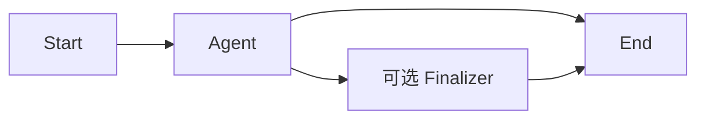

模板参数：`agent_revision_id`、可选 `finalizer_agent_revision_id`、是否继承 Session history、
输出 Schema、节点预算。

节点契约：

- Start 将 Run input 映射为 `root_goal/task`。
- Agent 运行精确 Agent Revision，可产生 ToolCall 和 Artifact。
- Finalizer 只能读取前序输出和 Artifact，默认不给副作用 Tool。
- End 校验最终 output schema 后才能把 Run 标为 succeeded。

终止条件：Agent 成功且没有 Finalizer，或 Finalizer 成功。Tool/LLM 超时、预算耗尽和取消分别进入
明确终态。

测试：无工具、只读工具、有副作用工具审批、Finalizer 开关、非法输出、取消、重试、崩溃恢复、
重复 idempotency key。

#### 7B. `pipeline`

编译图示例：

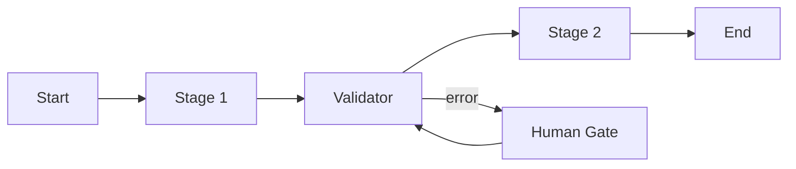

模板参数：有序 stages；每个 stage 的 primitive type、Agent/Tool Revision、输入输出 Schema、
mapping、retry、timeout 和 error policy。

约束：

- 关键业务字段必须通过 Schema 和 mapping 传递，禁止只拼接自然语言。
- 每个 Stage 最多一条 success 主边；错误可 fail、重试、走 error edge 或进入 Human Gate。
- v1 可用 `error/timeout` 边进入明确的错误处理节点，但不支持取消补偿；需要 Saga 的 Workflow 在
  Compiler 阶段拒绝发布，不能把普通 `cancel` 边当成已实现的回滚协议。
- Tool Stage 必须声明幂等策略。

终止条件：所有必需 Stage 成功且 End 输出校验通过。可选 Stage 失败仅在 Workflow 的
failure policy 允许时标记 skipped。

测试：确定顺序、Schema 不匹配禁止发布、阶段重试、错误/超时路由、断点恢复、Human Gate、
`cancel` 边被 v1 Compiler 拒绝、取消时未开始 Stage 不运行。

Pipeline 必须同时提供以下四种编译结构：

1. `sequential`：`Start -> Stage A -> Stage B -> End`，每个 Stage 输出经 reducer 和 mapping 进入
   下一节点，对齐 Spring `SequentialAgent` 的共享父图状态语义。
2. `parallel`：`Start -> Fork -> A/B/N -> Join -> Aggregator -> End`。每个分支读取不可变输入快照，
   写独立输出；Join 以 `token_group_key` 隔离一次 fan-out，支持 `all/any/quorum`，Aggregator 使用
   版本化 reducer/merge policy，不能依赖任务完成顺序。
3. `conditional`：普通节点或 Router 后接多条受控条件边，按 `priority` 依次求值，最多一条默认边；
   谓词只读已声明路径，发布时检查条件互斥警告和无默认路径错误。
4. `loop`：`LoopInit -> LoopDispatch -> Body -> LoopDispatch -> End`，支持固定次数、JSON 数组逐项和
   受控条件循环。每次进入 Body 生成新的 `execution_no/iteration`，必须同时受
   `max_traversals/max_visits/max_loops/Run budget/NO_PROGRESS` 限制。

图中的 `LoopInit/LoopDispatch/Aggregator/Validator/Finalizer` 是展示角色，不是新的 `node_type`：
LoopInit 和确定性 LoopDispatch 编译为 `transform + conditional/loop edge`，Aggregator/Validator/
Finalizer 按配置编译为 `agent` 或 `transform`，分支节点只使用 `fork/join`。Compiler 遇到不在第
5.1 节白名单中的原语必须拒绝，不能让模板名称偷偷扩展运行器协议。

Parallel 测试还必须覆盖：分支返回顺序变化、一个分支超时、`ANY_OF` 后迟到结果被 fencing 丢弃、
不同循环轮次到达同一个 Join 不串组、两个完成者并发争抢唯一关闭权、含不可撤销副作用的分支被
拒绝 ANY/QUORUM、聚合策略冲突。Loop 测试还必须覆盖 0 次、1 次、上限、数组空值、条件非法、
Worker 在回边提交前后崩溃。Conditional 测试覆盖零命中、多命中、默认边和恶意深层谓词。

#### 7C. `router_specialists`

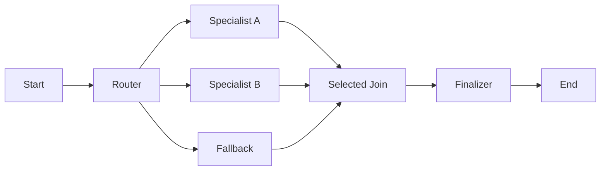

模板参数：Router Agent、至少两个 specialist Agent、允许的路由 key、`max_selected_agents`、
低置信度阈值、fallback、Join/Merge 策略和可选 Finalizer。

Router 输出必须包含 `routes[{next_node_key, task, context_patch}]`、reason、confidence，route 数量在
`1..max_selected_agents`。运行器逐项验证目标去重后仍在候选集合、用户有权限、目标没有归档，并把
每个 route 的独立 task/context 映射到对应分支；单目标直接执行，多目标创建 TokenGroup 后 fan-out
并 Join/Merge。非法 ID 走一次结构化修复，仍失败则 error/fallback；不能像当前 Spring 源码一样
只有 fallback 字段却不执行 fallback，也不能把一个 task 误发给所有目标。

终止条件：所有被选中的 required Specialist 满足 Join 策略，并由可选 Finalizer 成功合并。
Router 不得连续多次改派；多专家并发是一次结构化路由，不等于可重规划的 Planner 或多轮 Debate。

测试：每个合法专家、两个专家并行、重复 key、超出选择上限、非法 key、低置信度 fallback、Router
超时、无默认边、越权 Agent、Event 中 `edge.traversed` 与实际 NodeRun 一致。

#### 阶段 7 公共实施节点

1. 为三种模板写 TemplateCompiler 和版本化参数 Schema。
2. 注册 Agent/Tool/Router Node Handler。
3. Run API 仅对白名单 Workspace 灰度开启。
4. 每种模板提供一个无外部副作用示例 fixture 和一个真实 Tool fixture。
5. 添加端到端测试：创建 Agent -> 发布 Workflow -> 创建 Run -> SSE -> Graph Snapshot -> Artifact。
6. 完成 Agent 管理、模板 Workflow 配置和基础 Run 监控三个前端切片。
7. 收集 node latency、Run success、重试和 SSE 重连指标。

#### 阶段 7 验收门槛

- 三种模式均通过正常、失败、取消、断线和 Worker 重启测试。
- 同一个 Workflow Revision 多次 Run 的静态图 hash 相同，运行覆盖独立。
- 浏览器断线不取消、不重跑，Stop API 才会取消。
- 完成后才可以把系统称为“可用的编排 MVP”。

#### 回滚

按 template type 关闭新 Run 创建；现有 Run 继续由兼容 Worker 消费完，不能删除模板处理器导致历史
Revision 无法恢复。

### 阶段 8：Planner-Executor 与动态任务 DAG

#### 编译图

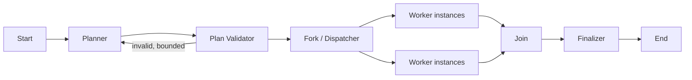

#### 结构化契约

Planner 输出 `Plan`：

```text
plan_id, tasks[
  task_key, title, goal, dependencies[], preferred_role,
  input, success_criteria, priority, max_attempts
]
```

Worker 输出 `TaskResult`：`task_key/status/summary/data/artifact_refs/evidence/error`。
Validator 输出 `valid/errors/replan_reason`。这些都必须通过 Pydantic 和 JSON Schema，不能解析 Markdown
列表来生成任务。

#### 实施节点

1. 实施 `0027_dynamic_tasks` 两张表。
2. Planner 成功后，在一个事务中插入完整任务和依赖，再做 Run 内环检测。
3. 只有所有 required dependency 成功的 Task 才进入 ready；optional dependency 失败仍可运行。
4. Dispatcher 按 preferred role、Agent capability 和预算选择 Worker 静态节点。
5. 同层无依赖任务通过 Fork 并行，受 Run `max_parallel_nodes` 限制。
6. 每个动态 Task 生成独立 activation/execution，Graph API 返回 runtime dynamic node。
7. Validator 最多允许配置次数的 replan；新计划必须有新 planner NodeRun，并保留旧计划审计。
8. Join 使用 DynamicTask 状态、TokenGroup branch manifest 和到达 Token 三重核对，避免遗漏或重复
   计算动态任务。
9. Finalizer 必须引用所有 required Task 的 result artifact；缺少结果不能成功。

#### 终止与无进展

- 所有 required Task 成功并通过 Finalizer即成功。
- required Task 达到重试上限且无 error route 时失败。
- 重规划次数、任务数、并行数和总预算任一上限耗尽时明确失败或转人工。
- 两轮计划的 canonical task/evidence 没有变化时触发 `NO_PROGRESS_REPLAN`，禁止无限重规划。

#### 测试

- 合法 DAG、依赖环、未知 dependency、自依赖、重复 task key。
- 串行依赖和并行任务的真实 PostgreSQL调度。
- Worker 失败后重派、optional 失败、required 失败、一次重规划。
- Join 等待全部 required，不被重复 Token 提前触发。
- Planner 输出任务数量和字符串大小限制。
- 动态 Graph Snapshot 刷新后节点位置和状态稳定。

#### 验收门槛

- Planner 产生的每个任务、依赖、执行和结果都有数据库记录和 Event。
- Worker 崩溃后动态 DAG 能恢复，不重新生成另一份计划。
- 并行任务不会造成 Run 原子预算计数丢失。

#### 回滚

关闭 `planner_executor` 新 Run；保留动态任务表供历史查询。不要把旧 Run 强行转换为 Pipeline。

### 阶段 9：Leader-Worker 与 Handoff 有界循环

#### 9A. `leader_worker`（参考项目 alias：`supervisor_dynamic`）

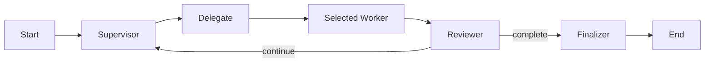

结构化对象：

- `DelegationDecision{delegations:[{target_node_key, task, wait_for_result, result_key}], context_refs, success_criteria, reason}`；本模板限制数组长度为 1
- `WorkerReport{status, summary, evidence, artifact_refs, blockers}`
- `SupervisorReviewDecision{action=continue|complete|reassign|block, completion_score, missing_items, next_task}`

实施重点：

1. Supervisor 每轮只能选择允许集合中的一个 Worker。
2. Reviewer 是独立判断节点，不能只相信 Worker 文本中的“完成”。
3. 每轮走显式 loop edge，递增 Run loop_count 和 Node execution_no。
4. 检测连续选择相同 Worker、相同 task hash、相同 artifact/evidence 的无进展循环。
5. Worker 失败可改派；改派仍保留前一次报告和 Artifact。
6. 达到 cycle 或预算上限时可转 Human Gate，默认不能伪成功。

测试：完成、继续、阻塞、改派、Reviewer 非法输出、重复委派、最大 cycle、取消传播。

#### 9B. `handoff`（参考项目 alias：`peer_handoff`）

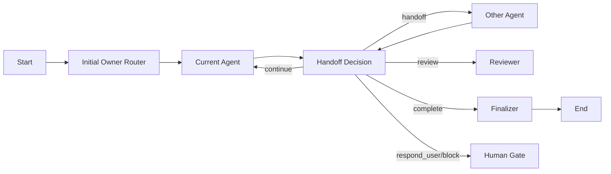

动作只允许：`continue/handoff/review/complete/respond_user/block`。每个动作必须携带目标 Agent、
任务覆盖、context patch 和 Artifact refs 中适用的字段。

实施重点：

1. Initial Router 选择首 owner；后续 owner 只通过 Handoff Decision 改变。
2. 非法目标、自 Handoff 和无权限 Agent 在落 Token 前被拒绝；自 Handoff 规范化为 continue。
3. 上下文交接只传不可变 Artifact/Message 引用和受控 patch，不复制完整隐藏 Prompt。
4. 每次 handoff 在同一锁事务更新 `current_owner_node_id`、递增 hop_count、创建下一跳 Token、写
   Checkpoint/Event；超过 `max_hops` 转 Reviewer 或失败，不能从 Event 倒推当前 Owner。
5. complete 必须由根任务 Reviewer 验证；Tool 失败或 required Artifact 缺失时不能完成。
6. respond_user/block 进入持久 Human Gate，释放 Worker lease，恢复后 execution_no 递增。

测试：合法交接、非法目标、自交接、上下文引用不丢、hop 上限、人工暂停恢复、Agent 失败改派、
根任务完成审查。

#### 阶段 9 验收门槛

- 所有回边都有局部和全局上限，且 Event 能解释为什么继续或停止。
- 无进展检测在固定输入下可确定复现。
- 刷新图页面能看到同一静态节点的多次 execution 和当前 Owner。

#### 回滚

按模式关闭新 Run；历史 Worker Handler 必须保留到所有非终态 Run 完成或人工终止。

### 阶段 10：Debate

#### 编译图

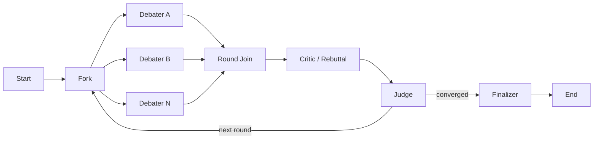

#### 结构化契约

- `Argument{claim, evidence_refs[], assumptions[], confidence}`
- `Critique{target_argument_id, issues[], counter_evidence_refs[]}`
- `DebateVerdict{decision, rationale, winning_claims[], unresolved[], confidence, converged}`

Argument、Critique、DebateVerdict 保存为 Artifact；Event 只放 ID 和摘要。各 Debater 第一轮使用隔离上下文，
不能先看到其他人的草稿；Join 后才共享已提交观点，避免伪多样性。

#### 实施节点

1. 模板要求至少两个 Debater 和一个独立 Judge。
2. Fork 为每个 Debater 创建稳定 branch；Join 按 Agent key 排序，保证相同输入的聚合顺序稳定。
3. Critic 必须引用目标 Argument ID，禁止无来源反驳。
4. Judge 输出非法时允许一次结构化修复；仍非法则失败或人工判断。
5. `converged=true`、置信阈值达到、最大轮数或预算耗尽决定停止。
6. 平局策略必须在模板中选择：继续一轮、人工判断或按证据评分，而不是代码隐式随机。
7. 轮间比较 claim/evidence hash；完全无变化时触发无进展停止。

#### 测试

- 两方/多方、并发顺序、一个 Debater 失败、Join all/quorum。
- 第一轮上下文隔离，第二轮只看到已提交 Artifact。
- 证据引用不存在、Judge 平局、非法 Verdict、未收敛到上限。
- Token 预算按参与者并发正确累加。
- Graph 显示轮次、并行 Debater 和 Judge 当前状态。

#### 验收门槛

- 每个结论可以追溯到 Argument、Critique 和证据 Artifact。
- 单个 Debater 失败时的 quorum 策略明确，不会永久卡在 Join。
- Debate 结果不能仅保存一段 Final 文本而丢失推理制品。

#### 回滚

关闭 Debate 模板新 Run；保留 Artifact 类型读取和历史图展示。

### 阶段 11：Hierarchical 子工作流

#### 编译图

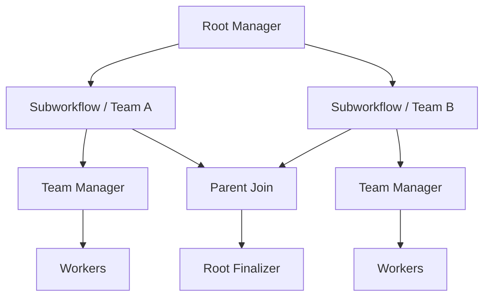

#### 实施节点

1. Subworkflow Handler 创建子 `workflow_runs`，设置 root/parent/invoking NodeRun。
2. `TaskScope` 冻结目标、允许 Agent/Tool、可见上下文、预算份额、deadline 和返回 Schema。
3. 父 Run 原子预留子预算；子 Run 完成后只返还未使用额度，不能各层独立使用全局上限。
4. 子 Run 只看到 Scope 授权的 Artifact/Memory/Skill；不能自动继承父 Workspace 的全部资源。
5. 父 NodeRun 在 waiting 时释放执行租约；子 Run 终态 Event 唤醒父 Scheduler。
6. 父取消向所有非终态子 Run 级联；子失败按父节点 retry/failure policy 处理。
7. Compiler 对静态子图引用做环检查；运行时对动态 depth 再检查一次。
8. Event correlation 和 Graph API 返回 Run tree，前端可折叠每一层。
9. 不使用当前禁止 SubAgent 再 Spawn 的两层实现伪装层级；Hierarchical 必须以子 Run 表达。

#### 测试

- 两层/最大深度、递归引用、兄弟并行、子 Run 重试。
- 预算预留、消费、返还及并发不超卖。
- 父取消、子超时、子等待人工、父 Worker 重启。
- Artifact 权限和上下文隔离，越权 Tool/Skill 被拒绝。
- Run tree Event/SSE 重放顺序和 Graph 折叠数据。

#### 验收门槛

- 任一子 Run 可独立查询和重放，同时能回到根 Run 的完整链路。
- 父 Run 不轮询 LLM 等待子结果，只等待持久状态/事件。
- 深度、预算和权限在每层都 fail closed。

#### 回滚

关闭 Hierarchical 新 Run；已存在父子 Run 必须用兼容 Worker 完成。禁止通过删除父 Run 让数据库
CASCADE 清理正在运行的子 Run。

### 阶段 12：真正的 Peer-to-Peer 高可用语义

这一阶段与 Handoff 不同。Handoff 仍由中央 Scheduler 可靠推进；Peer-to-Peer 要允许多个 Peer
独立认领、转移和复制任务，并处理重复、乱序和故障。

#### 逻辑拓扑

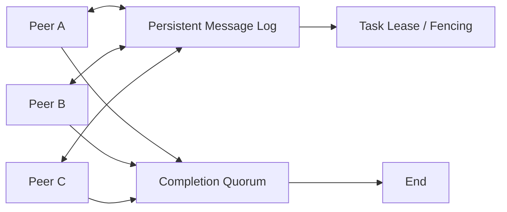

#### 实施节点

1. 实施 `0028_peer_runtime` 三张表。
2. Peer 以 epoch 和 member lease 注册；过期后进入 suspected，再由策略判定 failed。
3. 所有 Envelope 有 message_key、causation、correlation、sender、recipient、payload Schema。
4. Message 消费为 at-least-once；消费者先按 key 去重，再执行业务。
5. Task Owner 使用 lease token/version fencing；旧 Owner 恢复后不能写结果。
6. 能力匹配只决定候选，最终 Claim 仍由数据库 CAS/行锁决定。
7. 复制任务必须声明 replication factor 和结果策略：first-valid、majority 或 Judge。
8. Completion quorum 满足且没有未决 required lease 时，根 Run 才能成功。
9. 网络分区模拟中只允许持有最新 fencing token 的分区提交；无法达 quorum 时等待或超时，不可脑裂完成。
10. Worker、Redis 和应用节点可横向扩容；PostgreSQL 仍是基础设施依赖，若产品承诺“无单点”，
    数据库本身也必须采用经过验证的高可用方案，这不由编排图自动提供。

#### 测试

- Peer 心跳丢失、lease 到期接管、旧 Peer 延迟结果。
- 重复消息、乱序消息、重复 ack、consumer 崩溃后重投。
- 两个 Peer 同时 Claim、fencing CAS、任务复制和 quorum。
- 网络分区、少数派不可完成、恢复后收敛。
- 取消传播到 Peer 消息和 Task Lease。
- 大量消息下 Claim 索引、Event/Message 保留和数据库负载。

#### 验收门槛

- 故障注入证明单个 Worker/Peer 退出不会丢任务或产生两个有效 Owner。
- 乱序和重复投递不改变最终业务结果。
- 产品文案明确区分“逻辑 P2P”与“基础设施端到端无单点”。

#### 回滚

关闭新 Peer Run 和新成员注册；等待活跃 lease 到期，保留消息表用于审计。不能把非终态 P2P Run
直接切换成 Handoff，因为两者完成协议不同。

### 阶段 13：前端 Agent 管理、编排配置和运行监控

当前 AgentOS 没有前端工程。进入阶段 2 前必须完成前端技术栈 ADR 并创建独立前端项目，再选择与
该技术栈匹配的图组件；不要在后端仓库中虚构已有 Vue/React 依赖，也不要复制参考项目按节点名称
写死的 SVG 布局。阶段 13 只负责自由图编辑器与全部高级模式交互的最终收口。

这里的“阶段 13”表示全部高级模式 UI 的最终收口，不表示前端到最后才开工。应按纵向切片同步交付：

```text
后端阶段 2 完成 -> Agent 管理基础页
后端阶段 3 完成 -> Workflow 模板配置与只读图预览
后端阶段 6 完成 -> Run Snapshot/SSE 监控页
后端阶段 7 完成 -> 三页面 MVP 浏览器端到端验收
后端阶段 8-12 -> 逐步补动态 Task、轮次、Run tree 和 P2P 视图
阶段 13 -> 自由图编辑器与全部高级交互收口
```

#### 页面 1：Agent 管理

功能顺序：

1. Agent 列表：名称、状态、发布版本、模型、Tool/Skill 数、更新时间。
2. 创建/编辑 Definition 元数据。
3. Revision 表单：Prompt 编辑器、模型参数、预算、Tool 选择和 allow/ask/deny、Skill Revision 选择。
4. 校验面板：错误必须定位到具体字段；警告不阻止保存但发布前需确认。
5. Revision 对比：Prompt、模型、Tool、Skill 和预算逐项 diff。
6. 发布/归档：明确显示正在发布的 hash，不允许把“保存草稿”误认为“已发布”。

#### 页面 2：Workflow 配置

首期优先做模板表单，不立即做完全自由拖拽编辑器：

1. 展示九种模式、适用场景、必需角色和可用状态；只能选择当前阶段已实现的模式，未实现项不可保存
   或发布，不能用前端隐藏代替后端 Compiler 拒绝。
2. 绑定 Agent Revision，而不是 Definition 当前值。
3. 配置预算、重试、超时、循环/hop/depth 和输出 Schema。
4. 调 compile API 获取执行图；图只读预览，显示 Start/End、控制节点和实际 Decision 节点。
5. 校验错误定位并聚焦节点/边。
6. 保存 Revision、查看版本历史、发布和回滚发布指针。

等模板稳定后再增加 `custom_graph` 编辑器。自由编辑器需要节点面板、连边、条件构造器、Schema
映射、撤销重做、自动布局和发布前 diff，工作量远大于模板表单。

#### 页面 3：运行监控

运行监控采用稳定的工作台布局，不做营销式大卡片：

- 左侧或主区域：执行图，支持缩放、平移、适配视图和小地图。
- 右侧详情：选中节点的 attempts、输入输出摘要、Artifact、ToolCall、错误和 usage。
- 下方时间线：按 sequence 展示生命周期、路由、重试、人工交互和成本事件。
- 顶部命令：状态、耗时、预算、取消；取消使用明确图标/确认状态。
- Hierarchical 支持 Run tree；Planner 支持动态 Task；Debate 支持轮次和证据；并行时同时高亮多个节点。

节点显示状态至少包括：queued/ready/running/waiting/succeeded/failed/skipped/cancelled/timed_out。
边只有收到 `edge.traversed` 才标记已走，不能根据“目标节点亮了”反推所有入边。

#### 前端数据流

1. 打开页面先 GET Graph Snapshot，记录 `last_sequence`。
2. 用该 sequence 建立 SSE，避免 Snapshot 与订阅之间的事件窗口。
3. Event reducer 按 `(run_id, sequence)` 幂等应用。
4. SSE 断开指数退避重连，复用 Last-Event-ID；绝不重新 POST Run。
5. 收到 unknown event version 时保留原始 Event 并刷新 Snapshot，不能让整个页面崩溃。
6. Cancel 只调用 Cancel API；Abort SSE 只是离开观察页面。

#### 可视化要求

- 图节点 ID 必须是后端 IR ID，展示图与执行图一致。
- 使用自动布局处理 DAG、回边、并行和子图；用户临时拖动不改变执行定义。
- 节点、Label、Badge 和边不能重叠；长名称截断并提供 tooltip。
- 桌面和移动视口都要验证文字不溢出；移动端可把详情改为 Drawer，不压在图上。
- running 动画不能造成布局抖动；节点尺寸用稳定约束。
- 状态不能只靠颜色区分，要同时使用图标、文字或边框模式。

#### 测试与验收

- Reducer 单测：乱序、重复、缺口、unknown version、并行节点、多 attempt。
- API mock 集成：Snapshot 与 SSE 衔接、旧游标、权限失效、Run 终态。
- 浏览器端到端：创建 Agent、模板 Workflow、运行、刷新、断线恢复、取消、Artifact 下载。
- 使用 Playwright 在桌面和移动视口截图，检查节点/文字重叠和 Drawer。
- 真正执行一个并行 Pipeline/Planner，确认多个节点同时高亮且画布非空。

#### 回滚

前端按功能开关隐藏新入口；后端 API 和 Worker 可继续服务已有调用方。已发布 Revision 和历史 Run
不因前端回滚被修改。

### 阶段 14：生产化、配额、成本与灰度

#### 安全

1. Workspace 所有读取、Run SSE、Artifact 下载做实时成员校验；JWT Workspace 不是唯一依据。
2. Tool/Skill 权限按 Agent Revision、Workspace、Session 和用户请求取最严格交集。
3. SkillRun、Bash、Write、Edit 等副作用工具继续审批；headless Run 必须预先配置可审计策略。
4. Skill 脚本进入容器/nsjail 等真正隔离，限制文件、网络、CPU、内存、进程和执行时间。
5. Prompt、Event、日志、Artifact preview 做秘密和个人数据脱敏。
6. 条件、Transform、模板参数均有大小和复杂度限制，禁止任意代码。
7. 对 Agent/Workflow 发布、Run 启动、取消、人工批准和 Artifact 下载建立审计记录。

#### 配额和成本

1. Workspace 配额包含并发 Run、每日 Run、Token、成本、Artifact 容量和 Event 保留。
2. Run 创建时做额度预检；执行中以原子计数列硬限制，不能只在结束后统计。
3. Hierarchical 父子预算采用预留/返还；Debate 和 P2P 的并发成本纳入根 Run。
4. 成本价格表需要版本化，NodeRun 保存计算所用价格版本或详细 usage，避免后续价格变化污染历史。
5. 达到软阈值写 warning Event，达到硬阈值停止下一次外部调用并进入明确终态。

#### 可观测性

指标至少包括：

```text
run_queue_depth, run_claim_latency, run_duration, run_success_rate,
node_duration_by_type, node_retry_count, lease_takeover_count,
llm_tokens, llm_cost, tool_error_rate, interaction_wait_duration,
sse_active_connections, sse_reconnect_count, event_write_latency,
artifact_bytes, deadlock_count, budget_exhaustion_count
```

日志结构字段至少有 `request_id/workspace_id/run_id/node_run_id/worker_id/lease_version`。详细异常只
进入服务端；API 和 Event 不泄漏堆栈或供应商响应体。

#### 容量与保留

1. 对 RunEvent、NodeRun、ToolCall 和 Artifact 做真实数据量压测。
2. Event 达到规模阈值后评估按时间或 hash 分区；在有证据前不提前重构 Base。
3. 保留任务按小批量清理终态 Run 的 delta Event、过期 Checkpoint 和 orphan object。
4. 发布版本、最终 Artifact、审计 Event 的保留期应长于流式 delta。
5. 删除 Workspace 前明确数据导出和级联范围，不能依赖意外 CASCADE。

#### 灰度顺序

```text
内部 fake workflow
-> 单 Workspace Single Agent
-> Pipeline / Router
-> 5% Workspace
-> Planner / Leader / Handoff
-> Debate / Hierarchical
-> 独立批准后的 Peer-to-Peer
```

每次扩大灰度前观察成功率、租约接管、重复 ToolCall、预算误差、SSE 缺口和数据库负载。出现重复
副作用、跨租户访问或无法恢复的 Run，立即停止创建新 Run；保留 Worker 处理可安全完成的存量。

#### 最终生产验收

- 单元、完整 pytest、真实 PostgreSQL 集成、崩溃恢复、SSE 重连和浏览器 E2E 全部通过。
- 多 Worker 下没有重复有效 Node 结果，旧 lease fencing 测试稳定。
- 浏览器断线、Redis 故障、单 Worker 退出不影响 Run 最终一致性。
- 取消、超时、预算耗尽和人工等待都有可解释终态。
- 安全审计确认 Skill/Permission/Artifact/Run 的 Workspace 隔离。
- Run 图与数据库 NodeRun/Event 抽样逐项一致。

## 12. 九种模式的来源与去重

参考项目五种类型和图片六种架构去重后，不是十一种，而是九种 canonical 模式：

| Canonical 模式 | 参考项目 | 图片模式 | 推荐阶段 |
|---|---|---|---|
| `single_agent_chat` | 原生支持 | - | 7 |
| `router_specialists` | 原生支持 | - | 7 |
| `planner_executor` | 原生支持 | 与 Leader-Worker 有关联但语义不同 | 8 |
| `leader_worker` | `supervisor_dynamic` | Leader-Worker | 9 |
| `pipeline` | 未真正支持 | Pipeline | 7 |
| `handoff` | `peer_handoff` | Handoff | 9 |
| `debate` | 不支持 | Debate | 10 |
| `hierarchical` | 不支持 | Hierarchical | 11 |
| `peer_to_peer` | 仅有中央决策的弱原型 | Peer-to-Peer | 12 |

`planner_executor` 不能替代 Pipeline：前者运行时动态生成任务，后者在发布时已经确定步骤和类型。
`handoff` 也不能冒充高可用 P2P：前者是有界所有权转交，后者还要求消息去重、租约、故障转移和
quorum。

Spring AI Alibaba 的 `SequentialAgent`、`ParallelAgent`、`LoopAgent` 和
`ConditionalGraphBuildingStrategy` 不额外计入 canonical 产品模式，其中条件能力没有对应的
`ConditionalAgent` 包装类；`LlmRoutingAgent` 映射为 `router_specialists`，`AgentTool` 映射为当前
NodeRun 内的受控子 Agent 委派，Handoffs 示例映射为 `handoff`。`leader_worker` 只借鉴 Supervisor
模式，当前源码没有可直接复用的 `SupervisorAgent` 或默认 `SUPERVISOR` 策略。这样既覆盖源码能力，
又避免按 Java 类名复制多套调度内核。

## 13. 为什么不直接复制 Multi-Agent-Playground

参考项目适合作为交互原型，但其运行基础不能直接进入 AgentOS：

- 五种 Workflow 分别硬编码构图和执行，没有统一 Node/Edge DSL。
- 每个请求重新 compile/invoke，使用 daemon thread + 内存 Queue 输出 SSE。
- 数据库没有 Run、NodeRun、Event、Checkpoint 或 Artifact。
- 浏览器 Stop 只中断连接，后端线程继续；流失败后的再次 POST 有重复执行风险。
- 前端图按已知节点 ID 手写布局，Peer 展示图还隐藏了真实 Decision 节点。
- `router_prompt` 虽进入 Workflow Schema，但运行器实际使用模块内固定 Prompt。

可复用的是设计思路：模板入口、图 DTO、Trace 到节点高亮、Skill 运行前检查，以及 Handoff 的
结构化动作和 hop 限制。不能复用的是请求内线程、非持久 Trace、固定布局和五套独立运行器。

## 14. 推荐的最小可用边界

第一版不要同时承诺九种模式。阶段 7 交付的是仅面向白名单 Workspace 的试用 MVP，并包含：

```text
Agent/Skill Revision
+ Workflow Revision/Compiler
+ Run/NodeRun/TokenGroup/Token/Event/Artifact/Checkpoint
+ 独立 Worker/Lease/Cancel/Retry
+ 可重放 SSE/Graph Snapshot
+ Single Agent/Pipeline/Router
+ Agent 管理/模板配置/运行监控三个页面
```

这条边界已经能验证用户最关心的“自定义 Agent、绑定能力、选择编排、实时看运行节点”，同时只在
Pipeline 中保留静态、有界、可恢复的循环，没有把动态重规划、多层组织和分布式 P2P 塞进首版。
完成阶段 14 的安全、配额、保留、容量和灰度门槛后，才允许扩大到生产可用范围。

后续顺序必须保持：Planner -> Leader/Handoff -> Debate -> Hierarchical -> Peer-to-Peer。前一阶段
建立的动态任务、循环、Join、子 Run 和消息租约正好成为后一阶段的依赖，不会形成返工式扩展。

## 15. 首版明确不做的能力

为了保持主线可交付，以下能力不应混进 MVP：

### 15.1 用户上传任意 Tool 代码

首版 Agent 可以绑定 `ToolRegistry` 中已有工具，但不能上传任意 Python 作为 Tool。后续真正需要
MCP/HTTP Connector 时，再引入版本化 `tool_definitions/tool_revisions`、credential reference、
网络出口策略和独立沙箱。仅有数据库 CRUD、没有安全执行器的“自定义 Tool”是危险空壳。

### 15.2 多供应商凭据管理

首版 Agent Revision 冻结 provider/model/参数，凭据仍使用现有服务端配置。需要用户自带 Key 时，
先建设加密秘密存储和 `model_profiles`；表中只保存 credential reference，不保存明文 Key。不能把
供应商密钥塞入 `model_parameters` JSONB。

### 15.3 知识库/RAG

当前 Memory 和 Skill 不等于知识库。需要文档检索时应新增独立 knowledge feature，负责数据源、
切分、embedding、索引版本和检索审计；Agent Revision 再绑定精确 Knowledge Revision。不要把大量
文档正文塞进 Skill、Prompt 或 Workflow Artifact。

### 15.4 数据库 RLS

首版继续使用 Service 层 Workspace 校验和复合外键。RLS 是有价值的纵深防御，但会影响连接池、
后台 Worker 和测试事务，需要单独设计 session variable 与 policy，不能在编排迁移中顺手开启。

## 16. 每阶段交付检查清单

具体测试文件名可按实现调整，但验证层级不能省略：

```bash
# 纯逻辑：状态机、Compiler、条件、模板
uv run pytest tests/test_orchestration_compiler.py -q
uv run pytest tests/test_orchestration_state_machine.py -q

# 控制面：Service、权限、发布和 hash
uv run pytest tests/test_agent_service.py -q
uv run pytest tests/test_orchestration_service.py -q

# 真实 PostgreSQL：约束、JSONB、部分索引、锁、lease、SKIP LOCKED
uv run pytest tests/test_orchestration_pg.py -q
uv run pytest tests/test_orchestration_worker_pg.py -q
uv run pytest tests/test_orchestration_join_pg.py -q
uv run pytest tests/test_database_comments_pg.py -q

# SSE、崩溃恢复和端到端
uv run pytest tests/test_orchestration_events.py -q
uv run pytest tests/test_orchestration_recovery.py -q
uv run pytest tests/test_orchestration_e2e.py -q

# 完整回归
uv run pytest -q
```

迁移验证必须使用已配置的测试 PostgreSQL：从上一 Head 升级到新 Head，检查约束和回填，再在可丢弃
测试数据库执行 downgrade/upgrade 往返。不得在包含真实数据的开发库上用 downgrade 做演练。

每个 PR 的交付说明至少包含：

- 涉及阶段和功能开关。
- 新增/修改表、索引、约束和 downgrade 行为。
- 事务边界和幂等策略。
- 执行过的测试命令、通过项、失败项及原因。
- 外部服务未连接或未验证的部分。
- 对存量 Revision/Run/Artifact 的兼容和回滚方式。

## 17. 推荐 PR 拆分与工程量估算

以下估算以熟悉当前 AgentOS 的工程师为基准，单位是包含实现、单元/集成测试、代码审查修正和文档的
工程人日，不是自然日。假设现有 PostgreSQL、Redis、MinIO、Anthropic 配置可用；不包含采购额度、
安全渗透测试、模型效果调优和基础设施高可用改造。陌生团队或缺少真实 PostgreSQL 测试环境时，整体
增加 25% 至 40% 缓冲。

### 17.1 MVP PR 工作包

| PR | 阶段/迁移 | 独立交付内容 | 前置 | 估算人日 |
|---|---|---|---|---:|
| PR-01 | 阶段 0 | Team AgentType Schema/默认值修复、功能开关、基线回归和源码 SHA 清单 | 无 | 2-3 |
| PR-02 | `0021` | Team/Permission matcher 历史值规范化、Workspace/scope、matcher key、部分唯一索引和冲突报告 | PR-01 | 3-5 |
| PR-03 | `0022` | Skill Revision ORM/Alembic、不可变上传、dry-run/可恢复回填命令 | PR-02 | 5-8 |
| PR-04 | `0023` | Agent Revision/绑定、Permission Agent 维度、双读双写和回填命令 | PR-03 | 6-9 |
| PR-05 | 阶段 1 | IR、决定联合类型、状态机、条件解析器、三种 MVP Compiler | PR-01，可与 PR-03/04 并行 | 6-9 |
| PR-06 | `0024` | Workflow 四表、发布事务、Template Registry 和控制面 API | PR-04/05 | 6-9 |
| PR-07 | `0025` | Run/NodeRun/TokenGroup/Token/Event/Artifact/Checkpoint ORM、迁移和 Repository | PR-06 | 9-14 |
| PR-08 | `0026` | ToolCall、Turn、Suspension、Interaction、SubAgent 跨域关联 | PR-04/07 | 4-6 |
| PR-09 | 阶段 4/5 | Fake Scheduler、Join 关闭 CAS、Worker Claim/Lease/Retry/Cancel/Recovery | PR-07 | 9-14 |
| PR-10 | 阶段 5 | AgentExecutor、Tool 幂等、人工审批、预算原子预留和 Artifact 写入 | PR-08/09 | 8-12 |
| PR-11 | 阶段 6 | Snapshot、SSE 历史重放、Redis 唤醒降级和事件权限 | PR-07/09 | 5-8 |
| PR-12 | 阶段 7 | Single、四种 Pipeline 图结构、Router 多目标与端到端 fixture | PR-10/11 | 8-12 |
| PR-13A | 前端切片 | 前端 ADR/工程、Agent 管理和 Revision 对比 | PR-04 | 4-6 |
| PR-13B | 前端切片 | Workflow 模板表单、Compiler 错误定位和只读图 | PR-06 | 5-8 |
| PR-13C | 前端切片 | Run 监控、SSE 重连、TokenGroup/循环/Artifact 展示 | PR-11 | 5-8 |
| PR-14 | 阶段 14 MVP 门槛 | E2E、故障注入、指标、配额、保留任务、安全审计和白名单灰度 | PR-12/13C | 8-12 |

MVP 合计约 93-143 工程人日。使用 2 名后端、1 名前端和 0.5 名 QA/SRE，且外部服务稳定时，依赖关系
决定的日历工期约为 10-14 周；这不是把总人日直接除以人数，Skill/Agent 回填门槛、运行时事实表和
Scheduler 必须串行验收。PR-05、PR-13A/B 和 PR-11 的部分工作可以按表中前置关系并行。

### 17.2 高级模式 PR 工作包

| PR | 阶段/迁移 | 独立交付内容 | 前置 | 估算人日 |
|---|---|---|---|---:|
| PR-15 | `0027`/阶段 8 | Planner 动态任务 DAG、依赖复合 FK、重规划和无进展检测 | MVP | 9-14 |
| PR-16 | 阶段 9 | Leader-Worker、SupervisorReviewDecision、持久 Owner Handoff 和人工恢复 | PR-15 | 9-14 |
| PR-17 | 阶段 10 | Debate 轮次隔离、Argument/Review Artifact、Judge 和收敛 | PR-09/12 | 7-11 |
| PR-18 | 阶段 11 | Hierarchical 子 Run、预算预留/返还、权限交集和取消级联 | PR-16 | 9-14 |
| PR-19 | `0028`/阶段 12 | Peer Member/Message/Task Lease、重复投递、fencing、quorum 和故障注入 | PR-18 | 20-35 |
| PR-20 | 阶段 13 | 动态 DAG、轮次、Run Tree、P2P 视图和自由图编辑器收口 | PR-15 至 PR-19 | 9-15 |
| PR-21 | 阶段 14 完整门槛 | 全模式容量、成本、保留、兼容 Worker、灾备与生产灰度 | PR-19/20 | 12-18 |
| PR-22 | `0029` 兼容清理 | 清理前审计/备份、删除旧绑定投影与可变列、降级演练 | PR-21 后至少一个完整兼容观察周期 | 4-6 |

高级模式和最终兼容清理再增加约 79-127 工程人日；完整方案总量约 172-270 人日。P2P 的范围波动
最大：如果“无单点”
包含 PostgreSQL/对象存储本身的高可用、跨可用区演练和灾难恢复，该基础设施项目必须另行估算，不能
算在 20-35 人日的应用层消息/租约实现里。

### 17.3 合并与发布门槛

1. 每个 PR 最多引入一个 Alembic revision；跨域 `0026` 不得夹带运行器功能。
2. `0022` 和 `0023` 分别在回填审计为零错误后才合并下一迁移，不能一次 `upgrade head` 越过门槛。
3. PR-07 只建立事实源，PR-09 先用 fake handler 证明调度正确，PR-10 才连接真实 LLM/Tool。
4. 前端 PR 只能依赖已冻结 API Schema；未实现模板显示禁用状态，不能生成不可执行 Revision。
5. 每个运行器 PR 都要同时提交崩溃点测试：外部 I/O 前、返回后落库前、状态提交后通知前。
6. 任何 PR 出现重复副作用、跨 Workspace 引用、TokenGroup 双关闭或 Event sequence 缺口，禁止灰度。
7. PR-14 只开放白名单试用；完成 PR-21 和生产审计后，才允许对外宣称九种模式均生产可用。
8. PR-22 是破坏性兼容清理，只能在 PR-21 后运行一个完整版本周期、回填审计为零错误、备份恢复演练
   通过且旧代码已停止读写兼容列后合并；不得为了“迁移到 Head”提前执行。
